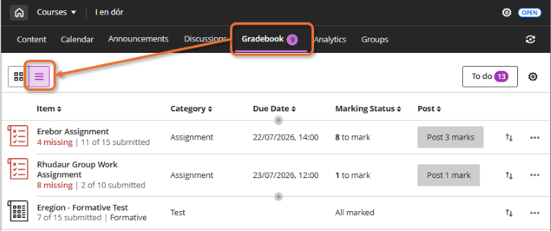
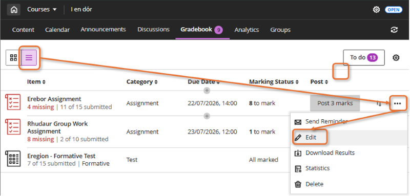

---
tags:
    - Key guide - admin
    - Assessment
    - Ultra
    - Other tools
---

# Update assessment due dates

!!! Summary

    In rolled-over sites, **assessment due dates and release dates must be updated** for the new academic year. Items can be hidden fom students if the new due date is still to be confirmed.
        
    If old due dates are left visible once the site is opened:

    - students may receive confusing/stressful automatic notifications of missing or overdue work.
    - items released based on date will be visible to students.

    Before making your new Ultra site available to students, make sure to update due dates or hide submission points/tests from students (to update later).

This guides uses *assessment item* to collectively refer to the various submission point types and tests available in an Ultra site.
 
## List all assessment items

Click **Gradebook** in the top navigation menu, then select the **List View icon** (three stacked horizontal lines). This displays all assessment items in the site with the due date.

## Hide assessment items

If the new due date is still to be confirmed, you can [hide the assessment item from students](../ultra/content-visibility.md) and update it later.

## Edit due dates

Here are steps to update assessment item due dates via the Markable Items list. This is just one way; for example, you can also update due dates for Ultra Assignments and Tests using the [Batch edit tool](../ultra/batch-edit.md).

### Ultra Assignment or Test

1. Click **Gradebook** in the top horizontal menu, then the **List View** icon (three stacked horizontal lines).
2. Locate the relevant assessment item and click the **three dots icon** to the right of the Ultra Assignment submission point. 
3. Click **Edit**, update the due date, then **Save**.

### TurnItIn Feedback Studio

1. Click **Gradebook** in the top horizontal menu, then the **List View** icon (three stacked horizontal lines).
2. Click the name of the submission point then click the Cog icon in top right to open TurnItIn's Settings. IMPORTANT: Make sure the Feedback Release Date is set for AFTER the Due Date you intend to set via the Ultra interface in the next step (otherwise you can invalidate the submission point).
3. Go back to the Gradebook List View and locate the submisison point again. Click the **three dots icon** to the right of the TurnItIn submission points row. 
4. Click **Edit**, update the due date, then **Save**. Note that this can also be done via the Content area of the site; locate the TurnItIn submission point and click on its three dot icon (“...”) to the right of the submission point, click **Edit**, update the due date, then click **Save**.

### Gradescope

1. Click **Gradebook** in the top horizontal menu, then the **List View** icon (three stacked horizontal lines).
2. There will not be a due date shown, as dates are only shown within the Gradescope item.
3. Click on the Gradescope submission point name, select **Settings** from the left menu and update the date settings. Click **Save Assignment**. Note that this can also be done via the Content area of the site by locating the Gradescope submission point and clicking on its name.
