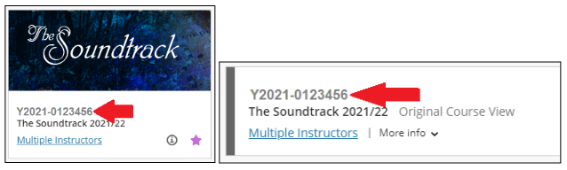

# Contact Us

!!! Summary
    The team that look after the tools described on this website is the Digital Education Team (DET) at the University of York, UK. We are contactable via email and phone, 9-5 BST, Monday to Friday (not [bank holidays](https://www.gov.uk/bank-holidays)).
    
## Our contact details:

- Email: vle-support@york.ac.uk – We aim to reply within three working days
- Phone: (01904 32) 1131 – For urgent queries only

## Information to include:
When getting in touch with our team, if you have an issue/query about a particular site on the VLE, please include its "YCode". The YCode is an identifier that's unique to each VLE site, and helps us quickly find and access the site you need help with.

### To find a YCode:

If you're already in the VLE site: 
The YCode will be displayed above the name of your site, in the top left of the screen

If you're not currently in the VLE site:

1. Go into either your [Courses](https://vle.york.ac.uk/ultra/course) or [Communities](https://vle.york.ac.uk/ultra/organization) page in the VLE (depending what type of site your’s is) 
2. Locate the site within the list, either manually or by using the search box at the top
3. The site’s YCode will be displayed next to its entry in the list.

