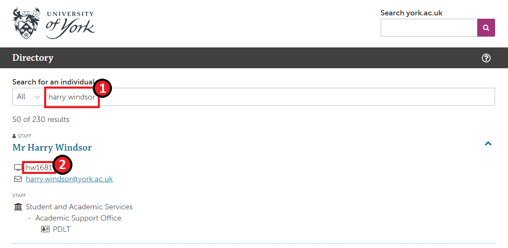

# Usernames

!!! Summary
    Usernames (eg. abc123) are unique to each person at York, when their actual names (eg. Joe Bloggs) are often not. Providing usernames is very helpful to us, as it allows us to make sure that we're definitely looking at the right accounts when investigating your issue/query.

## Finding Usernames
Usernames can be found in a number of places, including the People Database and Student Enquiry Screen. However, those two systems are locked down to only certain people, so we recommend using [the University's Directory](https://directory.york.ac.uk/) for finding usernames, as everyone has access to it.

Search for the user's name or email address (whichever you have) in the box at the top of the page. An entry will then show for them, which will include their username:

