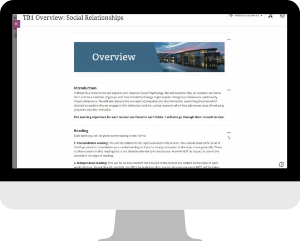

---
tags:
    - Help
    - Ultra
    - Panopto
    - Other tools
---

# Information for new staff

!!! Summary
    Welcome to the University of York! Here's an introduction to the Digital Education Team, the learning technology tools we support and where to find help with other key tools.

<!-- To come: very quick overview/video summary of tools -->

## The Digital Education Team (DET)

We advise individuals and departments on designing, delivering and evaluating learning technology interventions. Our advice is pedagogy-first and evidence-based; we'll help you find the right tool and approach to meet your learning objectives.

We also provide training and support on using the University’s centrally-supported Virtual Learning Environments (VLEs): Learn Ultra and Canvas and on a wide range of other learning technologies.

Find out more about us and our work on the [DET blog](https://elearningyork.wpcomstaging.com/).

## Virtual Learning Environments (VLEs)

Each module has a VLE site to host content, interact with students and handle submission-based assessment.

The VLE you'll use depends on your department:

- [Learn Ultra](../ultra/index.md): On-campus departments & Hull York Medical School
- [Canvas](../other-tools/canvas.md): York Online programmes

### Preparing VLE sites

- [All VLEs: Site design principles](../ultra/site-design-principles.md): best practice in site design and requirements for VLE module sites.
- [Ultra: Preparing your module site](../ultra/prepare-site.md): a step-by-step guide to update an existing site after rollover or set up a new site from a departmental template.
- [Ultra: Reading List](../other-tools/reading-list.md): guidance on setting up your module Reading List

## Lecture Capture & other video

Our video streaming tool is [Panopto](../panopto/index.md).

This is used widely for:

- the lecture capture system, [Replay](https://www.york.ac.uk/staff/teaching/support/recording-lectures/).
- recording short 'at-desk' videos (resources for module VLE sites or other uses).

!!! Note

    The Hull York Medical School uses Echo360 instead of Panopto; see HYMS guidance.

## Other key tools

- :material-tools: **[Other tools we support](../other-tools/index.md)**

    ---

    Tools to build or present content, create interactive sessions or resources, facilitate communication and more.

- :fontawesome-brands-google: **[Google Workspace tools](https://subjectguides.york.ac.uk/google)**
    
    ---

    Used extensively for Gmail, Google Calendar, Drive, Docs, Sheets, Slides and more.
   Supported by the [Digital Inclusion, Skills & Creativity team](https://subjectguides.york.ac.uk/skills/about/disc) (DISC) & [IT Services](https://www.york.ac.uk/it-services/contact/).

## Training available

We offer a range of synchronous and on-demand training and resources on effectively implementing digital education tools to support teaching and learning. Explore what's available on our [Training page](../training/index.md).

The DISC team also offer a range of [IT and digital skills training](https://subjectguides.york.ac.uk/skills/training?audience=staff&type=dst) on topics such as Google Workspace, presentations and managing data.