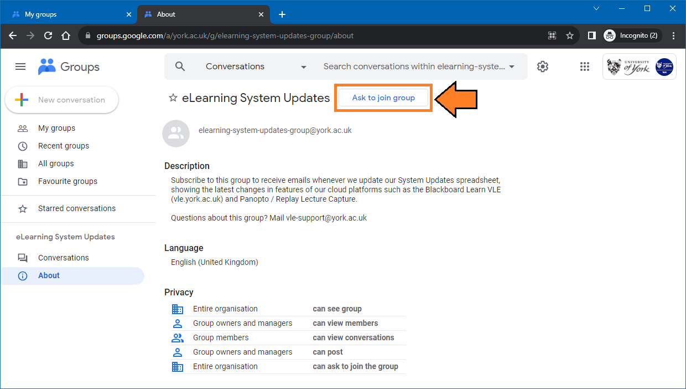

---
tags:
    - Help
---

# System Updates, Issues, Outages, and Degradations

!!! Summary

    Many of our systems are now Cloud-based and are updated very regularly. The resources on this page will help you keep track of what's happening with our systems.

## Support dashboards (Google Looker Studio)

Use our [support dashboards in Google Looker Studio](https://lookerstudio.google.com/embed/reporting/4de0e8c1-2254-4f46-a08e-e048d192baae/page/p_60kddgyw8c) to see:

 - **System Updates**: new features and changes that have been released, or are expected to be released soon on our systems
 - **Known Issues**: issues with specific functionality or tools on our systems, that may impact day to day use
 - **Planned Outages/Degradations**: future, current and past planned outages or degradations, such as updates, maintenance or similar
 - **Unplanned Outages/Degradations** unplanned outages or degradations, ie. an unexpected problem that's taken a system completely offline or made it run slowly for end users.

## Support dashboards (Google Sheets)

You can also access and filter the base spreadsheets directly in Google Sheets, particularly if the Google Looker Studio dashboards are inaccessible to a piece of assistive technology that you are using:

 - [System Updates Sheet](https://docs.google.com/spreadsheets/d/1Diz4EtXxllz07U2ZSo1izlX8dAH65AlDESGK2ieQhsY/edit#gid=172144886)
 - [Known Issues Sheet](https://docs.google.com/spreadsheets/d/1lorcyENG0ZtrqsE1WSgEY_VDrWO5iWucMqhpMCYUkkY/edit#gid=172144886)
 - [Planned Outages/Degradations Sheet](https://docs.google.com/spreadsheets/d/1_AibFcL71ZvvJay6E7C7FKkNpIts3E8xTdjnFA8Fr1Q/edit#gid=1593061267)
- [Unplanned Outages/Degradations Sheet](https://docs.google.com/spreadsheets/d/1_AibFcL71ZvvJay6E7C7FKkNpIts3E8xTdjnFA8Fr1Q/edit#gid=770753579)

### Filtering the dashboard sheets

You can use a **Temporary Filter View** to filter your view of the dashboard sheet without changing the sheet itself. For example, you could use this to look at just updates relating to assessments, or just updates relating to marking staff. 

1. Open the Google Sheet
2. Click on the "Data" menu towards the top of the screen
3. Hover your mouse over "Filter Views" in the options that show
4. Click on the "Create New Temporary Filter View" option
5. A black frame will now appear around the data on screen, with a warning message advising that your changes can't be viewed by anyone else - you can dismiss the warning message.
6. Filter the data now as normal, using the arrows in the header of each column.

[More guidance on filtering content in Google Sheets](https://support.google.com/docs/answer/3540681?hl=en-GB&co=GENIE.Platform%3DDesktop).

## Subscribe to update information

To receive an email each time we update this update and known issues information, [subscribe to the "eLearning System Updates" mailing list by visiting this link and clicking the "Ask to join group" button ](https://groups.google.com/a/york.ac.uk/g/elearning-system-updates-group/about).

**Important**: Make sure you are [logged into Google](https://accounts.google.com/ServiceLogin) using your University of York account before trying to access the Google Group to join.

