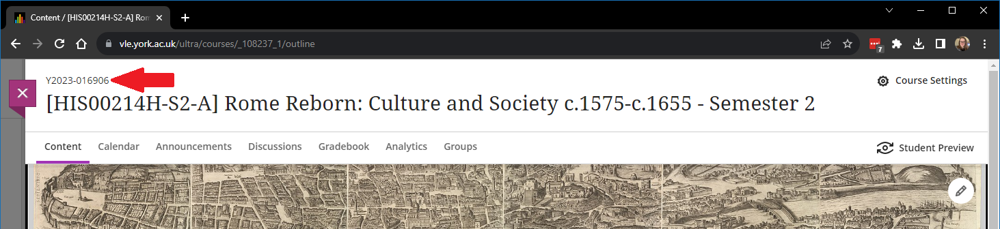

---
tags:
    - Help
---

# Finding a YCode

!!! Summary
    The YCode is an identifier that's unique to each VLE site, and helps us quickly find and access the site you need help with.

## If you're already in the VLE site 
The YCode is displayed above the name of your site, in the top left of the screen

## If you're **not** currently in the VLE site

1. Go into either your [Courses](https://vle.york.ac.uk/ultra/course) or [Communities](https://vle.york.ac.uk/ultra/organization) page in the VLE (depending what type of site it is) 
2. Locate the site within the list, either manually or by using the search box at the top
3. The site’s YCode is displayed above the site name in its entry in the list.

