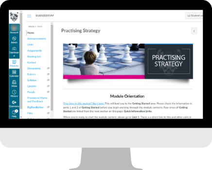

---
tags:
    - Other tools
---

# Canvas

!!! Summary
    Canvas is the VLE used for [York Online programmes](https://online.york.ac.uk/study-online/).

Access support through our dedicated [Canvas guide](https://docs.google.com/document/d/1-iQOxCMQS-lB4A6BcjhjEZdKDcUY62HNFReXDiRd2AU/edit?usp=sharing) (also embedded below). This covers topics including:

- module building
- discussion boards
- using Padlet in Canvas
- marking assignments

<iframe width="100%" height="600px" title="Canvas guide" src="https://docs.google.com/document/d/e/2PACX-1vRapXkeICIJJMCUfJsUk7tC52iwfuPbVBx_TrF7KUWi6CONJigPJAJbgb06HPgPd4GjfRQlVEeYBVRN/pub?embedded=true"></iframe>