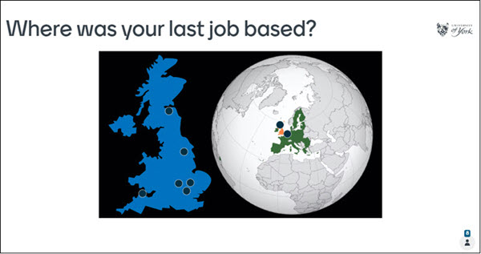
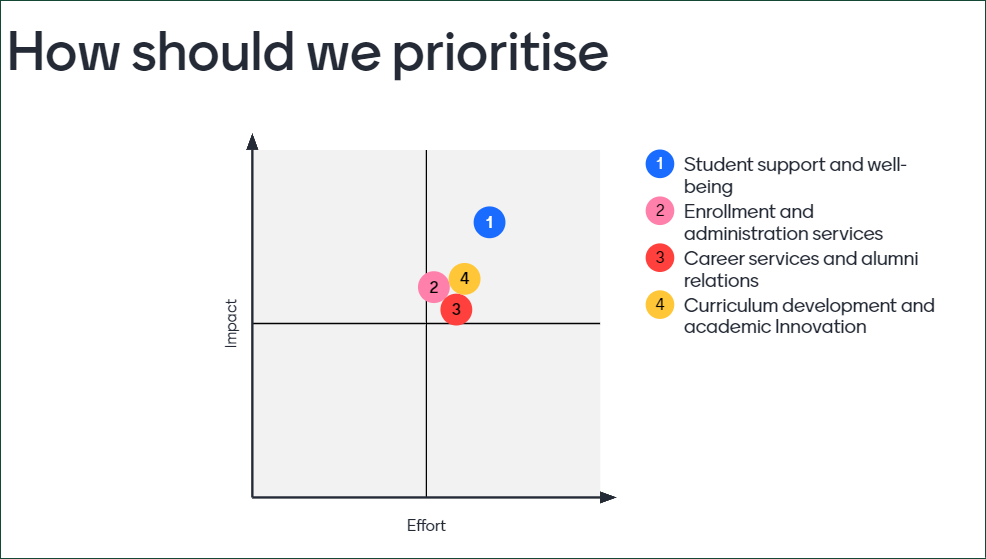
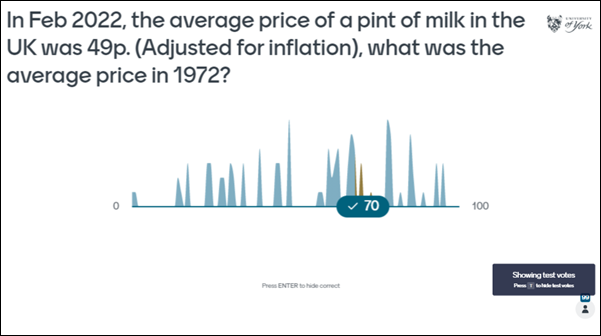

# Question types: Q&A, comments and chat

!!! Summary
     You can use a range of other question/interaction types in Mentimeter:

     - Quiz competition
     - Pin on image
     - 2x2 grid
     - Guess the number
     - Quick form

## Quiz competition

[Quiz competition](https://help.mentimeter.com/en/articles/410463-how-to-create-a-quiz-competition) questions allow you to introduce a competitive element by allocating scores to individuals or groups for correct answers to a series of questions. You can also allocate extra points for quicker answers. The scores are then displayed in a leaderboard with updates after each question. You can use multiple-choice and short answer questions in quiz cometituions.

## Pin on image

[Pin on an image](https://help.mentimeter.com/en/articles/4582546-pin-on-image) questions allow students to add a pin on a map or label an image, such as in the example below which allow users to drop a pin on a map indicating the location of their last job.

 

## 2 x 2 grid 

[2 x 2 grid](https://help.mentimeter.com/en/articles/410474-2-by-2-grid) questions provide an option for rating scales along two separate axes to show relationships between selections. Students can respond by selecting where an item sits on the two scales. Results are plotted with scale 1 on the x-axis and scale 2 on the y-axis, and the coordinates for each item represent the average response. As with the scales question type, hovering over a response will show how each individual responded (up to a maximum of 50 responses).

## Guess the number

Students choose a response along a numerical scale before a correct answer is shown (with a margin of error if needed). The correct answer is highlighted along with information on how many responses there were for each option. This could be useful for factual questions involving numerical responses such as calculations, stats, prices, and dates.

## Quick form

[Quick form](https://help.mentimeter.com/en/articles/1840520-collect-email-addresses-and-other-information-from-your-audience-with-quick-form) questions allow you to create a survey with responses not displayed on screen but for download afterwards as an excel file. When used with question slides, the downloaded information also allows you to connect the survey data to the data from slides to, for example, [identify participants](https://help.mentimeter.com/en/articles/410525-how-to-identify-participants#h_b4021850e0) and find out how particular respondents answered each question.  

