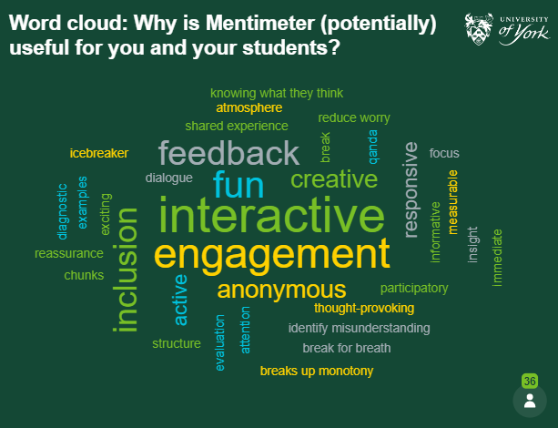

---
tags:
    - Interactive content
    - Other tools
---

# Mentimeter

!!! Summary
    [Mentimeter](https://www.mentimeter.com/) is our University-supported web-based tool for adding polling and other interaction to presentations or sessions.

Participants respond online to the variety of questions available through a mobile device or laptop by scanning a QR code or entering a ‘session code’ at [http://www.menti.com](http://www.menti.com). You can then access or share these responses during and after the presentation. No special software is required.
    
