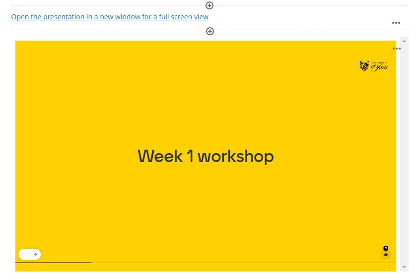

---
tags:
    - Interactive content
    - Other tools
---

# Asynchronous use of Mentimeter

!!! Summary
    How to switch to 'survey mode' to use Mentimeter for asynchronous interaction to make all the question types and features available in Mentimeter available to support online learning and independent study between live sessions.

You can change your Mentimeter presentation settings to make a presentation available for students to respond asynchronously in their own time by [switching from ‘Presentation mode’ to ‘survey mode’](https://help.mentimeter.com/en/articles/410899-how-the-presentation-mode-affects-your-presentation).  You can then [share the voting link](https://help.mentimeter.com/en/articles/410895-let-your-audience-connect-to-your-presentation-via-a-link) with them, for example by [creating a link](../ultra/links.md) in your VLE site.

If you are sharing the presentation online, for example in the VLE, you can add this link (see the following guidance page for information on [how to add links in the VLE](../ultra/links.md) if needed).

You can also copy an embed code which can be used to display the presentation in a frame on a VLE page. The following [embedding content](../ultra/embedded-content.md) guidance shows you how to do this in the VLE. 

When embedding the presentation on a VLE page, it is necessary to provide the link so that it can be viewed in full screen if needed. This can be added above the embed by choosing the ‘add content options’ and using the text editing tools to add a hyperlink (see example below).

 