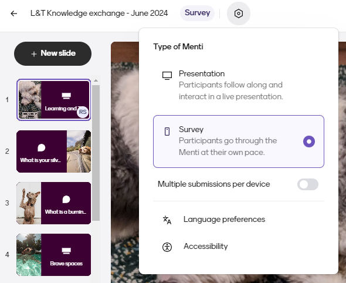
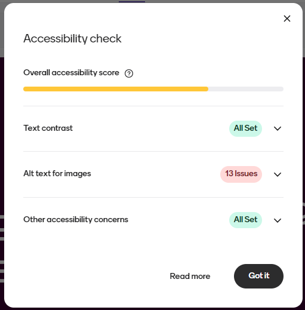
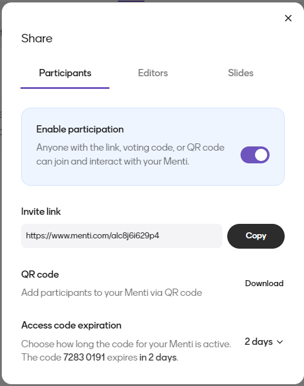
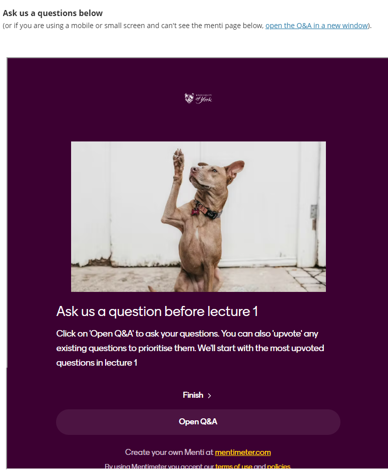

---
tags:
    - Interactive content
    - Other tools
---

# Asynchronous use of Mentimeter

!!! Summary
    How to switch to 'survey mode' to use Mentimeter for asynchronous interaction to make all the question types and features available in Mentimeter available to support online learning and independent study between live sessions.

You can change your Mentimeter presentation settings to make a presentation available for students to respond asynchronously in their own time by [switching from ‘Presentation mode’ to ‘survey mode’](https://help.mentimeter.com/en/articles/410899-how-the-presentation-mode-affects-your-presentation).  

## Survey mode

To activate survey mode, select ‘survey’ from settings. The word ‘survey’ will appear next to the title of your presentation.  You can adjust the settings to allow multiple responses on the same device by selecting the option. 

 

You can also check the accessibility of your presentation which will flag any issues such as problems with colour contrast or missing ALT text on images.

 

## Sharing your survey

You can share your survey with participants in a number of ways from the ‘share – participants’ options:

 

### Via invite link

This is the easiest way to share your survey in the VLE or via an announcement or email.  Students can follow the link to open the presentation and respond.

### Using a QR code access code

This is ideal for live sessions or when the students will not be able to access your link direct. You can bring these up on screen and student can use a QR code reader if they have one on their phone or device, or they can alternatively enter the access code at menti.com (nb access codes remain valid for 2 days by default but you can change the expiration to allow the link to be used for up to 14 days). 

### Embed in another platform

You can embed a Mentimeter survey into other platforms. For example, integrate a survey with other teaching materials by [embedding it in a Learn Ultra Document](../../ultra/documents.md#block-html).

To do this, paste the invite link into a HTML embed code:

```<iframe src="ADD INVITE LINK HERE" style="width:100%; height:820px; frameborder="0"></iframe>```

You can adjust the height settings by making the height number bigger or smaller in the embed code to ensure that the whole activity is displayed within the embed including the ‘submit’ or ‘Open Q&A’ buttons whilst avoiding any wasted space on the page.

It is important to include a link above the embed to ensure that it will be accessible even on a device with a very small screen or if a participant cannot see the embed frame for any reason. An example of an embedded Q&A slide is shown below.



## Sharing your survey results

You can share the results of a survey in a live session or asynchronously in the VLE. See [sharing your presentation and results](../../other-tools/mentimeter/results.md#sharing-your-presentation-and-results) for guidance.

