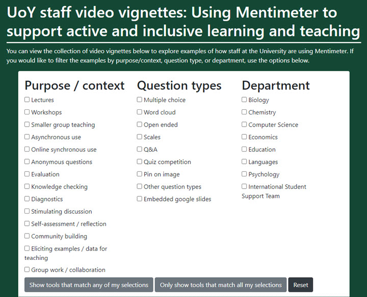

---
tags:
    - Interactive content
    - Other tools
---

# Mentimeter staff case studies

!!! Summary
    Examples from staff at the University of York of how they are using Mentimeter to support active and inclusive learning.

Staff in a range of different departments are using Mentimeter in a variety of ways to support active and inclusive learning.  If you would like to explore some examples, please see the following resource.  You can browse through video vignettes with staff talking about their practices, and you can also filter the examples by purpose / context, by question type, or by department.

[UoY staff video vignettes: Using Mentimeter to support active and inclusive learning and teaching](https://script.google.com/a/macros/york.ac.uk/s/AKfycbxs1uNLVd9fi0MjeMMIvhMW2V8HKDu-UVTYyMfxm5MMfBXSjyojZjvL7J7ysOoseFl-/exec)

Purposes for use include:

- **Diagnostics:** Finding out where students are at or what they already know at the beginning of a session. Adapting teaching during a session in response to their needs.
- **Knowledge checking:** Providing opportunities for students to test their understanding by responding to questions or engaging in competitive quiz activities.  Providing feedback or further teaching based on responses.
- **Promoting active learning and discussion:** Using polls as a trigger for learning or for activities involving comparison or discussion.  Sharing outputs and providing efficient feedback.
- **Engagement:** Providing a means for students to take part anonymously.  Eliciting questions during teaching sessions.
- **Stimulating reflection and feedback:** Polls to engage students with questions about their own learning and action planning, or to seek feedback on teaching.
- **Community building and inclusive learning:** Providing opportunities for ‘getting to know you’ activities or to gauge feelings and preferences on learning.

A range of examples were also shared in the following blog post following an experience-sharing webinar in Spring 2022:

[Active and inclusive learning and teaching: A key role for Mentimeter classroom polling.](https://elearningyork.wpcomstaging.com/2022/02/21/active-and-inclusive-learning-and-teaching-post-pandemic-a-key-role-for-mentimeter-classroom-polling/)

We are always keen to highlight and share effective practices with polling tools for learning and teaching. If you have examples you would like to share please [contact us](mailto:vle-support@york.ac.uk).