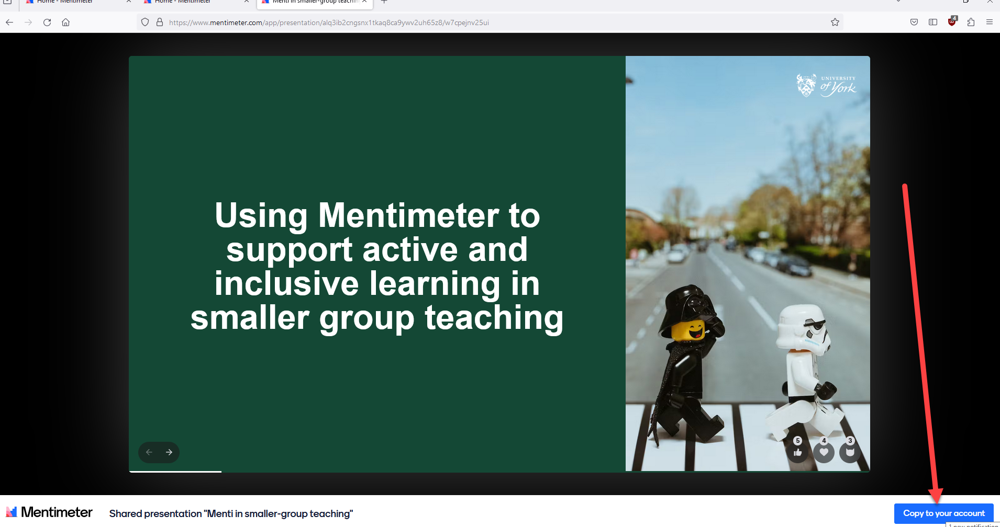

---
tags:
    - Interactive content
    - Other tools
---

# Collaborating with others on Mentimeter presentations
!!! Summary
     How to share your presentation with others so that they can be collaboratively edited or copied.

## Collaborate on your presentation

See [Mentimeter's guide to collaborating on presentations and folders](https://help.mentimeter.com/en/articles/5422663-collaborate-on-presentations-with-friends-and-colleagues) for details of how give others access to edit your Mentimeter presentations. This can be done with single presentations or at folder level. All those you have invited as editors can edit and work on the same presentation at the same time. You can also give access to others 
 
You can only share with others who have a [University Mentimeter account](log-in.md), or who otherwise have a pro or enterprise Mentimeter licence.

## Giving others a copy of your presentation 

To give others a copy of your existing presentations that they can use in their own Mentimeter account, you can [share the presentation results](results.md#sharing-your-presentation-and-results) setting it to 'Link to results - Anyone with the link can access'.  When a logged-on user accesses the link, they see the results view and get a 'copy to your own account' option. Once copied, they can then edit and use their own copy in their own account as normal. 

## Running the same presentation simultaneously

It is not possible for two different people to run the same presentation in two different places at the same time, even if the presentation owner has invited the second person to collaborate on the presentation. To be able to do this, the second person needs to take a separate copy of the presentation for their own account as described in the [How to hold simultaneous presentations](https://help.mentimeter.com/en/articles/410938-how-to-hold-simultaneous-presentations) guidance.