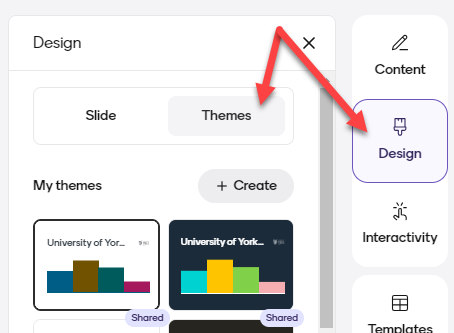
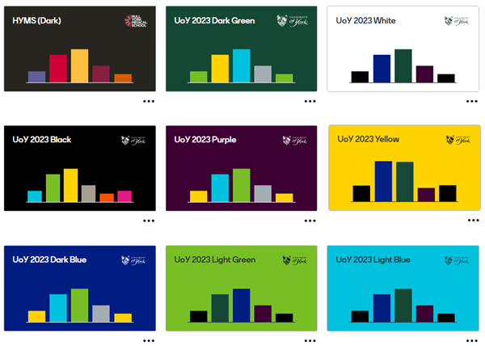

---
tags:
    - Interactive content
    - Other tools
---

# Mentimeter presentations

!!! Summary
    Create a Mentimeter presentation and build your slides.

Create a Mentimeter presentation to build content and interactive/question slides. You can use this as a standalone presentation or integrate with PowerPoint/Google Slides.

You can also use engagement and response tools such as Q&A and emoji reactions throughout your presentation, and use mentimote to control your presentation using a mobile device (see the [presenting guide](/docs/other-tools/mentimeter/present.md) for more information).

## Create a new presentation

Create a new presentation directly from your Mentimeter Home screen using the **+ New presentation** button.

For more details, see [Mentimeter's guide to the Home screen](https://help.mentimeter.com/en/articles/410450-your-home-screen) or watch the tutorial below. You can also [organise your presentations in folders](https://help.mentimeter.com/en/articles/1183596-folders-in-mentimeter).

7 minute tutorial to create your first presentation:
<iframe width="560" height="315" src="https://www.youtube.com/embed/on_Ib7SP6Go?si=j0a051mpOl5I0Xt1" title="YouTube video player" frameborder="0" allow="accelerometer; autoplay; clipboard-write; encrypted-media; gyroscope; picture-in-picture; web-share" referrerpolicy="strict-origin-when-cross-origin" allowfullscreen></iframe>
[How to Create Your First Mentimeter Presentation [YouTube]](https://www.youtube.com/watch?v=on_Ib7SP6Go)

## Slide theme

!!! principle "Relevant [VLE site design principles](../../ultra/site-design-principles.md)"

    - 2.3 Essential: Design and images adhere to the UoY brand.

We recommend using one of the Univeristy of York slide themes. These have designed to have high contrast and good accessibility using the University brand colours, and also contain the UoY logo.

1. Under **Design** options, select **Themes**.
 
2. Select one of the University of York theme options.
 

You can also select from other [Mentimeter theme options](https://help.mentimeter.com/en/articles/410482-change-the-theme-of-your-presentation) or [create your own theme](https://help.mentimeter.com/en/articles/410484-create-your-own-themes).

You can [organise your presentaions in folders](https://help.mentimeter.com/en/articles/1183596-folders-in-mentimeter).

## Slide types

### Content slides

Use [Mentimeter content slides](https://help.mentimeter.com/en/articles/410480-content-slides-in-mentimeter) to add 'normal' slides into your presentation. These could add context to interactive slides, or let you create and run accessible presentations entirely within Mentimeter.

Mentimeter content slides can include:

- headings and paragraoh text
- bullet points
- images (including instant access to a library of copyright free images and gifs)
- embedded videos

!!! tip "UoY feedback"

    Content slides do not include the layout, transition and animation options available in PowerPoint or Google Slides. However, a number of staff have provided feedback that they value the use of Mentimeter content slides for simplifying the layout of presentations and improving accessibility.

### Question & interactivity slides

Add interactivity to your presentation with one of the various question or interaction types:

- [closed question types](/docs/other-tools/mentimeter/question-types-closed.md)
- [open question types](/docs/other-tools/mentimeter/question-types-open.md)
- [Q&A and comment question types](/docs/other-tools/mentimeter/question-types-qa-comments.md)
- [other question types](/docs/other-tools/mentimeter/question-types-other.md)

## Integrating Mentimeter with other presentation platforms

It is possible to integrate Mentimeter slides into other presenttaion platforms, particularly PowerPoint or Google Slides.

Our guide to [Integrating Mentimeter questions into presentations](https://elearningyork.wpcomstaging.com/2023/10/26/integrating-mentimeter-questions-into-presentations/) covers three options on how to do this:

1. Create and deliver the whole presentation in Mentimeter
2. Switiching between PowerPoint/Google Slides and Mentimeter
3. Import PowerPoint/Google Slides into Mentimeter

!!! Warning
    Mentimeter makes an integration with PowerPoint available via office 365, but this is not currently supported at the University.
    
    There are no official Google Slides ‘add-ons’ for Mentimeter so please do not install any add-ons that promise to integrate Mentimeter with Google Slides. These add-ons are unlikely to be effective and may constitute a security risk.

