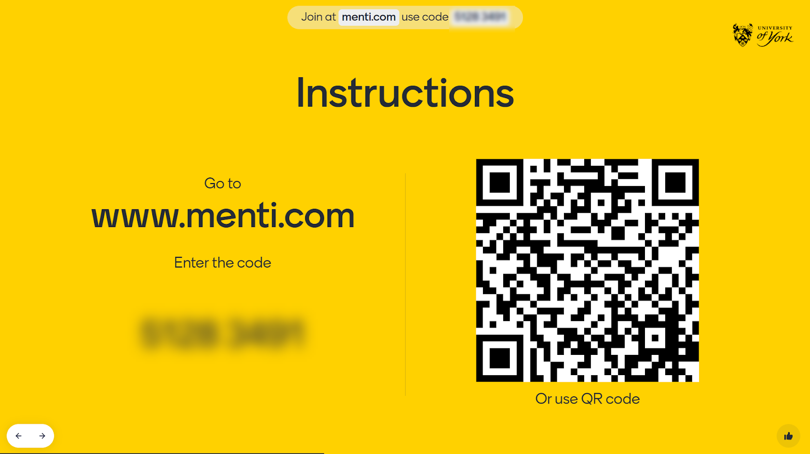
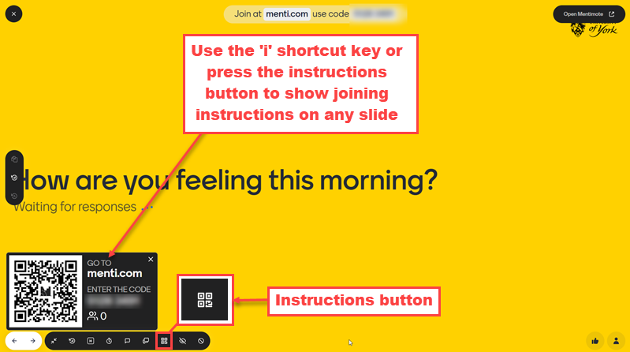
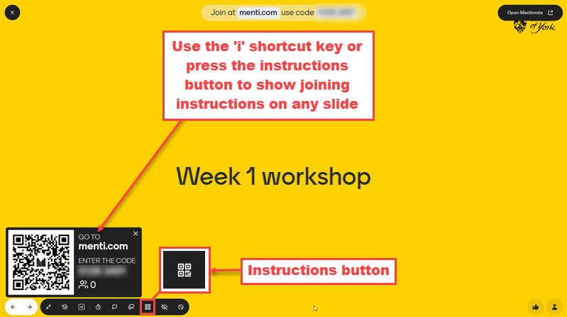

---
tags:
    - Interactive content
    - Other tools
---

# Presenting with Mentimeter

!!! Summary
     How to present with Mentimeter, give students joing instructions, control your presentation using a mobile device, and use keyboard shortcuts.

Log onto the console computer, open a browser window, and log into your Mentimeter account (remember your phone as [Duo authentication](https://www.york.ac.uk/it-services/services/duo/) is needed to log into Mentimeter). Open your Mentimeter presentation and select ‘Present’ to open it in presentation mode in full screen.

## Integrating Mentimeter with other presentation platforms

See our guide to [Integrating Mentimeter guide](../mentimeter/create-presentation.md/#integrating-mentimeter-with-other-presentation-platforms) for advice on using Mentimeter to present alongside (or instead of) PowerPoint or Google Slides.

## Giving joining instructions

Your participants will need to join your Mentimeter presentation to be able to respond (either by using a QR code or by inserting the joining code at menti.com). You can use the following options to make this a smooth process:

Add a Mentimeter instructions slide and make this the first slide students see when you open your Mentimeter presentation. This provides a code that students can insert at menti.com to join, and also a QR code for anyone who is able to use them on their device. The instructions screen slide is a particularly useful option the first time you use Mentimeter with participants as the instructions are presented very prominently.

 

Include a quick ‘warmer’ or a question at the beginning to give your participants the chance to join Menti on their device and check that they can respond successfully (this can be a fun, socially-oriented question or something connected to the subject matter). You can include this after the instructions slide. Alternatively, you can bring up joining instructions on your warmer question slide using the ‘i’ shortcut key or by pressing the ‘show/hide instructions’ button on the toolbar. 

 

You can also bring up joining instructions on an introductory content slide to give a reminder to participants on how to join. This shows the instructions in a less intrusive way than the instructions slide, allowing you to include instructions in a more context-specific welcome slide which can be particularly useful when participants are already familiar with Mentimeter. 

 

Once your participants have joined the presentation, they should not need to re-join to respond to your subsequent questions so long as these are in a single Mentimeter presentation. Should a participant become disconnected for any reason, you can display the joining instructions again on any slide by pressing the ‘i’ shortcut key.

## Controlling your presentation with 'Mentimote'

If you would like to use your phone or tablet as a remote control device to control your presentation, you can simultaneously log onto Mentimeter using a browser on the device, open the same presentation and, instead of choosing ‘Present’, select ‘Open Mentimote’. The Mentimote interface will open for your presentation. The ‘Present’ options show thumbnails of your presentation slides with arrows allowing you to move between slides. The Q&A options allow you to switch on the Q&A function (if it is not switched on already) to allow your participants to ask you questions during the presentation. You can then view questions received, bring them up on the presentation screen and mark them as answered using the device. Finally, the ‘More’ options allow you to carry out a wide range of functions including showing and hiding results, opening and closing voting, showing the voting instructions and QR code, and blanking the screen. 

See [Mentimeter’s Mentimote page](https://www.mentimeter.com/features/mentimote) for instructions and an introductory video.

## Using keyboard shortcuts

When presenting in Mentimeter, you can use keyboard shortcuts to manage presentation navigation and options. Shortcuts include:

**H**: Hide or show results – you can hide results until all students have responded to prevent bias and then show them when you are ready

**I**: Show voting instructions and QR code – useful for pauses in a presentation or for a minimally-disruptive reminder of how to connect to a Menti session.

**T**: Show test votes – You can use this before a session to try out a question and its options by viewing automated responses.

**K**: The meta-shortcut – brings up a list of all available keyboard shortcuts.