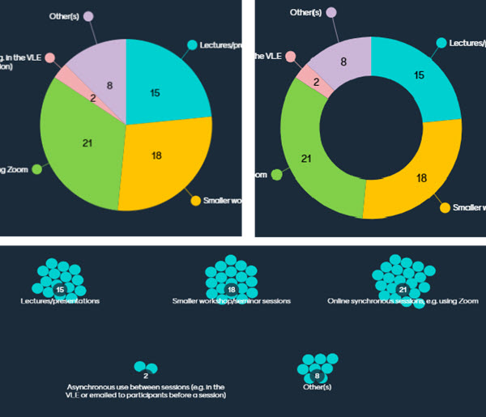
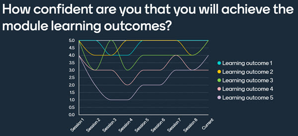

---
tags:
    - Interactive content
    - Other tools
---

# Question types: Closed (Students select from options presented to them)

!!! Summary
     Closed question types such as Multiple-Choice, ranking, and scales questions allow students to select responses from a list. There are options for how results are presented including showing the results of a questions organised by responses to a previous question (segmentation) and showing changes in responses over time (trends).

## Multiple-choice questions

[Multiple-choice questions](https://help.mentimeter.com/en/articles/410459-multiple-choice-questions) provide an option for students to select one or more options from a list.  You can pre-select a correct answer to be revealed at a time of your choice if you wish.  The results can displayed in the form of a bar chart as follows:

Alternatively, the results can be shown in the form of a pie chart, donut or dots as follows:

!!! Tip
     Feedback from students at the University shows a preference in knowledge checking MCQ questions for the answers to be hidden as they are received to give all students the chance to respond without being influenced by the answers of others. See the following Mentimeter guide to learn how to [show or hide responses](https://help.mentimeter.com/en/articles/422266-hide-or-show-results).

For multiple-choice questions with a single correct answer you can also apply '[segmentation](https://help.mentimeter.com/en/articles/697797-segmentation-of-votes)' which allows you to display the results of questions organised according to responses to a previous question. This can allow you to make connections between the results of different questions and to highlight patterns in, for example, whether those answering question 1 in a particular way are more likely to answer question 2 in a particular way. Asking the same question(s) at different stages of a session can also be a useful way of exploring and highlighting changes after teaching or discussion. The following video example shows how segmentation was used by Sally Quinn (Department of Psychology) to show a breakdown of how responses to a question asked at the beginning of the session changed when the same question was asked at the end:

[Sally Quinn: Using segmentation to track changes in learning](https://york.cloud.panopto.eu/Panopto/Pages/Viewer.aspx?id=6c1a8822-91cc-4d8a-b488-ade400bd5451) (Panopto video player, 2 mins 3 secs, UoY Panopto log in required)

## Ranking

[Ranking](https://help.mentimeter.com/en/articles/2780579-ranking-questions) questions allow students to put options in order and displays the responses by average ranking:

## Scales

[Scales questions](https://help.mentimeter.com/en/articles/410471-scales-questions) allow students to select a response on a sliding scale.  Answers are presented with the mean highlighted and the distribution shown.  Hovering over a question shows the specifics of how many students selected each option on the scale:

The following example shows how Gareth Evans (Department of Biology) used scales questions to encourage self assessment at the beginning of workshops by asking students to rate how well they felt they had met each of the learning outcomes for the week.

This was the first part of a standard pattern of activities in workshops to support a flipped learning approach. The review and self-assessment activity was followed by a Q&A, a knowledge check, and a group practice activity with discussion and feedback. This is described in the following example video:

[Gareth Evans: Mentimeter for flipped workshops](https://york.cloud.panopto.eu/Panopto/Pages/Viewer.aspx?id=e703a3f6-f5b1-443e-88cc-ae000129f422) (Panopto video player, 3 mins 41 secs, UoY Panopto log in required)

When using scales questions it is possible to collect and compare historical data to identify trends in the way that students respond.  When reusing a presentation, you can opt to ‘reset results’ and use the same questions a second time.  If you do this, historical responses are stored and you can use the ‘[Show trends](https://help.mentimeter.com/en/articles/410577-see-historical-data-with-sessions-and-trends)’ option.  In the example shown below, students are asked to rate their confidence about meeting the module learning outcomes at the end of each weekly session.  The ‘show trends’ option reveals how confidence levels for each outcome might rise and fall as the module progresses to track self-assessment of progress and achievement over time.

## 100 points questions

[100 points questions](https://help.mentimeter.com/en/articles/410475-100-points-question) allow students to prioritise pre-fixed options by allocating a total of 100 points across the different options.  This is similar to ranking but allows each respondent to estimate the strength of preference. The average points allocation for each option is show in the results. 