---
tags:
    - Interactive content
    - Other tools
---

# Question types: Open (text-based responses)

!!! Summary
     Open question types where participants enter free-text in response to a question or prompt, for example gather ideas from students. 
     
     Longer form responses can be automatically grouped using an AI tool, or participants can vote on responses.

## Word clouds

[Word cloud](https://www.mentimeter.com/features/word-cloud) slides allow students to add words or short phrases in response to a question or prompt. These are then collated with the most frequent additions shown with the largest size.

This can be useful to collate and share short individual anonymous responses, for example to elicit ideas, examples, suggestions, feedback and reflection. These can then be used as a start point for further discussion.

## Open-ended questions

[Open ended questions](https://help.mentimeter.com/en/articles/410470-open-ended-questions) allow you to elicit longer anonymous responses from individuals.

Possible uses include:

- eliciting longer form questions, feedback, examples etc.
- knowledge check questions on lecture content or a check in point to engage students 
 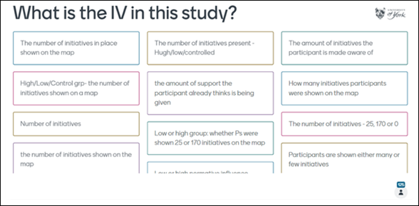 
- collate ideas and examples following group work. In the following example, groups posted their response to a series of questions, identifying their table number for further discussion of noteworthy responses:
 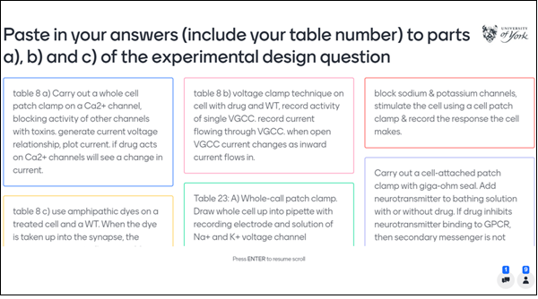

### AI tool: open response grouping

An AI-powered grouping tool is automatically available on any open-ended question slide with more than 10 responses. This could be useful to help you quickly identify key themes in responses during live sessions.

!!! ai "Using AI tools effectively"

    AI-generated content is a **starting point** for your own content development rather than a finished product. You must always **carefully check** that output is accurate and appropriate for your intended use and adapt as needed.

    See our [general guide to Artificial Intelligence tools](../../other-tools/ai.md) for more details on using AI responsibly.

To activate the AI grouping tool:

1. Once sufficient responses are received, press **space** on the keyboard or click the button to group responses.
 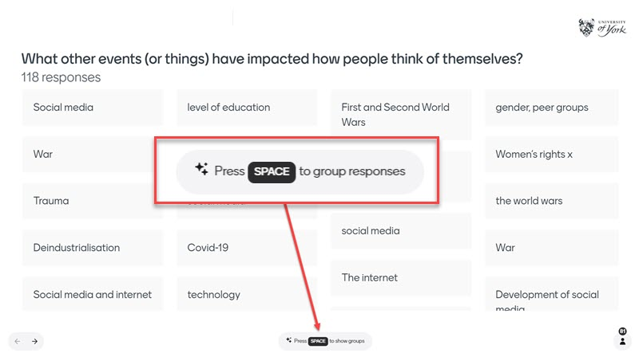
2. Depending on response numbers and complexity, you may see a *Sorting the circles from squares* waiting page while the grouping takes place.
 
3. Once complete, responses are shown grouped under headings generated by the AI tool.
  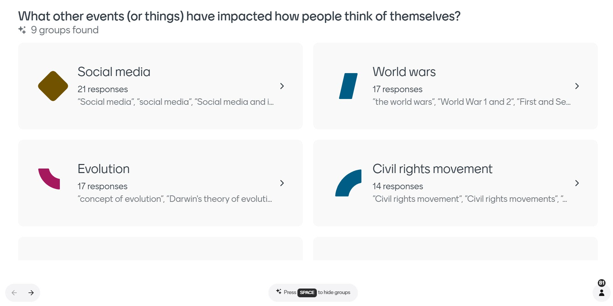
4. Click on a group heading to view the individual responses categorised within it. You can return to the list of groups by selecting the link at the top.
  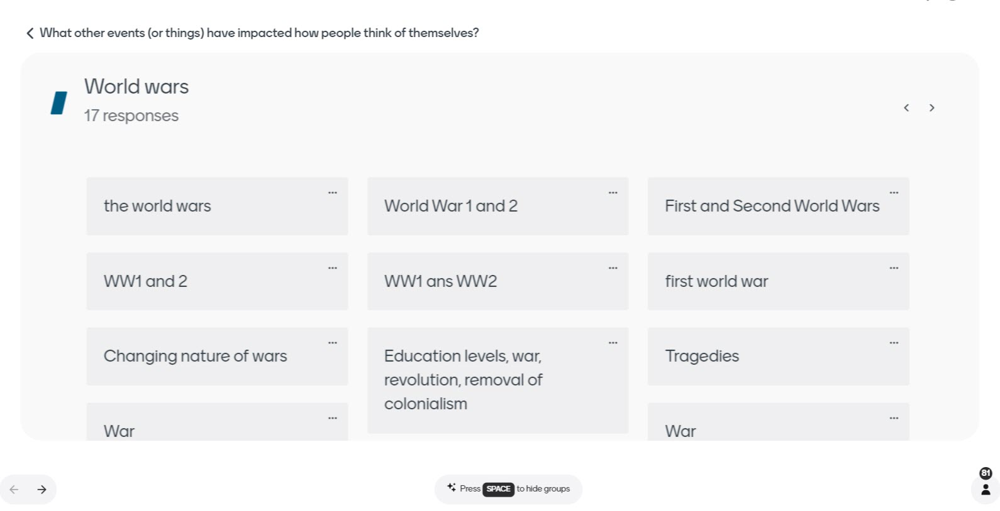
5. To move a specific item from one group to another, select its **three dots menu icon**and choose from the existing groups or add a new group to move it to.
 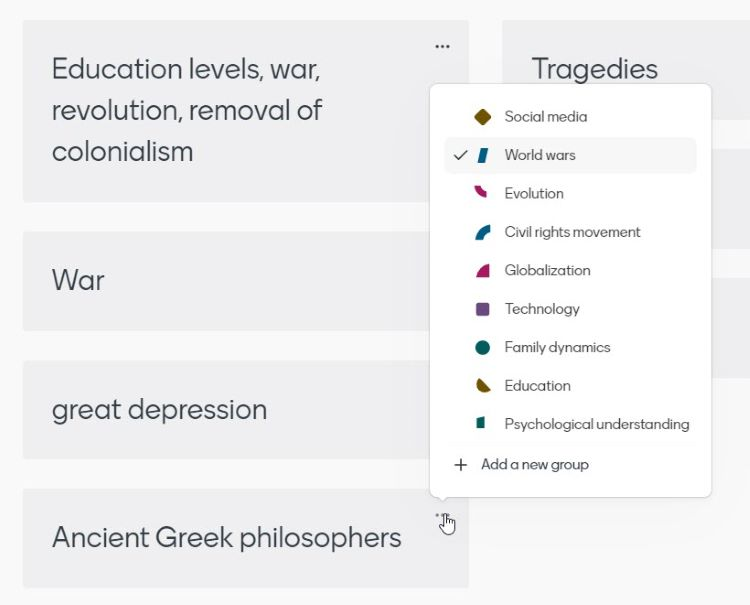
6. To remove the AI grouping, press **space** again to hide the groups. This is necessary before [participants can vote on responses](#voting-on-open-responses).

Further details on the grouping tool can be found on Mentimeter’s [Group responses to your Open Ended questions using AI](https://help.mentimeter.com/en/articles/8300577-group-responses-to-your-open-ended-questions-using-ai) page.

??? ai "UoY feedback on the AI grouping tool"

    The AI grouping tool was trialled by a group of teaching staff on previously-collected responses in large lectures (to gather ideas on the subject matter) and workshops (to seed discussion and gather group responses to short answer practice questions).

    Overall, the **grouping tool output was seen as accurate and helpful**. Testers felt it made it easier to give feedback and discuss responses in live sessions, especially for larger numbers of responses and relatively general rather than very specialised subject matter.

    However, there were some ‘outliers and oddities’ grouped in seemingly arbitrary or incorrect ways. As with other uses of Generative AI, it could be useful to think of the grouping tool as **a useful starting point for live analysis of student responses**, rather than expecting that it will organise the groupings as you would have done so yourself.

    For more detailed feedback and examples of the generated groupings, see our    
    [Introducing the AI open response grouping tool in Mentimeter](https://elearningyork.wpcomstaging.com/2024/05/01/introducing-the-ai-open-response-grouping-tool-in-mentimeter/) blog post.

### Voting on open responses

You can switch on voting on open text responses, making this ideal for a brainstorming or prioritising session, allowing everyone to contribute ideas and then to vote on the contributions made. 

To use voting in a session:

1. *Set up*: Create an **Open Ended question slide** and add your question as normal in the question field under the *Content* options. In the slide settings, toggle on **Enable voting on responses** and set the desired **Votes per participant**.
 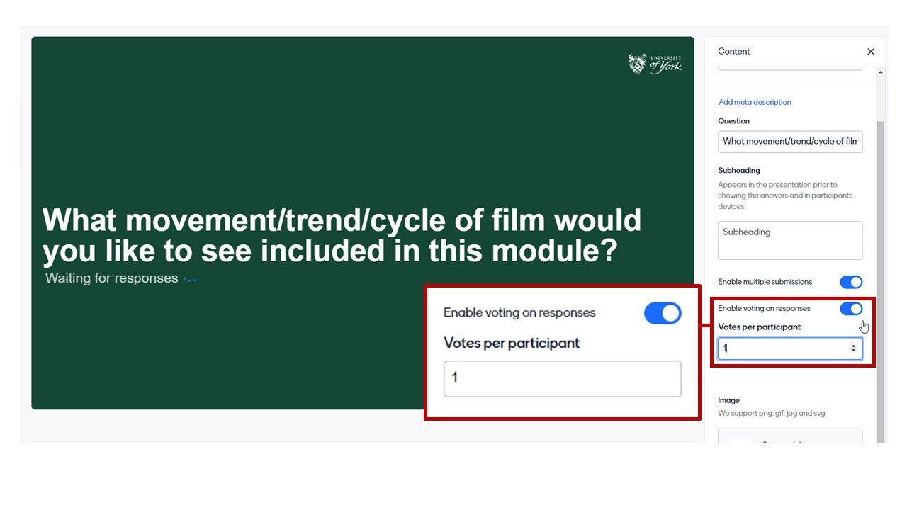
2. *Gather responses*: Present your slide for participants to provide open responses as normal. Responses can be displayed immediately or hidden until a time of your choosing using the **shortcut key H**.
  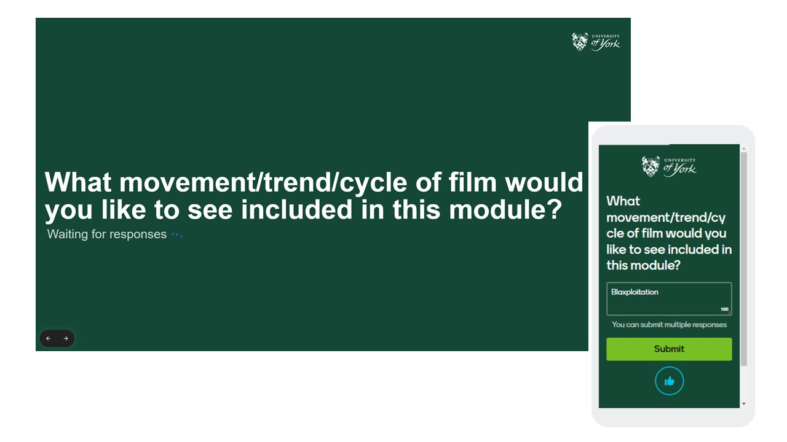
3. *Begin voting*: When you are satisfied with the number of open responses received, press **Enter** to begin the voting. Until this point participants who have submitted their responses will see a message telling them that the presentation is not yet open for votes.
  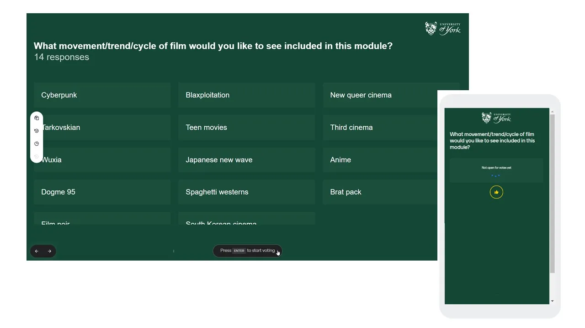
4. *Participants vote*: the message *Voting in progress* appears under the question. Participants select response(s) to vote for, which are then shown by a tick (select the option again to de-select). Once they have made their selections, press the **Submit votes** button.
 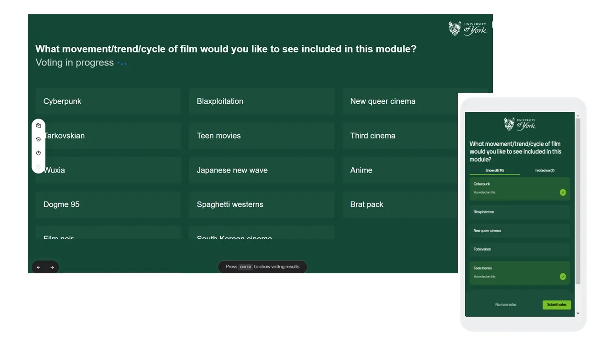
5. *Show voting results*: once sufficient votes are received, press **Enter** again to show the voting results on the screen and participant devices, ordered by the number of votes from most to least.
 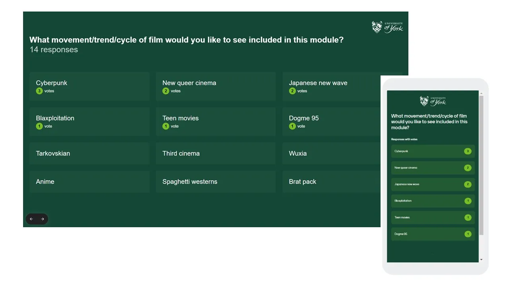

!!! Warning
     By default, Mentimeter is completely anonymous. For strategies to reduce the likelihood of any misuse of anonymous word cloud or open-ended questions, and to limit the impact of any inappropriate or offensive responses, please see the following page:
     [Using open text responses safely and dealing with inappropriate or offensive posts](safe-anonymity.md).

