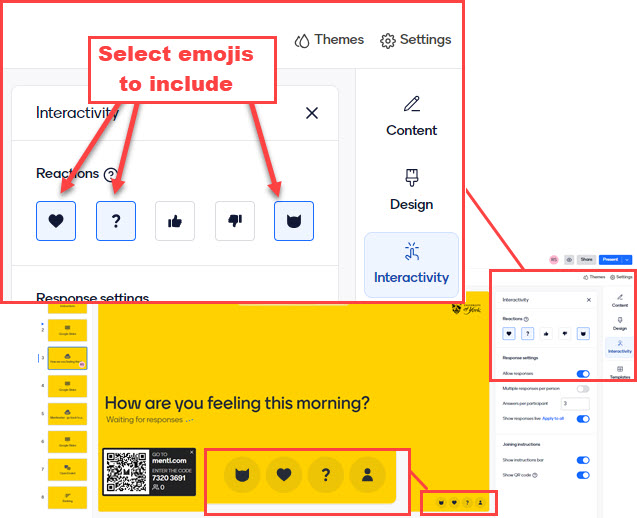

# Question types: Q&A, comments and chat

!!! Summary
     You can allow students to post questions, give reactions or add chat comments on slides in Mentimeter.

## Q&A

The [Q&A](https://help.mentimeter.com/en/articles/1501502-questions-from-audience) option allows students to post anonymous questions either on specific 'Q&A' slides, or at any point during a presentation.  You can decide whether you would like the questions to be private or viewable by all as they come in. You can also decide whether you would like to be able to ['moderate' questions](https://help.mentimeter.com/en/articles/1840522-moderate-your-q-a-session-to-ensure-a-great-experience) which means they need to be approved before they are displayed on the screen.  Moderation can be done by the presenter (Mentimote provides a useful option for this) or you can share a link to allow moderation by a colleague. 

## Reactions

You can enable 'reactions' to allow students to select 'emojis' during a presentation which will display on the screen at the bottom of a slide (options include: heart, question mark, thumbs up, thumbs down, and cat). To enable or disable specific emojis, select 'Interactivity' and select the emojis to include.

 

## Chat

You can enable [chat](https://help.mentimeter.com/en/articles/4194716-allow-comments-and-chatting-during-your-presentation) to allow participants to post short transitory comments during a presentation.  These will appear for a moment on the bottom corner of the screen before disappearing.  Unlike Q&A questions, they are not saved and cannot be exported afterwards.

!!! Warning
     By default, Mentimeter is completely anonymous.  For strategies to reduce the likelihood of any misuse of anonymous word cloud or open-ended questions, and to limit the impact of any inappropriate or offensive responses, please see the following page:
     [Using open text responses safely and dealing with inappropriate or offensive posts](safe-anonymity.md).