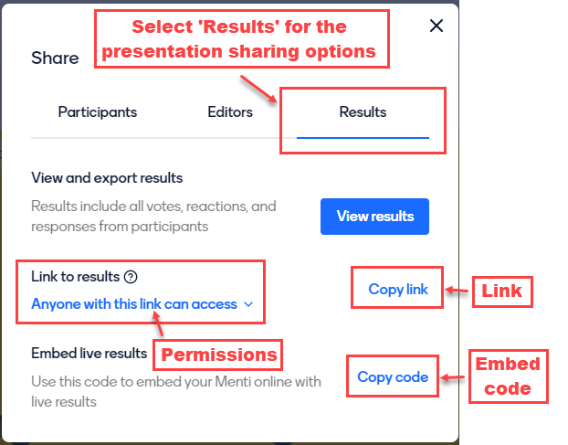

---
tags:
    - Interactive content
    - Other tools
---

# Dealing with results

!!! Summary
     How to display results and how to analyse them to support teaching.

## Displaying results

When you display a Mentimeter presentation, the results can be displayed on the screen as they come in from participants. You can select to [hide the responses](https://help.mentimeter.com/en/articles/422266-hide-or-show-results) to questions until students have answered, or you can display the results from the beginning and show how the ‘story’ changes as answers are received. You can also share a presentation and its results so that they can be accessed afterwards, or so that students can display this on their own computers, for example in remote teaching sessions (see [sharing your presentation and results](mentimeter-sharing-presentations.md)).

!!! Tip
     Feedback from students at the University shows a preference in knowledge checking MCQ questions for the answers to be hidden as they are received to give all students the chance to respond without being influenced by the answers of others. For word clouds, students report that they appreciate the opportunity to see ideas as they emerge. See the following Mentimeter guide to learn how to [show or hide responses](https://help.mentimeter.com/en/articles/422266-hide-or-show-results).

## Using responses to support teaching

Results can be used to guide feedback or further teaching.  They can be used as a start point for discussion in groups, or for individual reflection by, for example, asking students to briefly compare their own responses with others or to identify responses from others that meet particular criteria. 

From the teacher perspective, further insight can be gained by accessing the results page to view more detailed summaries of responses or to [download the responses as an excel file](https://help.mentimeter.com/en/articles/410566-export-results-to-excel). This shows (anonymously) how individual students responded to the questions and can highlight common misconceptions.

## Sharing your presentation and results

You can share a presentation link with your participants using ‘Share – Results’, change the permissions to ‘Anyone with the link can access’ and ‘copy link’. 

 

Further instructions on this with screenshots are available on Mentimeter’s [share a presentation link](https://help.mentimeter.com/en/articles/410894-share-presentation-link) page.

If you share the presentation link with participants, they will be able to use it to open the presentation and navigate independently through the slides and view any existing results.

If you are sharing the presentation online, for example in the VLE, you can add this link (see the following guidance page for information on [how to add links in the VLE](../../ultra/links.md) if needed).

You can also copy an embed code which can be used to display the presentation in a frame on the page. The following [embedding content](../../ultra/embed-content.md) guidance page shows you how to do this in the VLE. 

When embedding the presentation on a VLE page, it is necessary to provide the link so that it can be viewed in full screen if needed. This can be added above the embed by choosing the ‘add content options’ and using the text editing tools to add a hyperlink (see example below).

 

If you would like to make the presentation available to participants offline, you can also [export the presentation](https://help.mentimeter.com/en/articles/410575-presentation-pdf-and-screenshots) as a pdf, images, or as an Excel file and share the resulting files with them (e.g. by uploading the files into the VLE). As with all digital resources, it is essential to consider accessibility. For example, if you are uploading images or pdfs, make sure that you also provide the Excel file as a more accessible alternative.