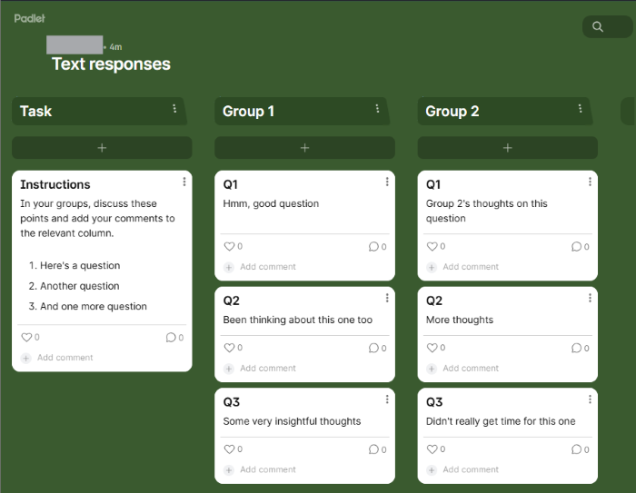
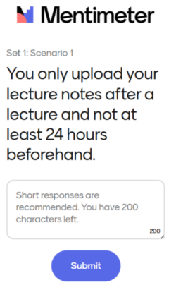
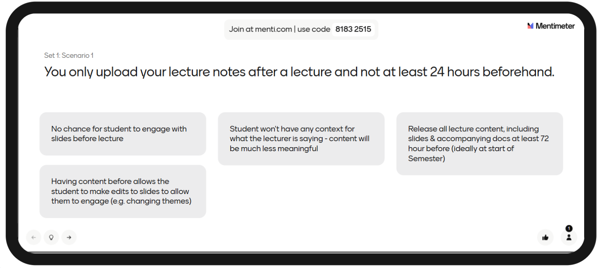

---
tags:
    - Other tools
    - Interactive content
---

# Padlet

!!! failure "Padlet to be retired on 30/09"

    Due to unexpected licensing changes leading to rising costs, **Padlet will no longer be available** at the University of York after **September 30th, 2025**.

    After this date, there will be **no access** to the platform, either to create new Padlet boards, or to access/view/update existing ones in a “read only” mode or otherwise.

    We apologise for the short notice of this change.

## Exporting/archiving your Padlets

!!! Warning

    If you have Padlets that have been used in student teaching or assessment that need to be archived and retained, please export these from the platform as soon as possible.

See your [Dashboard of Padlet boards](https://uniofyork.padlet.org/dashboard?mobile_page=Collection&filter=made) for a list of all your Padlets. You can't export all of your Padlets in bulk; you must export each one separately.

There are various options to export a Padlet:

- Export as **image**: with or without post comments and votes
- Export as **PDF**
- Export as **CSV**
- Export as **Excel Spreadsheet** (.xlsx): includes comments but does not include any uploaded files. *Recommended option for most complete and usable data*
- **Download all files**: download copies of any files within the Padlet (eg. images, spreadsheets, documents).

## Supported alternative platforms

There isn't a direct replacement for the full Padlet functionality. Instead, choose a tool suitable for the particular use cases.

We will add examples of use cases here over the next few days.

!!! Tip

    Do not use non-supported external tools; there is no University support available, and they have not been assessed for data security, service reliability or accessibility compliance. This poses a risk to users.

### Use case: collecting text responses

Padlet can be used to collate individual or group text responses to tasks and questions, where responses to contributions are not required. These Padlets often use the *Column* layout. For example, they could be used to:

- elicit topics to cover in a revision session
- submit anonymous questions on lecture topic
- collect outputs of group discussion for plenary

#### Alternative platform

The [**Mentimeter polling tool**](../other-tools/mentimeter/) can be used to collect text responses, particularly using the [open question types](../other-tools/mentimeter/question-types-open.md) (*word cloud* and *open ended*). No login is required, and responses are anonymous.

Responses can be collected and shared on screen in a live session, or [embedded in your Ultra site for asynchronous use](../other-tools/mentimeter/asynchronous-use.md).

??? abstract "Example: collect groupwork discussion comments"
   
    In this *Accessibility scenario for VI workshop* Padlet, workshop participants discussed accessibility scenarios in groups and added comments. 

    **Padlet set up**

    A *Column* Padlet with one column per group. Before the session, each scenario is added as a post in the relevant column. During the task, groups discuss their scenarios and add responses as comments on the relevant scenario post.

    

    **Alternative platform: Mentimeter open ended question slides**

    This Padlet can be recreated as a Mentimeter presentation, with an open ended question slide for each scenario. In the Settings menu, set the Menti type to *Survey* and *Allow multiple responses per device* so participants can move to the relevant scenario slides and add their responses. 

    <figure markdown>
    
    <figcaption>Participant input view</figcaption>
    </figure>

    <figure markdown>
    
    <figcaption>Presenter view of responses</figcaption>
    </figure>

### Discussion/Commenting Spaces

For students to contribute content themselves:

- Discussions and commenting can be undertaken in the Learn VLE either anonymously or non-anonymously using its native [Discussion tool](../ultra/discussions.md)
- Surveying can be done anonymously or non-anonymously via [Google Forms](https://subjectguides.york.ac.uk/google/core-apps#s-lg-box-wrapper-18870759) or anonymously using the Learn VLE’s native [Form tool](../ultra/form.md)
- For content sharing outside of the VLE, Google Slides or Microsoft Whiteboards may be useful; Zoom has a built in whiteboard for use during Zoom calls. For more details, see [guidance on Google Slides, Microsoft Whiteboards, Zoom Whiteboards and more](https://subjectguides.york.ac.uk/project-management/boards).

### Content Sharing

To share your content and files with students:

- Content sharing within the Learn VLE itself is best done using its native [Document page type](../ultra/documents.md), where text, images, links and files can all be shared in one place. The Documents tool has been vastly improved throughout 2025, and continues to regularly receive feature updates.
- Module readings must be added to the [Leganto Reading List](https://subjectguides.york.ac.uk/readinglists/home).
- For content sharing outside of the VLE, Google Slides or Microsoft Whiteboards may be useful; Zoom has a built in whiteboard for use during Zoom calls. For more details, see [guidance on Google Slides, Microsoft Whiteboards, Zoom Whiteboards and more](https://subjectguides.york.ac.uk/project-management/boards).

### Curated Maps

[Google’s My Maps tool](https://www.google.co.uk/maps/about/mymaps/#:~:text=GET%20STARTED-,MAKE%20MAPS,-Easily%20create%20custom) allows users to build shareable, curated maps.

### Mind Maps / Workflows

Mind maps can be created in the University’s supported [MindGenius tool](https://www.york.ac.uk/it-services/tools/mindgenius/).

### Timeline Building

[Timelines can be built in Microsoft PowerPoint](https://support.microsoft.com/en-gb/office/create-a-timeline-in-powerpoint-d1bd35a0-bfa7-428b-ba3c-c8f5b6050791), and then uploaded to the VLE or elsewhere.