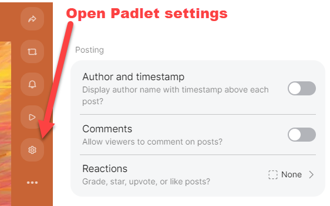
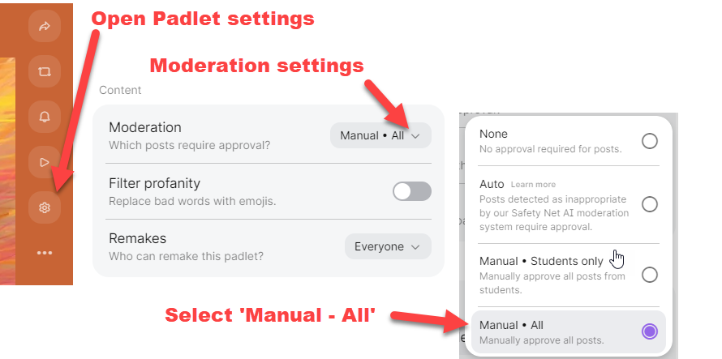
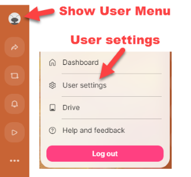

---
tags:
    - Communication
    - Interactive content
    - Other tools
---

# Padlet

!!! Summary
    Padlet is a flexible web-based tool for collaborative and individual project work and discussion.

    It offers some additional features than [Ultra Discussions](../ultra/discussions.md), such as subscribing to or moderating boards, or students being able to create their own boards.
    
## General Padlet Guidance
See our dedicated [Padlet guide](https://subjectguides.york.ac.uk/skills/padlet) (also embedded below) for information on:

- logging on to Padlet
- different layout options
- creating a padlet and sharing it
- posting to a padlet
- using Padlet on a mobile device

<iframe width="100%" height="800px" src="https://subjectguides.york.ac.uk/skills/padlet" title="Padlet guide"></iframe>

## Embed a Padlet in an Ultra site

For details on how to embed your Padlet so it displays directly within your Ultra site, see our [embedded content guide](../ultra/embed-content.md) 

## Padlet as an alternative to Ultra Discussions

### Anonymous Padlets

Ultra Discussions allow students to *choose* to post anonymously. If you want a discussion to be anonymous by default, you can do this using Padlet:

1. Within your Padlet, open the **Share settings** to make sure that the privacy settings selected are **Secret** and **Visitors can write**. This will let students post to your padlet without needing to log in.
 
2. Open **Padlet settings**. Under **Posting**, make sure that the **Author and timestamp** settings are OFF. This will hide poster names.
 
3. **Instruct students not to log in** before posting. This will hide their names even if you later turn on the Author and timestamp setting.

### Moderation in Padlets (aka approving posts)

You can switch on moderation that posts will not be displayed until you approve them:

1. Open **Padlet settings**. Under **Content** and select **Manual - all**

2. When new posts are made, you will now see an option to **approve** or **reject** the post before it is displayed to others.

For more detail, see [Padlet's guide to content moderation](https://padlet.help/l/en/article/v6iz7bhhl1-turn-on-content-moderation).

### Subscribing to Padlets (aka getting notifications)

You can receive notifications when new postings are made.

1. Open **Show user menu** and select **User settings**.
 
2. Select **Notifications** to view and adjust your settings
3. Use the checkboxes to turn on/off email and push (browser) notifications for general updates and specific Padlet boards.  

For more detail, see [Padlet's guide to notifications](https://padlet.help/l/en/article/2amj6wjed4-notifications).