---
tags:
    - Other tools
    - Interactive content
---

# Padlet

!!! failure "Padlet to be retired on 30/09"

    Due to unexpected licensing changes leading to rising costs, **Padlet will no longer be available** at the University of York after **September 30th, 2025**.

    After this date, there will be **no access** to the platform, either to create new Padlet boards, or to access/view/update existing ones in a “read only” mode or otherwise.

    We apologise for the short notice of this change. Unfortunately this was unavoidable.

!!! tip "Training session: Exploring alternatives to Padlet"

    We are offering a new training session that presents some alternative options to Padlet for key teaching and learning scenarios, including:

     - Gathering student ideas and comments (during live teaching sessions or asynchronously; anonymous or non anonymous)
     - Sharing curated content with students (including multimedia and links; with various methods of organisation including timelines or mind maps)
     - Providing shared spaces for collaborative work
     - Generating shared maps for 'pin' and 'comment' activities
    
    We will include native VLE tools such as [Documents](https://vle-support.york.ac.uk/ultra/documents/) and [Discussions](https://vle-support.york.ac.uk/ultra/discussions/), along with [Mentimeter](https://vle-support.york.ac.uk/other-tools/mentimeter/) and the [Google workspace](https://www.york.ac.uk/it-services/tools/google-workspace/) tools including Docs and Sheets. There will be space for discussion of specific Padlet use cases and opportunities for follow ups to consider how specific Padlets could be 'converted' using alternative tools.

    [Sign up for this session](../training/index.md#sign-up-training-sessions)

## Exporting/archiving your Padlets

!!! Warning

    If you have Padlets that have been used in student teaching or assessment that need to be archived and retained, please export these from the platform as soon as possible.

See your [Dashboard of Padlet boards](https://uniofyork.padlet.org/dashboard?mobile_page=Collection&filter=made) for a list of all your Padlets. You can't export all of your Padlets in bulk; you must export each one separately.

There are various options to export a Padlet:

- Export as **image**: with or without post comments and votes
- Export as **PDF**
- Export as **CSV**
- Export as **Excel Spreadsheet** (.xlsx): includes comments but does not include any uploaded files. *Recommended option for most complete and usable data*
- **Download all files**: download copies of any files within the Padlet (eg. images, spreadsheets, documents).

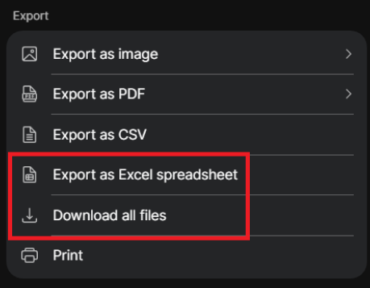

## Alternative tools to replace Padlet

There isn't a direct replacement for the full Padlet functionality, but there are many tools suitable for particular use cases. These tools also avoid the accessibility issues associated with Padlet.

We will add examples of use cases here over the next few days. If you're still not sure of the best replacement after reading this guide, please [contact us](mailto:vle-support@york.ac.uk) to discuss your particular use case.

!!! Tip

    Do not use non-supported external tools; there is no University support available, and they have not been assessed for data security, service reliability or accessibility compliance. This poses a risk to users.

### Gathering responses or summaries (for plenary)

Padlet can be used to collect individual or group responses to tasks and questions for review with the wider group. These often use the *Column* layout. Example uses include gathering:

- summaries of group discussion
- responses to short in-class questions/tasks
- student-created quiz questions for their peers

#### Example Padlet: brief groupwork discussion summaries

In this *Accessibility scenario for VI workshop* task, workshop participants discussed a set of scenarios in groups and summarised points in a Padlet. These were then reviewed live in the session with the wider participants. 

The Padlet is in **Column** format, with one column per group. Before the session, each scenario is added as a post in the relevant column. During the task, groups discuss their scenarios and add comments on the relevant scenario post. This can then be shown on screen for synchronous review or shared for asynchronous review.

<figure markdown>
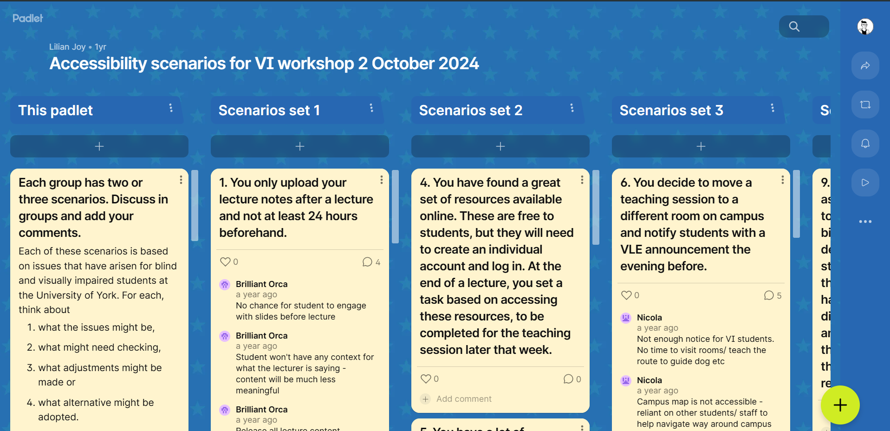
<figcaption>Example: Column Padlet to collect groupwork summaries</figcaption>
</figure>

??? Abstract "Alternative tool: Mentimeter (text comments only, anonymous, no replies)"
    
    - The [**Mentimeter polling tool**](../other-tools/mentimeter/) can be used to collect short text responses.
    - Responses can be collected and shared on screen in a live session, or [embedded in your Ultra site for asynchronous use](../other-tools/mentimeter/asynchronous-use.md).
    - Use one [open question slide](../other-tools/mentimeter/question-types-open.md) (*word cloud* and *open ended*) per question.
    - No login is required, and responses are anonymous. It is not possible to directly reply to other comments.

    **Reworking the example Padlet**

    A Mentimeter presentation can be used to collect groupwork summaries, with an open ended question slide for each scenario. In the Settings menu, set the Menti type to *Survey* and *Allow multiple responses per device* so participants can move to the relevant scenario slides and add their responses. 

    <figure markdown>
    
    </figcaption>Padlet reworked in Mentimeter</figcaption>
    </figure>

??? Abstract "Alternative tool: Ultra Discussion (text and other content, optional anonymity, replies possible)"

    - The [Ultra Discussion tool](../ultra/discussions.md) can be used to collect longer text responses, images and other content.
    - Requires an Ultra VLE site accessible to the participants (eg. a module site)
    - This tool is particularly suited to collecting and reviewing asynchronous responses, but can be used in live sessions.
    - Create a Discussion in the module Ultra site, then add Instructions as the initial post and one post per question.
    - You can allow anonymous responses. Students and staff can reply directly to other comments.

    **Reworking the example Padlet**

    An Ultra Discussion could be useful in this case if staff or students need to respond to the summaries. Set up the Discussion with one post (thread) per scenario. Students reply to the post with their comments. Students and staff can reply to these comments.

    <figure markdown>
    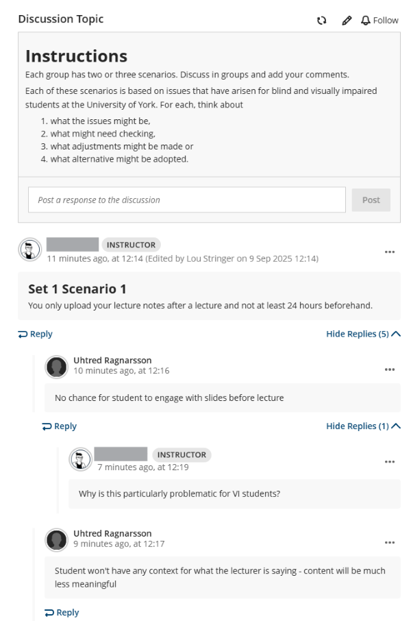
    </figcaption>Padlet reworked as an Ultra Discussion</figcaption>
    </figure>

---

### Gathering questions or comments (for tutor response)

Padlet is often used to collect anonymous questions or comments. These often use the **Wall**, **Column** or **Grid** layouts. Posts and replies are visible to other students. Example uses include:

- Q&A on module content or assessment
- collecting questions during presentations
- collaboratively selecting topics for a revision session

These are sometimes handled asynchronously, and sometimes during a live session. Suitable alternatives depend on when comments are gathered, and when/how they will be reviewed.

#### Example Padlet: reviewing responses in a live session

This *Q&A Sharing experiences with Blackboard Ultra* Padlet used the **Column** format to gather questions relating to different presentations during a live staff workshop. Questions were responded to live after each presentation, either verbally or in the Zoom chat. The same concept could be used to gather questions or comments before a session, to review live.

<figure markdown>
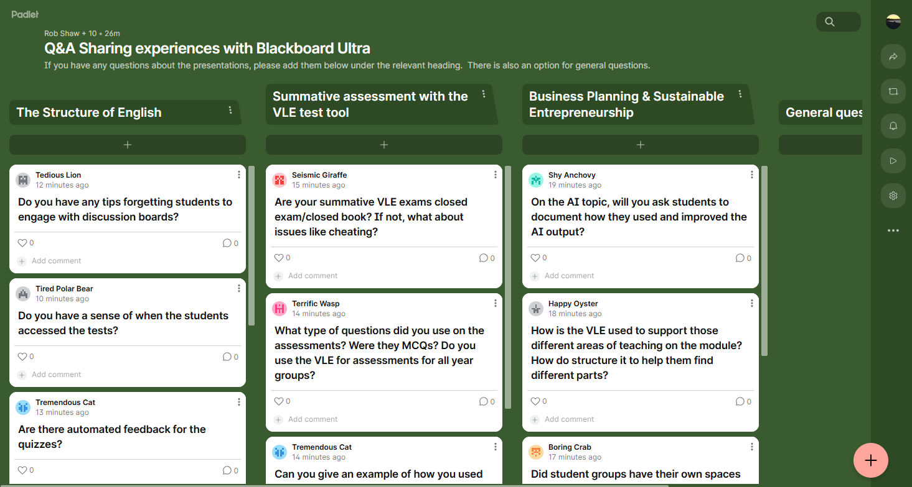
<figcaption>Example: Column Padlet for questions to review in live session</figcaption>
</figure>

??? Abstract "Alternative tool: Menti Q&A (synchronous collection)"

    - The [Mentimeter Q&A tool](../other-tools/mentimeter/question-types-qa-comments.md) is an excellent method for gathering and reviewing questions in live sessions.
    - Contributions are anonymous, with optional moderation and the ability to hide submissions as they come in.
    - Questions are displayed in a large format so they are easy to see in a live session.
    - Users can upvote and react to questions with emojis, helping to avoid duplicates and identifying key issues.
    - You can't respond to contributions within the Q&A slide, so this tool is best for live review.

    **Reworking the example Padlet**

    To collect and review questions in a live session, Menti Q&A is the best tool available to replace this Padlet. [Create a Menti presentation](https://vle-support.york.ac.uk/other-tools/mentimeter/create-presentation/) and add a Q&A slide. Share the access code with participants and display on screen.

    <figure markdown>
    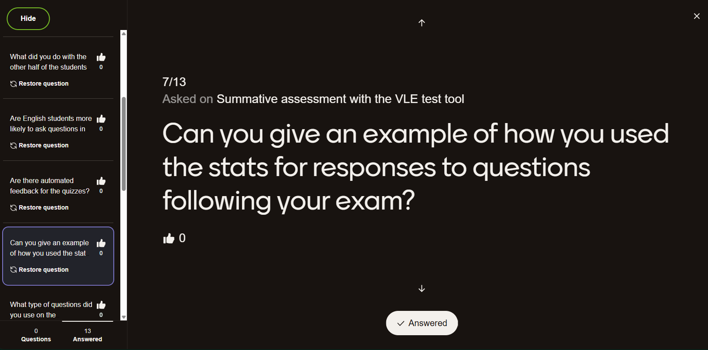
    </figcaption>Padlet reworked as Menti Q&A slide</figcaption>
    </figure>

??? Abstract "Alternative tool: Google Forms (asynchronous collection)"

    - [Google Forms](https://subjectguides.york.ac.uk/data/survey-tools#s-lg-box-wrapper-18938474) offers a quick, easy to engage with option for pre-session surveys, eg. for needs analysis - when you want to collect responses for discussion or sharing later, especially to elicit comments on multiple topics.
    - Contributions can be made anonymously. There are multiple question types; multiple choice, open text etc.
    - Results are immediately visible to creator, with the option to share responses with participants for review on their own devices.
    - You can't respond to contributions within the Form, so this tool is best for live review.

    A Google Doc may also be a simple alternative if you just need to provide a place for users to add content.

    **Reworking the example Padlet**

    A Padlet in the same format as the above example was used to gather experiences of online teaching for needs analysis before a training session. Google Forms could replace this to collect questions in advance for live review. Create the Form in advance, add question(s) and share with participants. You can screenshare responses, or switch on 'View Results Summary' and share the results link with participants.
    
    

    <figure markdown>
    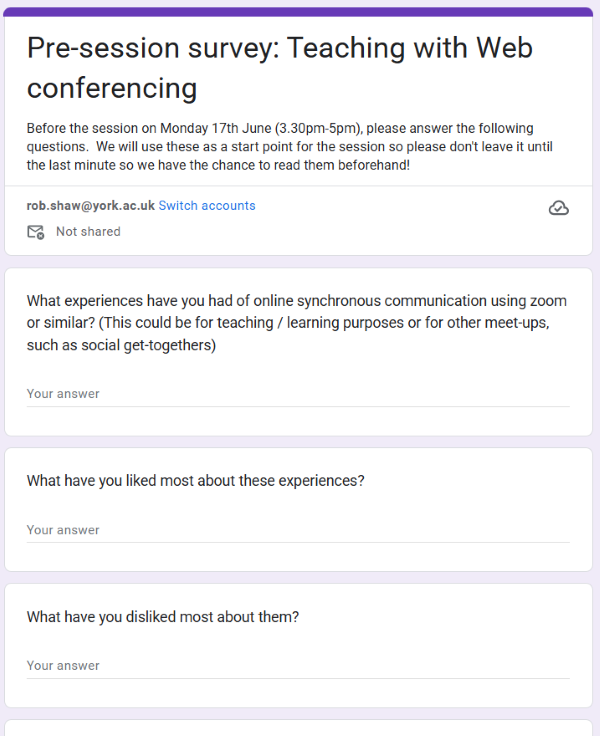
    </figcaption>Padlet reworked as Google Form: survey questions</figcaption>
    </figure>
    <figure markdown>
    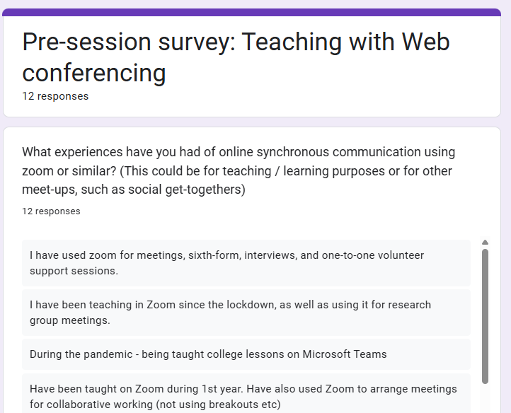
    </figcaption>Padlet reworked as Google Form: responses for live review</figcaption>
    </figure>
    

??? Abstract "Alternative tool: Google Docs (very simple collection option)"

    - A [Google Doc](https://subjectguides.york.ac.uk/google/core-apps) is a very simple option to collect questions/comments for use in a live session.
    - All users with access can post and view contributions. Users can also delete content (although this can be restored).
    - Allows text contributions, images and some other content types. 
    - Contributors are not explicitly identified, but use is not technically anonymous. Content is immediately visible to all users with access.
    - Present Doc on screen or participants can review on their device for review. You or other users can also directly respond to contributions.
    - Maximum 100 synchronous contributors. May get messy if there are lot of users editing the Doc simultaneously.

    **Reworking the example Padlet**

    A Padlet in the same format as the above example was used to gather experiences of online teaching for needs analysis before a training session. Google Docs is a lightweight solution that could replace this to collect questions either in advance or during a session for live review. Create a Doc, add question(s) if needed. Give participants Edit access so they can contribute. To review, you can screenshare or users can review on their devices.

#### Example Padlet: fully asynchronous Q&A forum

This *Week 1 Q&A* Padlet uses the **Wall** format to allow students to submit questions anonymously (to other students and also to the lecturer). Students post their question and the lecturer comments on it to reply. Students can also comment on posts if they wish.

<figure markdown>
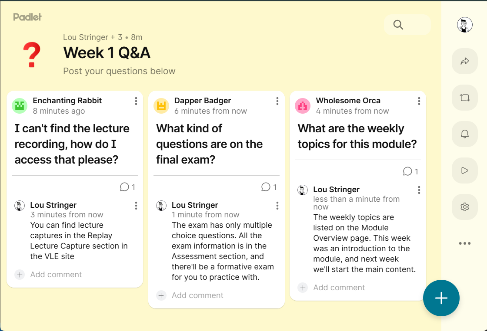
<figcaption>Example: Wall Padlet for anonymous asynchronous Q&A</figcaption>
</figure>

??? Abstract "Alternative tool: Ultra Discussion (within Ultra VLE sites)"

    - The [Ultra Discussion tool](../ultra/discussions.md) can be used for discussion boards and Q&A forums.
    - Requires an Ultra VLE site accessible to the participants (eg. a module site). All enrolled users can access the Discussion, post and read other contributions.
    - There have been lots of improvements to this tool during 2025; it's now possible to 
    [allow anonymous posting](../ultra/discussions.md#anonymous-posting) and [subscribe to be notified of new posts](../ultra/discussions.md#follow-a-discussion).
    - Allows posting and commenting, and supports a range of content types; text, links, images, embedded YouTube videos etc.

    **Reworking the example Padlet**

    For use in modules, the Ultra Discussion tool is the most appropriate tool to replace this Padlet. Create a Discussion in the relevant materials folder in your VLE site and add some instructions. In settings, click **Allow anonymous responses and replies**. Students can post their questions either anonymously or non-anonymously.

    <figure markdown>
    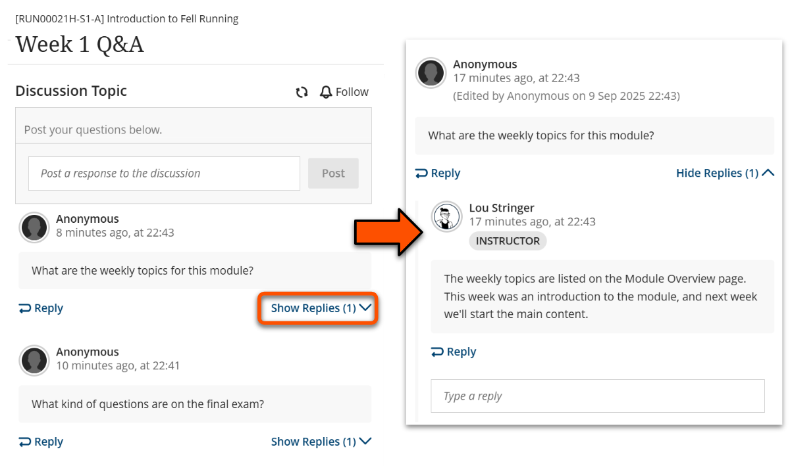
    </figcaption>Padlet reworked as an Ultra Discussion</figcaption>
    </figure>

??? Abstract "Alternative tool: Google Docs (for other uses)"

    - A [Google Doc](https://subjectguides.york.ac.uk/google/core-apps) can be used for Q&As.
    - Shareable across the University or more widely, so suitable for non-module use where there is not an Ultra VLE site. All users with access can post and view contributions.
    - Allows text contributions, images and some other content types. Note that other users can delete content (although this can be restored).
    - Contributors are not explicitly identified, but use is not technically anonymous. Content is immediately visible to all users with access.
    - It's not possible to receive notifications when questions are posted.

    **Reworking the example Padlet**

    For use outside modules or other Ultra VLE sites, A Google Doc could replace the Q&A Padlet. Create a Google Doc, share it appropriately with participants and monitor for questions.

    <figure markdown>
    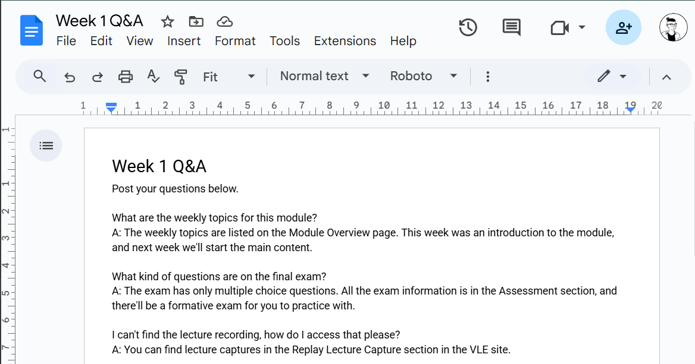
    </figcaption>Padlet reworked as a Google Doc</figcaption>
    </figure>

---

### Gathering student work

Padlet is often used to collect outputs of individual or groupwork to be shared with the wider group. Padlets commonly use the **Column** or **Wall** format, but there are many options for this use case. Work is shared with the wider group, either for in-session or asynchronous review or reference. In some cases students or staff comment on contributions.

Example use cases include:

- completing specific tasks, eg. find an example of a journal paper or artefact, treasure hunt etc.
- providing a space for collaborative in-session work
- collating a range of student-curated materials: links, images, files etc.
- create a poster

#### Example Padlet: individual student-curated examples

In this *Exploring policy research* Padlet, each group has a separate **Column** format Padlet with headings for various types of policy research (eg. Government, think tanks, academic etc.). Within the group, each student finds and summarises a piece of research for each column, providing a link or a file of the full research document. Other students can view and commment on all contributions.

<figure markdown>
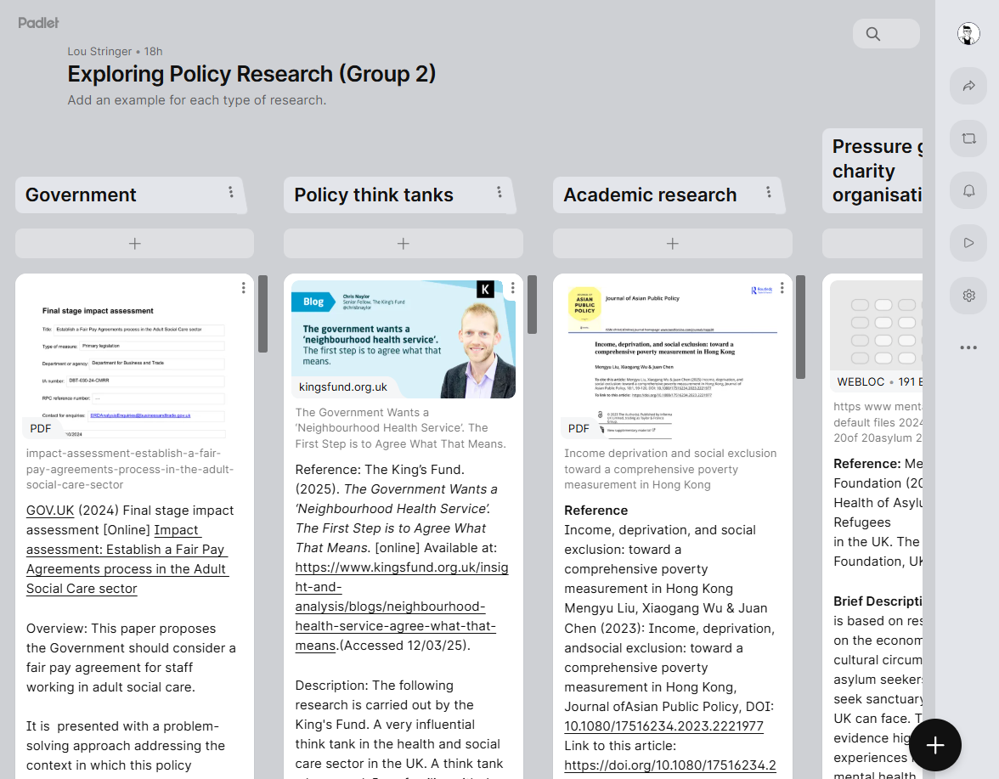
</figcaption>Example: Padlet to gather student-curated examples</figcaption>
</figure>

??? Abstract "Alternative tool: Ultra Discussion (within VLE site)"

    - The [Ultra Discussion tool](../ultra/discussions.md) can be very useful to collect outputs from specific tasks, such as finding or summarising an example.
    - Requires an Ultra VLE site accessible to the participants (eg. a module site).
    - Allows posting and commenting on others' posts, and supports a range of content types; text, links, images, embedded YouTube videos etc.
    - Discussions can be visible to all students, or [restricted to specific groups only](../ultra/discussions.md#assign-to-groups).
    - It is possible to [allow anonymous posting](../ultra/discussions.md#anonymous-posting), if desired.

    **Reworking the example Padlet**

    The Ultra Discussion tool is likely the best tool to replace this Padlet, as it's easy to access with other module materials and the research examples are available to refer to later. Create a Discussion in the relevant materials folder in your VLE site and add a starter post with each column heading. Students add their contributions to the relevant post.

    <figure markdown>
    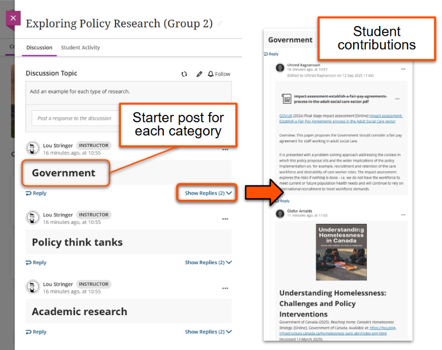
    </figcaption>Padlet reworked as an Ultra Discussion</figcaption>
    </figure>

<!-- ??? Abstract "Alternative tool: Google Docs (simple option)" -->

#### Example Padlet: collaborative in-session groupwork

In this *Breakout groups: Renewable energy options* Padlet in **Column** format, each group has a different energy type to research together. They post their work in their group's column, with one post per point. This could be similarly achieved in a **Wall** Padlet for each group.

This is one of Padlet's own example use cases: [Breakout groups Padlet example](https://padlet.com/sample_teacher/breakout-groups-renewable-energy-options-pr2ngbhlnhw9jspa)

<figure markdown>
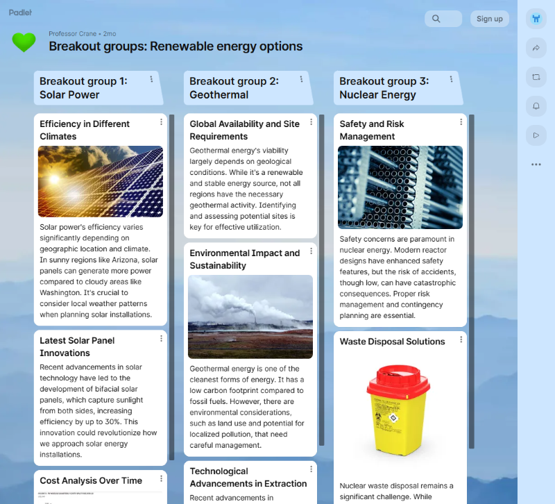
</figcaption>Example: Padlet for synchronous collaboration</figcaption>
</figure>

??? Abstract "Alternative tool: Google Slides (incorporating visual elements)"

    - [Google Slides](https://subjectguides.york.ac.uk/google/core-apps#s-lg-box-wrapper-18870757) is a good tool for collaborative work, especially with a visual aspect.
    - All students can work in the same Slides deck with 1+ slide per group, or each group can have their own Slides deck.
    - Supports a range of content: text, images, charts, links to external resources, video, audio etc.
    - Can be reviewed while students are working, on screen for plenary and retained for future reference.
    - Has the usual Google sharing options: specific users, University of York or Public. Users will need Edit access to contribute, but can change to Viewer access after the task to lock down content.
    - Maximum 100 synchronous contributors. May get messy if there are lot of users editing the Slides simultaneously.

    **Reworking the example Padlet**

    To incorporate visual elements in a poster style, Google Slides is a useful and relatively simple option to replace this Padlet. Create a Slides document and add one slide per group, or one Slides document per group. Give students edit access and they work on their own devices. Can be presented on screen for plenary review if desired.

    <figure markdown>
    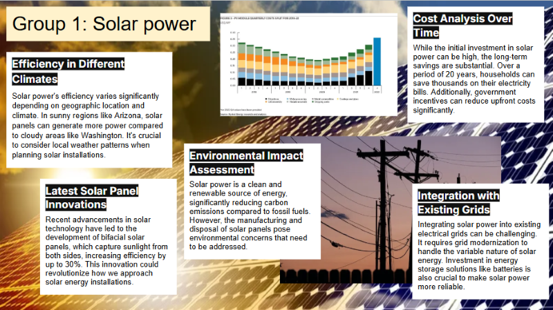
    </figcaption>Padlet reworked in Google Slides</figcaption>
    </figure>

??? Abstract "Alternative tool: Google Docs (simple text-based content)"

    - A [Google Doc](https://subjectguides.york.ac.uk/google/core-apps) is a good tool for text-based collaborative work.
    - Useful for lightweight content: add text and images directly, and links to files and videos.
    - Presentation and layout is much more restrictive than in Ultra VLE sites or Google Sites.
    - Document outline/table of contents built automatically using heading structure.
    - Can be reviewed while students are working, on screen for plenary and retained for future reference.
    - Has the usual Google sharing options: specific users, University of York or Public. Users will need Edit access to contribute, but can change to Viewer access after the task to lock down content.
    - Maximum 100 synchronous contributors. May get messy if there are lot of users editing the Slides simultaneously.

    **Reworking the example Padlet**

    For a text-based report, Google Docs is a useful and very simple option to replace this Padlet. Create a Doc and add one page per group, or one Doc per group. Give students edit access and they work on their own devices. Can be presented on screen for plenary review if desired.

    <figure markdown>
    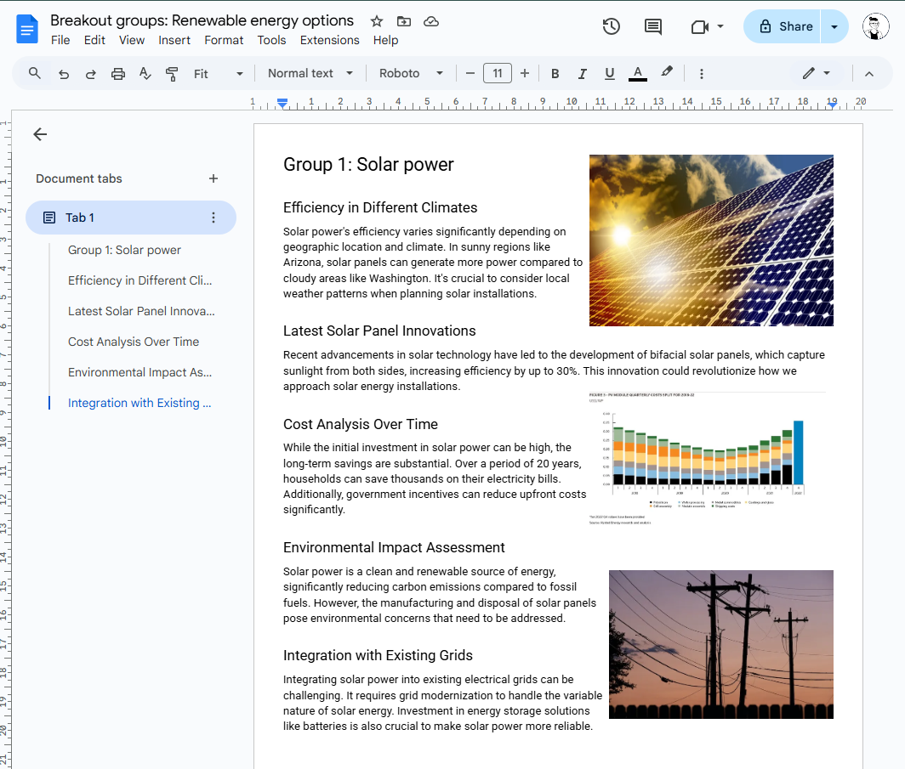
    <figcaption>Padlet reworked as Google Doc</figcaption>
    </figure>

<!-- Google Slides or Microsoft Whiteboards may be useful. Zoom has a built in whiteboard for use during Zoom calls. For more details, see [guidance on Google Slides, Microsoft Whiteboards, Zoom Whiteboards and more](https://subjectguides.york.ac.uk/project-management/boards). -->

---

### Staff-curated resources

Padlet is sometimes used to provide static materials and resources, such as:

- weekly lecture slides, tasks and reading items
- links to additional or extension resources
- careers or academic skills resources

In this use case, users access resources but do not contribute themselves.

#### Example Padlet: teaching materials

!!! Tip 
    
    Please **use your VLE site**! Teaching materials should be provided directly within the module's Ultra VLE site. Reading items must be provided on the Leganto Reading List.

This archive *Economic Data Analysis - Resources* Padlet used the **Column** format to present weekly module materials, containing:

- an introductory resource: article, link, YouTube video etc.
- lecture slides in PPT (with PDF slides on the VLE site)
- post-lecture tasks: reading items, VLE quizzes etc.
- uploaded PDFs of reading items

This was well organised and guided students through the content, but there are there are general problems presenting teaching materials in Padlet:

- Padlet require lots of scrolling, may have contrast issues, and don't allow users to select text. This makes it difficult to use for many users.
- Materials in a Padlet take students outside the module VLE site. This causes difficulties for some users, and is generally unpopular.
- Uploaded PDFs are problematic in terms of copyright and accessibility, amongst other issues. Readings should be added to the Reading List instead.

Once Ultra VLE sites and the [VLE Site Design Principles](../ultra/site-design-principles.md) were adopted, this Padlet was remade directly within the module site and reading items added to the Reading List.

<figure markdown>
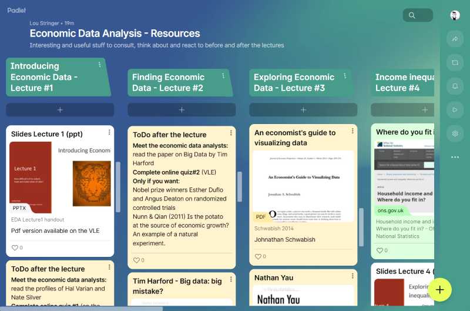
<figcaption>Example: Padlet used for weekly module materials</figcaption>
</figure>

??? Abstract "Required tool for module materials: Ultra VLE site"
    
    - The [Document](../ultra/documents.md) page type is the best option for providing most module materials. This uses drag-and-drop content blocks in a flexible layout to easily add text, images, video, files and more. Use column titles as section headings or an individual document.
    - Lecture slides and other files can be [uploaded with a Document](../ultra/documents.md#block-file-upload) to integrate with other content, or as [standalone items](../ultra/files.md).
    - Panopto and YouTube video content can be [embedded within a Document](../ultra/documents.md#block-html).
    - Students can use the Ally Alternative Formats tool to convert and download content in a way that works for them, and you can use the Accessibility Report to identify and fix issues.
    - **Do not upload or directly link to reading items**. Use the Reading List instead (see below).
    - Use your Departmental template materials sections; in most cases weekly sections or Documents.
    
    **Reworking the example Padlet**

    All non-reading item content should be added to the module Ultra VLE site. Add items from each weekly column to the relevant template weekly materials section. Most content is best added into a Document: overview, tasks, slides, details of readings etc. Add content such as Discussions and Quizzes as separate items within the weekly section, so that all weekly content is collated together. Once complete, remove the Padlet from the site.

    <figure markdown>
    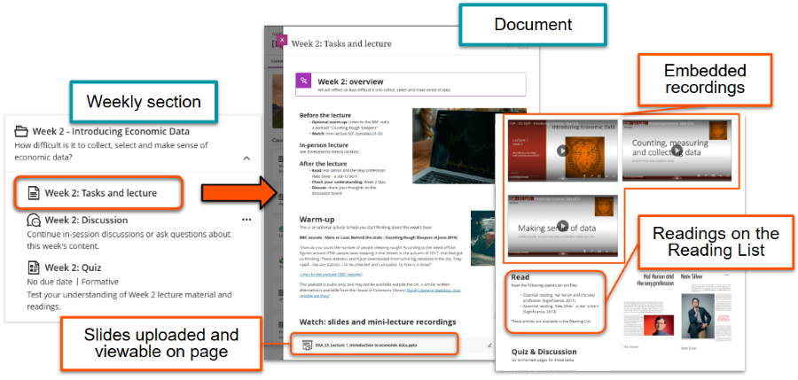
    <figcaption>Padlet reworked as Ultra VLE folder and Document with weekly materials</figcaption>
    </figure>

??? Abstract "Required tool for reading items: Leganto Reading List"

    From 2025/26, it is University policy that **all module readings must be provided through the [Leganto Reading List tool](https://subjectguides.york.ac.uk/readinglists/home)**. This collates all readings in one place and allows direct access to digital items via the University single-sign-on.

    !!! Warning

        Do not directly upload reading items to your Ultra VLE site, or link to them in Google Drive etc.
    
    **Reworking the example Padlet**

    Instead of adding resources to the Padlet, add them to the module Reading List. To use the tool effectively:

    - **tag** each item as Essential, Recommended or Background to help students prioritise and manage their workload. 
    - aid navigation by using the same **structure** as your VLE site. In most cases this should be weekly sections.
    - use the **Alternative Format Request (SSP)** tag to identify items for the Library staff to convert to digital format for students who can't access printed text.
        
    <figure markdown>
    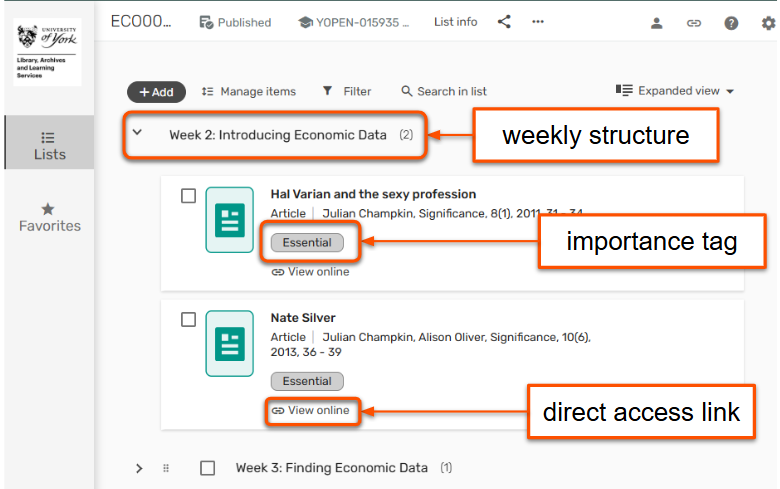
    <figcaption>Padlet reworked by adding items to Reading List</figcaption>
    </figure>

#### Example Padlet: non-teaching resources

This *You and Your Career* Padlet is one of a series of **Column** Padlets providing content as part of the York Law School's Careers & Development Programme. They contain a range of resource types, including:

- text content within the Padlet itself
- video demonstrations
- various useful files (PDF, Word etc.) and links

The Padlets are hosted within an ongoing VLE site for all current Law students.

<figure markdown>
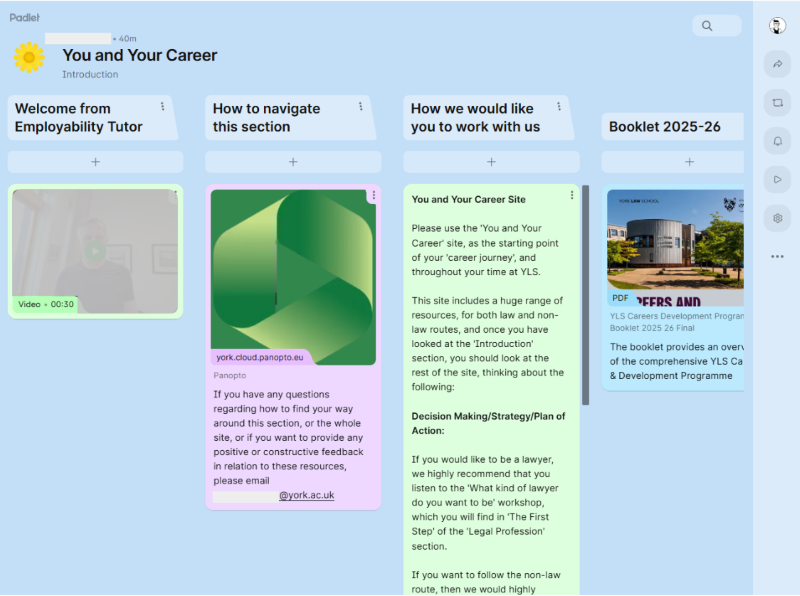
<figcaption>Example: Column Padlet for non-teaching resources</figcaption>
</figure>

??? Abstract "Alternative tool: Ultra VLE site (teaching-aligned content, current students)"

    - An Ultra VLE site is a suitable tool for providing 'teaching-aligned' content (eg. academic skills, career planning, lab skills), accessible in the VLE with module sites.
    - [Contact us](mailto:vle-support@york.ac.uk) to set up a new Ultra VLE site if needed.
    - The [Document](../ultra/documents.md) page type is the best option for providing most resources. This uses drag-and-drop content blocks in a flexible layout to easily add text, images, video, files and more.
    - Files can be [uploaded with a Document](../ultra/documents.md#block-file-upload) to integrate with other content, or as [standalone items](../ultra/files.md)
    - Panopto and YouTube video content can be [embedded within a Document](../ultra/documents.md#block-html).
    - Students can use the Ally Alternative Formats tool to convert and download content in a way that works for them, and you can use the Accessibility Report to identify and fix issues.
    - Usable with current students only.

    **Reworking the example Padlet**

    As the Padlet is already embedded in an Ultra VLE site and content is aimed at current students, the best alternative is to migrate the content from the Padlet to the VLE site itself. Create a [Document](../ultra/documents.md) (aka VLE page), Use the column titles as section headings and add the text, images, videos and files etc. Once complete, remove the Padlet from the site.

    <figure markdown>
    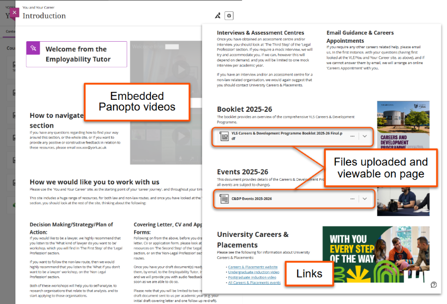
    <figcaption>Padlet reworked as Ultra VLE Document</figcaption>
    </figure>

??? Abstract "Alternative tool: Google Site (other content, staff, external users)"

    - A [Google Site](https://subjectguides.york.ac.uk/google/sites) is a simple website publishing tool that's useful to provide non-teaching related content, or any content for staff or external users.
    - Layout is very flexible, using a range of drag-and-drop 'content blocks' and collapsible sections. Various themes are available to style content.
    - Supports many content types, including text, images, embedded Google tools (Docs, Slides, YouTube etc.). External files (eg. PDF, Word) can't be added directly, but can be linked/embedded from Google Drive.
    - Has the usual Google sharing options: specific users, University of York or Public.
    - There is no access for students to directly download the content, or native accessibility tools within the Site.

    **Reworking the example Padlet**

    If access is needed for external users (eg. alumni), Google Sites could be used to present non-teaching content. This is also a good option for staff-facing content. [Create a Google Site](https://subjectguides.york.ac.uk/google/sites#s-lg-box-wrapper-19232733), add the text, images, embedded videos etc. You may need to upload files to Google Drive to add them. Once complete, publish the site and share with users (viewer access).

    <figure markdown>
    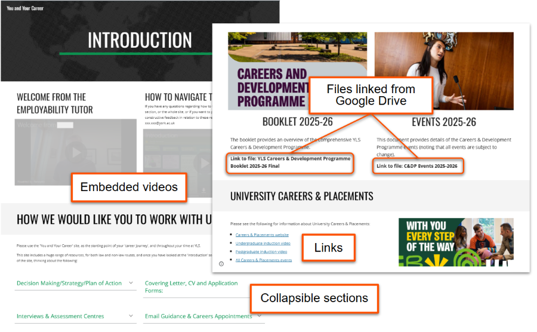
    <figcaption>Padlet reworked as a Google Site page</figcaption>
    </figure>

??? Abstract "Alternative tool: Google Docs (very simple option)"

    - A [Google Doc](https://subjectguides.york.ac.uk/google/core-apps) is a very simple option to present curated non-teaching resources.
    - Useful for lightweight content: add text and images directly, and links to files in Google Drive and videos in Panopto/YouTube.
    - Presentation and layout is much more restrictive than in Ultra VLE sites or Google Sites.
    - Document outline/table of contents built automatically using heading structure.
    - Has the usual Google sharing options: specific users, University of York or Public. Give users View only access.

    **Reworking the example Padlet**

    While basic, Google Docs could be an option to quickly and simply convert non-teaching content from a Padlet. Create a Google Doc, add the text and images, and link to videos/files etc. Once complete, share the Doc with users (viewer access).

    <figure markdown>
    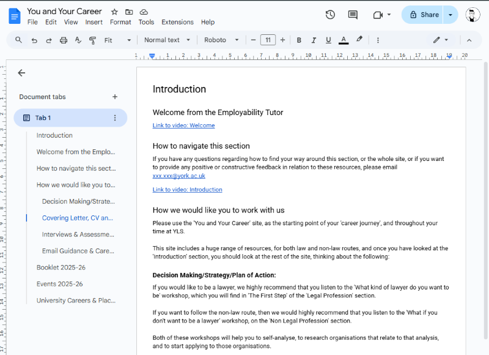
    <figcaption>Padlet reworked as Google Doc</figcaption>
    </figure>

---

---

<!-- Students also adding content in (eg ARC tree) -->

<!-- ### Bulletin boards -->

### Journal or reflection space

The [Ultra Journal tool](../ultra/journal.md) could be useful in this context. This is a private space for either an individual or a group of students and the teaching staff. Staff can comment on student work.

<!-- Something about group work? IPC type thing -->

---

### Curated Maps

[Google’s My Maps tool](https://www.google.co.uk/maps/about/mymaps/#:~:text=GET%20STARTED-,MAKE%20MAPS,-Easily%20create%20custom) allows users to build shareable, curated maps.

---

### Mind Maps / Workflows

Mind maps can be created in the University’s supported [MindGenius tool](https://www.york.ac.uk/it-services/tools/mindgenius/).

---

### Timeline Building

[Timelines can be built in Microsoft PowerPoint](https://support.microsoft.com/en-gb/office/create-a-timeline-in-powerpoint-d1bd35a0-bfa7-428b-ba3c-c8f5b6050791), and then uploaded to the VLE or elsewhere.

---

<!-- ### Portfolio

Google sites
Department-specific tool -->