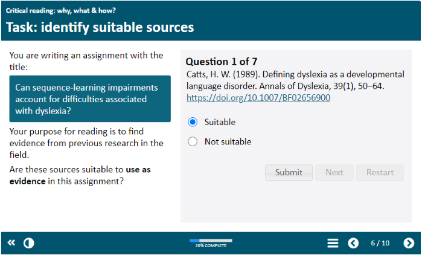
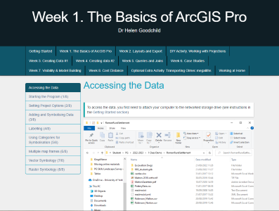
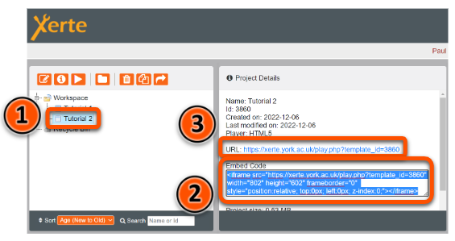
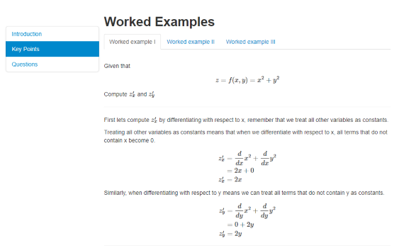

---
tags:
    - Accessibility
    - Interactive content
    - Other tools
---

# Xerte

!!! Summary
    Xerte is a tool to create interactive online learning content.
    
## What Xerte can do

Xerte (pronounced Zer-Tee) is an authoring tool for **flexible, interactive and accessible online content**. Xerte objects can be embedded or linked within VLE sites, and are very well suited to supporting flipped learning approaches.

There are two formats of Xerte objects:

- As an **interactive slide deck** (Online Toolkit type)

    ---
    Slide or page-style objects that can be embedded within VLE sites.
   
    Great for integrated or flipped learning resources, such as preparation or review tasks.

    [Example slide deck Xerte: Critical reading guide](https://xerte.york.ac.uk/play.php?template_id=1746)
     

- As a **simple web page** (Bootstrap type)

    ---
    Responsive and flexible web pages that work well on any size device.
    
    Great for standalone resources or presenting large amounts of content, such as semester-long workbooks or guides.

    [Example webpage Xerte: Achaeology Using ArcGis Pro workbook](https://xerte.york.ac.uk/play.php?template_id=1267)
     

## Embed Xerte objects

You can embed both formats into other platforms. For example, integrate a Xerte object with other teaching materials by [embedding it in a Learn Ultra Document](../../ultra/documents.md#block-html).

To locate the Xerte embed code:

1. Click the name of the Xerte object to embed.
2. In the *Project Details* box, copy the embed code from the **Embed Code** text box.
3. When creating the link to your Xerte item, copy the **URL** above the **Embed code** text box.
  

## Case study

!!! case-study "Case study: Using Xerte to enhance asynchronous learning"

    Phil Martin and Dawn Genner Lowson outline how they use Xerte to create interactive materials with built-in feedback to support asynchronous learning.

    Watch their presentation:
    <iframe src="https://york.cloud.panopto.eu/Panopto/Pages/Embed.aspx?id=d87fc4fc-b05a-4ee3-af92-aecc00cf2948&autoplay=false&offerviewer=true&showtitle=false&showbrand=false&captions=false&interactivity=all" height="405" width="720" style="border: 1px solid #464646;" allowfullscreen allow="autoplay" aria-label="Panopto Embedded Video Player" aria-description="Using Xerte to enhance asynchronous learning - Phil Martin and Dawn Genner Lowson" ></iframe>

    [Using Xerte to enhance asynchronous learning (Panopto viewer)](https://york.cloud.panopto.eu/Panopto/Pages/Viewer.aspx?id=d87fc4fc-b05a-4ee3-af92-aecc00cf2948) (2 mins 47 secs, UoY log-in required)

    See the [full case study for more details and the transcript](../training/case-studies/ipc-martin-genner.md).
    You can also browse our [full set of case studies](../training/case-studies/index.md).

## Interactivity & content types

### Interactive tasks

Xerte supports a range of interactive content types, including:

- multiple choice quizzes
- gap fill text
- matching options
- drag and drop categorisation
- hot spot/'pin the tail on the image'

### Layout & navigation

Xerte allows very flexible content presentation:

- full width or column layout
- callouts to highlight key information
- easily break up content: eg. accordion, drop down, tabbed sections
- multiple menu and navigation options

### Media

Xerte offers various ways to integrate media with text content, including:

- image/audio slideshow
- thumbnail image & text carousel
- media synched with text

### Maths content

Xerte is an excellent tool for accessibly presenting maths content online. It converts equations entered in LaTex to MathML, the standard for accessible online maths content.

## Full Xerte guide

Explore our full Xerte guide for more information on:

- what Xerte can do
- setting up your Xerte account
- a range of example Xerte objects
- the guide itself is an example of the webpage/Bootstrap style Xerte object.

You can [view the full Xerte guide in its own tab](http://bit.ly/ytel-xertepage) or embedded below:
<!-- Xerte embeds works in live, but not local -->
<iframe src="https://xerte.york.ac.uk/play.php?template_id=116" width="100%" height="800" frameborder="0" style="position:relative; top:0px; left:0px; z-index:0;"></iframe>