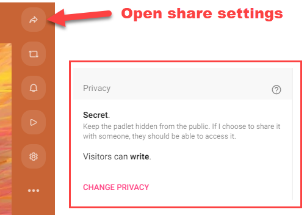
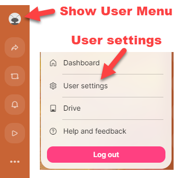
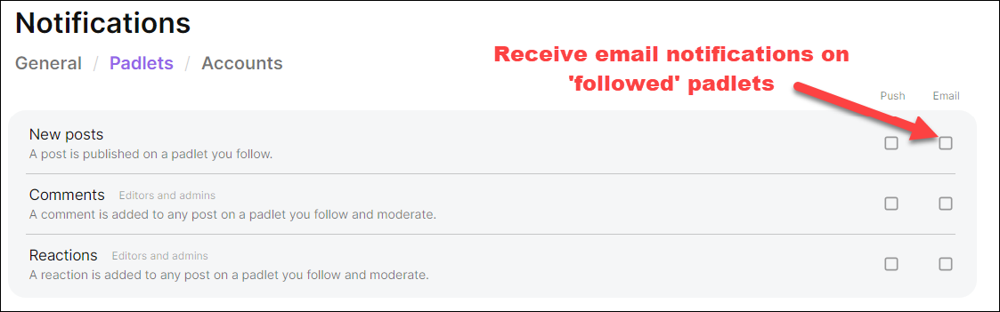

---
tags:
    - Foundation
    - Teaching
    - Ultra
    - Padlet
---

# Using Padlet as an alternative to Ultra discussion boards

!!! Summary

    Native discussion boards in Ultra VLE sites do not allow anonymous posting, nor email subscription/notifications for new posts. This guide describes using a Padlet board as an alternative, as it allows both.

## Background
As described on [the discussions page](https://vle-support.york.ac.uk/ultra/discussions/) of our Blackboard Learn Ultra guides, discussions offer a useful vehicle for asynchronous communication in your module.  You can create different discussions in different sections of your VLE site to allow students to communicate with peers and staff on different topics, and you can assign discussions to groups and allocate marks to postings.  

However, it is not currently possible to allow students to post anonymously to a discussion in Blackboard Ultra, and it is also not possible for users to ‘subscribe’ to discussions so that they are sent an email notification when a posting is made.  This guide shows you how to use Padlet as an alternative for anonymity and subscription using Padlet. It also shows you how to set up moderation on posts.

## General Padlet Guidance
For general information on using and setting up Padlets , see the University of York Padlet page. This shows you:

- How to log on to Padlet (Make sure you log on to “https://uniofyork.padlet.org/ ” [NOT padlet.com]).
- What different layout options are available
- How to create a padlet and share it with your students
- How to post to a padlet
- How to use Padlet on a module device.

The rest of this guide covers specifics to help with using Padlet as a discussion board replacement.

## Anonymous Padlets
It is important to note that the only way to ensure anonymity in a Padlet is to make sure that students do not log onto Padlet before they make a posting or add a comment.  By default, the name of a logged on user is collected when they make a posting and, as the Padlet creator, you can toggle the name display on or off at any time.  If you switch on the option to display names, the collected name will appear above a posting, but users who are not logged on are identified only as ‘Anonymous’.

- **Share settings**: To make sure that names are not displayed anywhere in a Padlet, firstly open the share settings to make sure that the privacy settings selected are ‘Secret’ and ‘Visitors can write’.  These are the default padlet settings but if you need to change this, select the ‘change privacy’ option. These settings will give students access to be able to post to your padlet without needing to log in.

- **Posting settings**: Next, open the padlet settings to check the Posting settings.  Make sure that the ‘Author and timestamp’ settings are off. This will ensure that names are not included above any postings regardless of whether students were logged into Padlet when the posting was made. NB If you toggle this setting on, even after a posting is made, the names of any students who were logged on when the posting was made will be displayed.  Anyone who was not logged on when the posting was made will display as ‘Anonymous’.

## Moderation in Padlets (aka approving posts)
You can switch on moderation in Padlet so that posts made by students will not be displayed until you approve them. To do this, open the padlet settings and select ‘Manual - all’ from the moderation settings. 

Once you have selected this option, you will see an option to ‘approve’ or ‘reject’ all new postings.  They will only be displayed to others once you have approved them.  Depending on your notification settings (see below), you will also receive an email when a post is awaiting approval.

## Subscribing to Padlets (aka getting notifications)
Notifications allow you to ‘subscribe’ to a Padlet so that you will receive an email when postings are made.  You can choose notification settings that will apply to all padlets you create, and adjust them for specific padlets.

To edit your notification settings, select ‘Show user menu’ and ‘User settings’.

Select ‘Notifications’ to view and adjust your settings.  

There are checkboxes to allow you to switch on or off notifications via email or via ‘push’ notifications which will appear in your browser if these are supported and enabled in your browser.  You can alter your ‘General notifications’ to, for example, trigger an email when a post is waiting for your approval or when someone comments on a post you have added.  You can also use the ‘Padlets’ notification settings to change your settings for specific padlets.  You will see a list of all the Padelts you have created and be given an option to ‘Follow’ or ‘Unfollow’ each.  You can select the ‘Email’ checkboxes to receive notifications on ‘followed’ padlets for new posts, comments, and reactions.

## Further Help

- [Padlet guide: Content moderation](https://padlet.help/l/en/article/v6iz7bhhl1-turn-on-content-moderation)
- [Padlet guide: Notifications](https://padlet.help/l/en/article/2amj6wjed4-notifications).