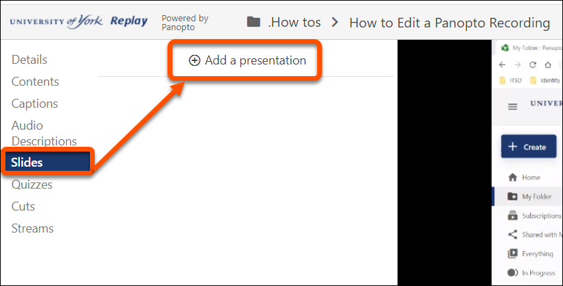
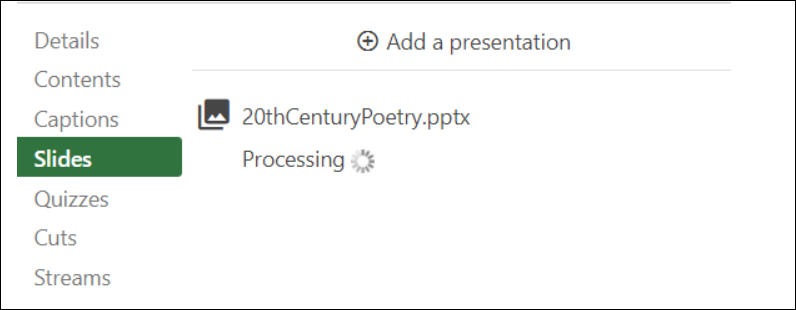
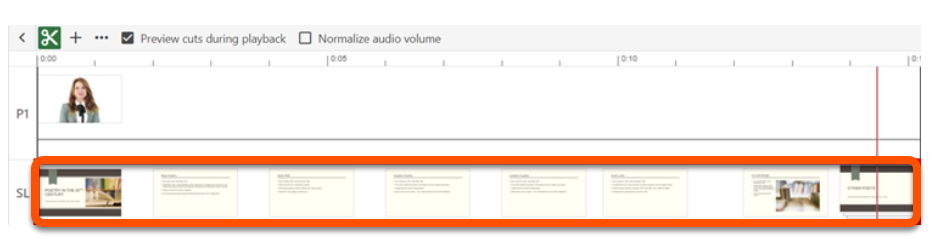

---
tags:
    - Key guide - teaching
    - Panopto

---

# Adding Presentation Slides to you Recording

!!! Summary

    You can attach a slide deck (presentation) to an existing Panopto video.

## Text Steps

1. In the editor, click on the **Slides** option in the left navigation menu.

2. If you have slides already in your Panopto video, a thumbnail image of each slide will
appear along with the time that it appears inside your video. If you'd like to add
slides to your video, click **Add a presentation** above and select your slide deck from
your computer.
3. To **add a presentation**, locate and select the PowerPoint you wish to add to your
video. Panopto will upload all slides in the presentation and allow you to preview
them once processed.

4. To add a slide to the video, click in the timeline to move the red line to the exact spot
you want to add the slide.

5. Select the **Plus icon** next to the slide to add it. Repeat this step to add additional
slides.

6. A new stream appears within the timeline and your slides will now appear in the video
stream.

7. To edit where a slide appears, select the **three dots** next to the slide and then select
**Edit**.

8. On the **Edit Table of Contents** entry page, you can manually type in the time you
want the slide to appear. When completed, click **Save**.
9. To remove a PowerPoint slide from the video, select the three dots next to the slide,
and then select **Delete**. *Note: The slide won't be permanently deleted, so you can
add the slide back into the video later if needed.*
10. Apply your changes using the **Apply** button in the top-right corner when you're
finished. 

