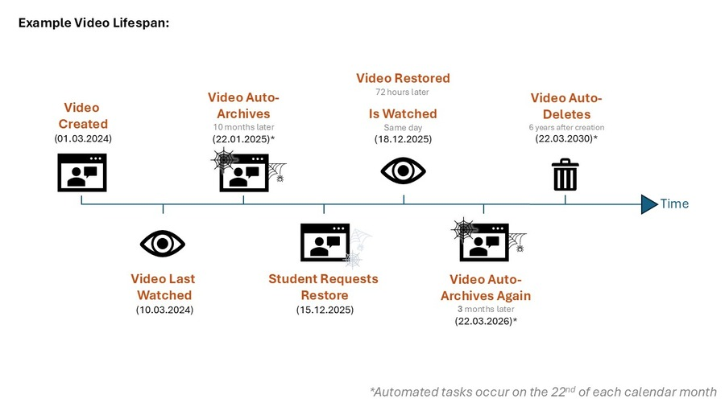
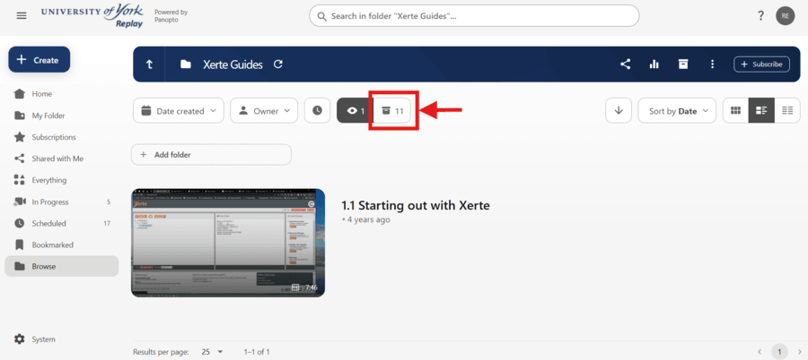
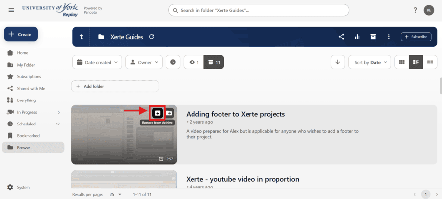
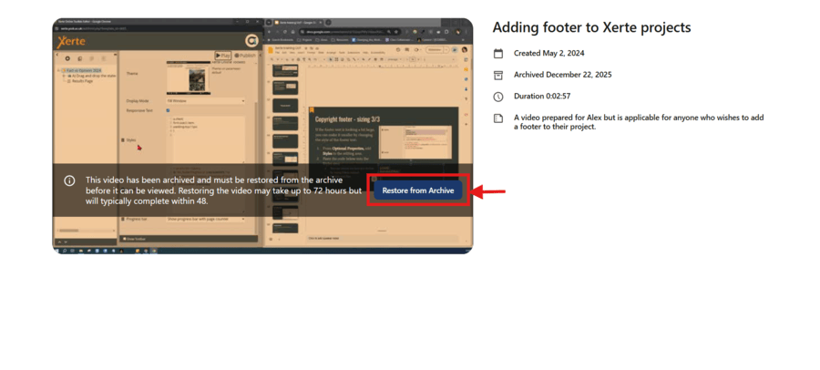
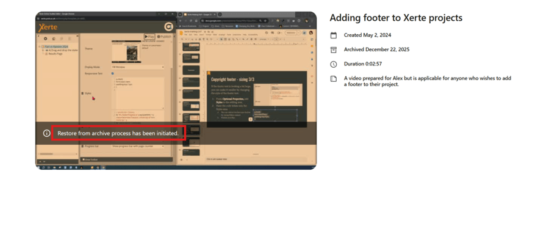
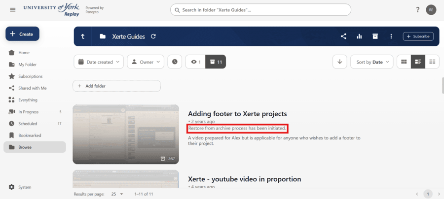

---
tags:
# Delete to leave only relevant tags

    - Panopto
---

# Content retention in Panopto
!!! Summary
    Panopto videos are automatically archived and deleted based on how long ago they were created and when they were last viewed.

## Background
[Since March 2024](https://elearningyork.wpcomstaging.com/2024/02/28/replay-update-new-panopto-purge-process-automatic-deletion-of-video-content-5yrs-old/) the Panopto (aka Replay) video system has had automatic archiving and deleting processes in place, to help ensure we are in line with GDPR, our Panopto license agreement, and the University’s archiving policies. These policies apply to all content and subfolders within a folder. Automated tasks occur on the 22nd of each calendar month.

## Recordings of timetabled teaching
Any recording that belongs to a taught module and is scheduled to be recorded falls into this category. If you have a Panopto folder linked to a VLE site, it is most likely this type. The following policies apply to all content in these folders. 

- Videos that were created less than 1 year ago will be archived when they have not been viewed for at least 10 months.
- Videos that were created more than 1 year ago will be archived when they have not been viewed for at least 3 months.
- Videos that were created more than 6 years ago will be deleted if they are in the archive.

 

## "My Folder"
All staff have a personal folder, labelled “My Folder”. Videos should never be shared from these folders. The following policies apply to all content in “My Folder”.

- Videos will be archived when they have not been viewed for at least 10 months.
- Videos are never automatically deleted.

## Ongoing Media
Departmental “Ongoing Media” folders are a way to reuse content over multiple academic years. The following policies apply to all content in Ongoing Media folders.

- Videos will be archived when they have not been viewed for at least 13 months.
- Videos are never automatically deleted.

## What counts as a view?
For Panopto to recognise a “view”, a video needs to be opened and played for any amount of time. Doing this will reset the period of time allowed before the video is archived. 

## Can My Videos Be Exempted?
Videos can be moved into an Ongoing Media folder, but only if a valid use case for this is provided. Exceptions from archiving will only be considered in exceptional cases. 

## How do I restore a video from the archive?
1. Folders which contain archived videos have the option to show “ready to view” videos, or to show “archived” videos. 
2. Hovering over an archived video brings up the option to “restore from archive”. Selecting this will begin the process. 
3. Opening the video will show when it was archived, and an alternative button to “restore from archive”.  
4. Once the request has been made, a message will state “Restore from archive process has been initiated”. This will show in both the folder view and the opened video. It can take up to 72 hours for videos to be restored, and nothing can be done to restore videos faster.  