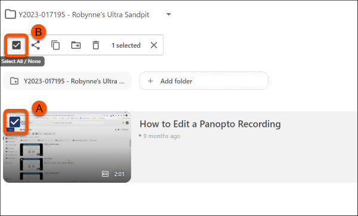
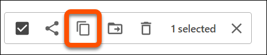
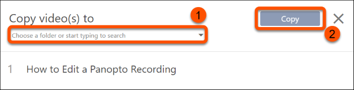

---
tags:
    - Panopto
---

# Copying Panopto recordings to other module sites

!!! Summary

    Panopto recordings can be copied manually to other courses, so other student cohorts have access to the recordings they need.

## Quick Start Guide

1. Go to your module site in **Blackboard Ultra**.
2. Click on the **Replay Lecture Capture (Panopto)** link on your VLE **Course Content** page.
 
3. In the Panopto folder, **hover** your cursor over the recording you want to copy.
4. **Check** the box that appears in the top-left hand corner of the video thumbnail as shown below (A).
 
5. To select multiple videos, **check** the **select-all/none** check box as shown above (B).
6. Click **Copy**.
 
7. **Search** for the module code (eg: ENG00001I) or VLE site code (eg: Y2023-000001), or navigate through the folders using the dropdown menu. 
 
8. Click **Copy**. 
9. Your video(s) will then be copied over to the associated VLE module site. 
10. To copy recordings to multiple sites, **repeat** the above steps as many times as needed.

!!! Tip 
    By default, when a recording is copied, a "Reference Copy" is created meaning that any edits you make in the original recording will also be reflected in the copies you have made. 

## More Details and Troubleshooting 

1. If you need to copy over content from a previous academic year, refer to [our Reusing Module Media guide](../panopto/reusing-module-media.md)

2. For more details on how Reference Copies in Panopto work, refer to [Panopto's Guide on using Reference Copies](https://support.panopto.com/s/article/Learn-About-Video-Reference-Copies).