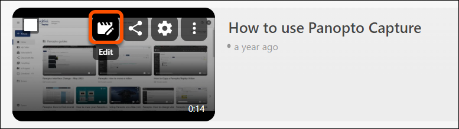
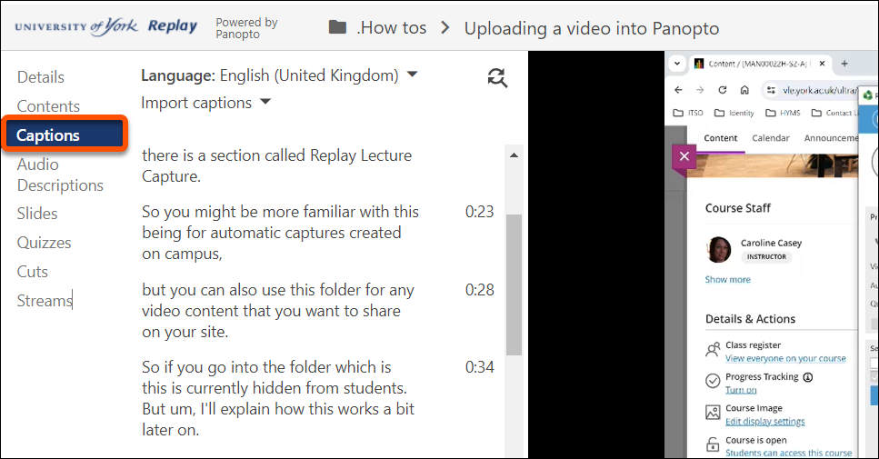
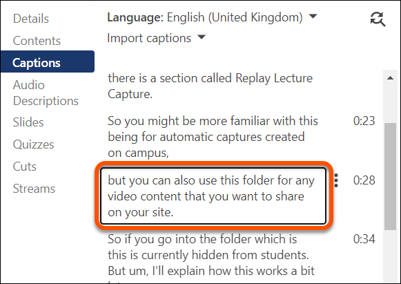
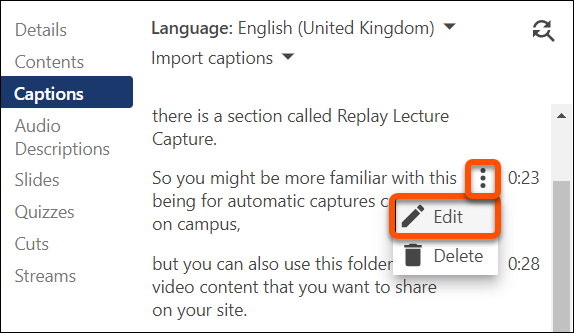

---
tags:
    - Accessibility
    - Panopto 
---

# Editing captions in Panopto

!!! Summary

    Pre-recorded videos must be accurately captioned to meet accessibility standards and for usability.

!!! principle "Relevant [VLE site design principles](../ultra/site-design-principles.md)"

    - 3.5 Essential: Pre-recorded videos are hosted in a streaming service and captioned accurately.

## Captioning & accessibility

Under the Public Sector Bodies (Websites and Mobile Applications) (No. 2) Accessibility Regulations 2018, University digital resources should meet the [WCAG 2.2 AA accessibility standard](https://www.gov.uk/service-manual/helping-people-to-use-your-service/understanding-wcag).

**It is your legal obligation to ensure that your digital teaching materials meet this standard.** 

To meet these standards, **pre-recorded videos** must have accurate captions. This includes:

- "at-desk" style lecture recordings: pre-prepared screencast recordings of lectures, talks, cohort feedback etc.
- lecture capture recordings re-used from a previous academic year
- video resources provided via YouTube, Box of Broadcasts or other platforms

Panopto provides auto-captioning for recordings, but [automatic captions alone are often insufficient without manual quality checking](https://www.w3.org/WAI/media/av/captions/#automatic-captions-are-not-sufficient). You will need to check and edit the captions as necessary before [making the recording available to students](../panopto/change-availability.md).

!!! Tip

    It isn't required to edit auto-captions on lecture captures for the current academic year as these are classed as 'live' recordings. However, students can request that captions be corrected or be made available in an alternative format if necessary.

## Captioning best practices

- **Keep Captions Concise**: Aim for one to two lines per caption for readability.
- **Ensure Accuracy**: Double-check the spelling of names, technical terms, and punctuation.
- **Consistency**: Use consistent capitalization and formatting across captions.
- [More detail on subtitles and transcripts](https://subjectguides.york.ac.uk/media/subtitles) (including on YouTube and other platforms) is available on the Practical Guide to media editing.

## Editing captions in Panopto

1. Sign into [Panopto](https://york.cloud.panopto.eu/) with your University of York credentials, or access the Panopto folder within your VLE site.
2. Locate the video to edit. Hover over the thumbnail, then click the **Edit icon**.
 
3. In the editing screen, click the **Captions** tab in the left-hand menu.
 
4. Click any caption text to make corrections. Type in the box to modify the text for accuracy, clarity, and punctuation.
 
5. To synchronize captions with audio, click the **three dots icon** then **Edit** to manually enter the time, or adjust the start and end times by dragging the handles.
 
6. **Preview captions** by playing the video to ensure edits are correct and properly timed.
7. Click **Apply** in the top-right corner to save your edits. Choose whether to replace the existing session or create a new version.

## Troubleshooting

- **Misaligned Captions**: adjust the timestamps if captions do not sync with audio.
- **Missing Captions**: check that captions are enabled and properly uploaded.
- **Saving Issues**: check your internet connection; try applying changes again if edits do not save.
- Visit our comprehensive [Panopto Recordings and Captions](https://docs.google.com/document/d/1eX5K4zg-yl13uYuK6SsMUa-qgiQzG5w5c2zh4rEGKj4/edit) guide for details on how to edit captions on a larger scale and for more complex editing and troubleshooting tips page.
