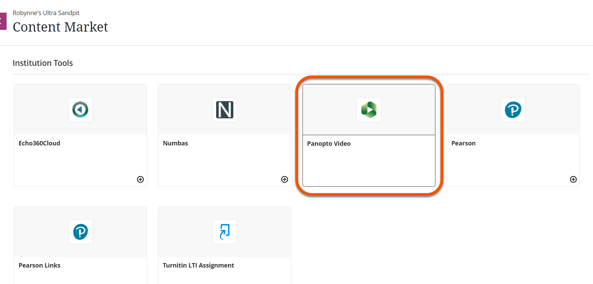
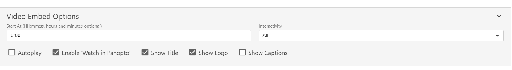
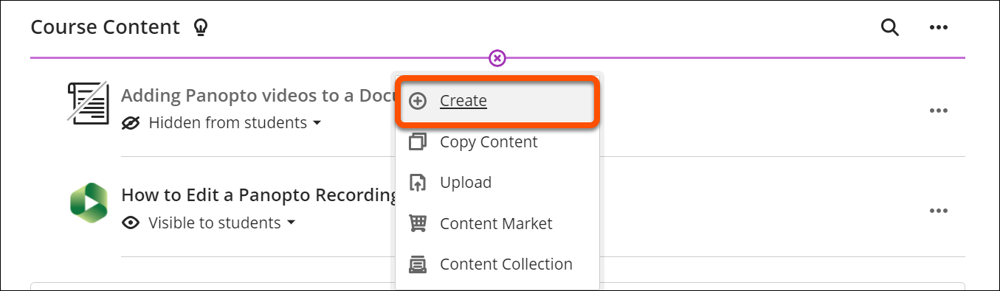
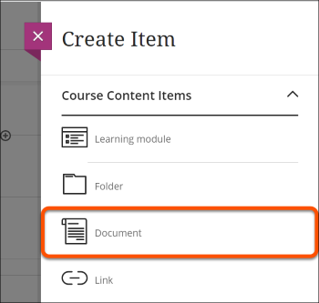
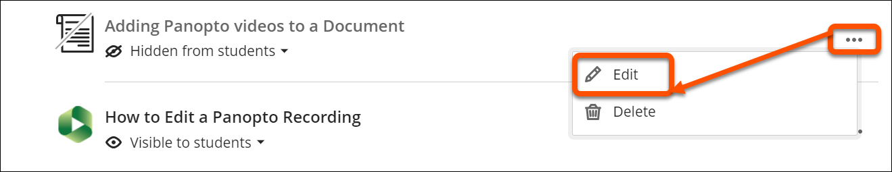
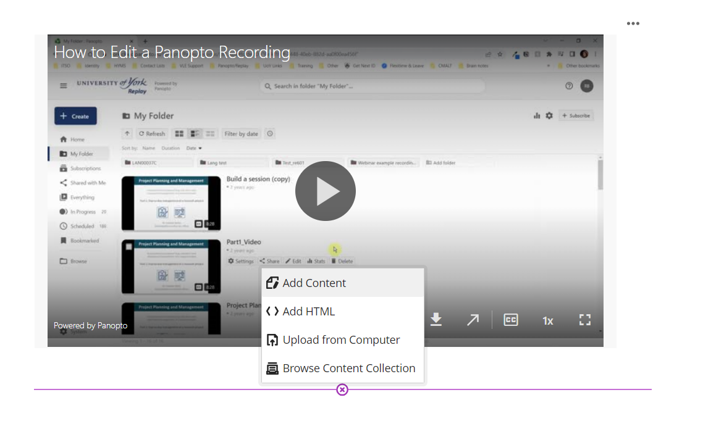
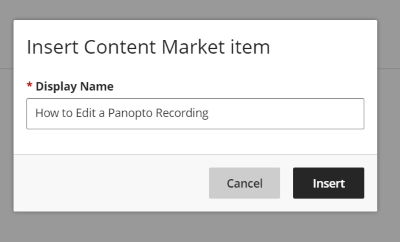
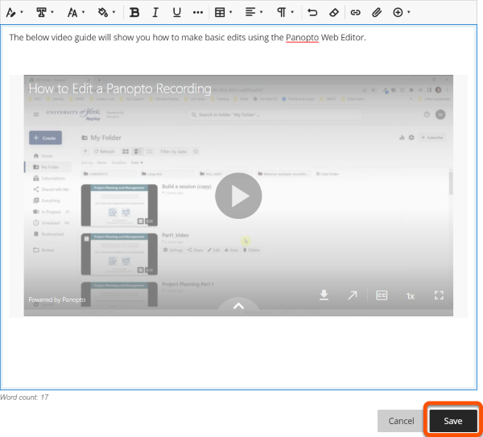

---
tags:
    - Ultra
    - Panopto
---
<!-- TO DO: RE-SIZE AND RE-UPLOAD IMAGES, ADD BORDERS, EDIT AND EMBED INSTRUCTIONAL VIDEO-->
# Embedding Panopto Videos in Blackboard Ultra

!!! Summary

    Embed Panopto video content into a Course Content area or Document in an Ultra site.

## Overview

Lecture capture recordings are available though the LTI link to the module's Panopto folder. However, you can also link to or embed videos within module content.

!!! Warning

    If you wish to reuse videos from a previous year, current students will not automatically have access to older content. Refer to our [Reusing Media guide](../panopto/reuse-module-media.md) for details on how to set this up correctly.

## Link to a Video in the Course Content area

1. From your VLE Ultra course, click the **plus** icon wherever you wish to add this content.
2. Select **Content Market** from the pop-up menu as shown below.
3. From the listed available tools, select **Panopto**. 
 
4. You will see listed any video content already uploaded to your course’s folder. Select the video you wish to embed. You can also upload and record new content directly in to this folder. 
    - **Note**: You can also use the search box in the top left of this window to search for and access an Ongoing Media folder if you have one (just search for "Ongoing Media").
5. Click **Insert**. 
6. Should you wish to apply further embed options, click the downward facing arrow next to **Video Embed Options**. Choose the options you wish to apply to your video. 
 

## Embed a video in a Document (or other content item)

1. If the document doesn’t exist, navigate to where you want the document to be, click the purple **plus icon** and click **Create**. 
 
2. From the side panel, select **Document**.
 
3. If the document does exist, click the ellipsis menu (three dots) next to its name and **Edit**.
 
4. Navigate to the space in the document you want to add the video and click the purple **plus icon**. Select **Add Content**.
 
5. In the text box editor, click the **plus icon**.
6. From the menu that appears, select **Content Market**.
7. From the page that now appears, select **Panopto**.
 
8. Select the video you want to embed by clicking the small radial button to the immediate left of the video. Click **Insert**. 
    - **Note**: You can also use the search box in the top left of this window to search for and access an Ongoing Media folder if you have one (just search for "Ongoing Media").
9. You will be prompted for a display name of the video. The default is the original name of the video. Click **Insert**.
 
10. The video will now appear embedded. Click **Save** to complete the process.
 

Watch a demonstration of embedding panopto videos in an Ultra Document:
<iframe width="100%" height="400px" src="https://www.youtube.com/embed/2KA0UWiTMWI?si=lOc9q46A84bqqpbO&amp;start=463" title="YouTube video player" frameborder="0" allow="accelerometer; autoplay; clipboard-write; encrypted-media; gyroscope; picture-in-picture; web-share" allowfullscreen></iframe>
[Ultra Essentials clip: embedding Panopto videos [YouTube]](https://youtu.be/2KA0UWiTMWI?t=463)