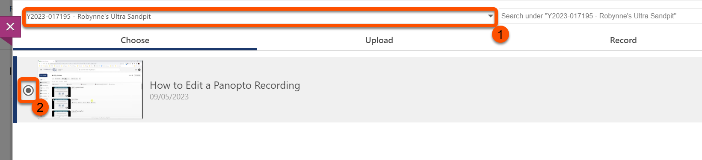
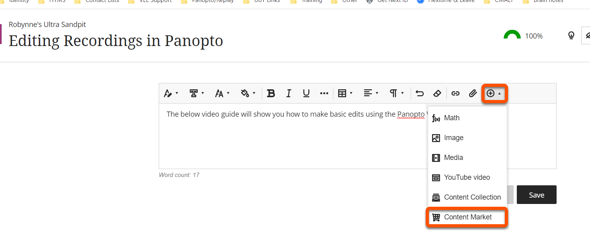

---
tags:
# Delete to leave only relevant tags
    - Foundation
    - Ultra
    - Panopto
---
<!-- TO DO: RE-SIZE AND RE-UPLOAD IMAGES, ADD BORDERS, EDIT AND EMBED INSTRUCTIONAL VIDEO-->
# Embedding Panopto Videos in Blackboard Ultra

!!! Summary

    Embed Panopto video content into a Course Content area or Document in Blackboard Ultra.

<!--### Video Steps

Below is an embedded video detailing how to DO THE THING. Alternatively, you can [open the video in a new browser tab](VIDEO URL).

<!-- PASTE YOUTUBE EMBED (should look like this:) -->
<!--<iframe width="560" height="315" src="VIDEO EMBED URL" title="YouTube video VIDEO TITLE" frameborder="0" allow="accelerometer; autoplay; clipboard-write; encrypted-media; gyroscope; picture-in-picture" allowfullscreen></iframe> -->

## Create a Link to you Video in your Course Content

### Text Steps

1. From your VLE Ultra course, click the **plus** icon to add content.
2. Select **Content Market** from the pop-up menu as shown below.

3. From the listed available tools, select**Panopto**. 

4. You will see any video content uploaded to your course’s folder. Select the video you wish to embed. You can also upload and record directly in to this folder.
5. Click **Insert**. 

6. Should you wish to apply further embed options, click the downward facing arrow next to **Video Embed Options**. Choose the options you wish to apply to your video. 

## Adding your Video to A Document or Discussion

### Text Steps

1. If the document doesn’t exist, navigate to where you want the document to be, click the purple **plus icon** and click **Create**. 

2. From the side panel, select **Document**.

3. If the document does exist, click the ellipsis menu (three dots) next to its name and **Edit**.
[Annotated screenshot showing edit menu of a document ](Images/embed-video-10.png)
4. Navigate to the space in the document you want to add the video and click the purple **plus icon**. Select **Add Content**.

5. In the text box editor, click the **plus icon**.

6. From the menu that appears, select **Content Market**.
7. From the page that now appears, select **Panopto**.

8. Select the video you want to embed by clicking the small radial button to the immediate left of the video. Click **Insert**

9. You will be prompted for a display name of the video. The default is the original name of the video. Click **Insert**.

10. The video will now appear embedded. Click **Save** to complete the process.

!!! Tip

    NB: If you wish to reuse videos from a previous year, current students will not automatically have access to older content. Refer to our Reusing Media guidance as linked below. 

## More Details and Troubleshooting 
[How to reuse media from previous years](https://vle-support.york.ac.uk/panopto/reusing-module-media.md)

