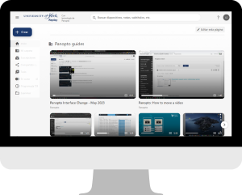

# Panopto

!!! Summary
    [Panopto](https://york.cloud.panopto.eu/) is York's tool to create, share and manage video content.

## What Panopto can do

At UoY, Panopto...

- powers the Replay lecture capture system
- links Learn Ultra module sites to Replay recordings
- allows staff to create their own 'at-desk' recordings
- lets all users download transcripts

## Panopto guides

!!! Note

    We are in the process of migrating our Panopto guides to this site from Google Drive.

To find the guide you need:

- explore our guide topics in the navigation menu
- search for specific content with the search box (top right)
- browse the [Site index](../help/site-index.md) to see all guides listed by topic tags

While we migrate guides, you may also find these useful:

- [Panopto staff guides [Google Drive]](https://drive.google.com/drive/folders/1TemPLfuoCsrsKjqzO5G6hbY-uZHJswvQ?usp=sharing)
- [Replay/Panopto Quick Start Guide](https://docs.google.com/document/d/1xsWX7PMX1alj_jMug3JIaiAzV8zAi5SongjkBN-ZHyA/edit?usp=sharing)
- [Help! My students can't see my recordings](https://docs.google.com/document/d/1L7qWGwEyIBvwjhpEit0tbVBBoBeMwUhDl_drl2-OENg/edit?usp=sharing)

## Blog: Panopto

Our [DET Blog: Panopto](https://elearningyork.wpcomstaging.com/category/tool/video-panopto/) covers Panopto-specific in-depth news items, research news and time-sensitive updates (also embedded below).

<iframe width="100%" height="600px" title="Digital Edutation Team blog - Learn Ultra" src="https://elearningyork.wpcomstaging.com/category/tool/video-panopto/"></iframe>