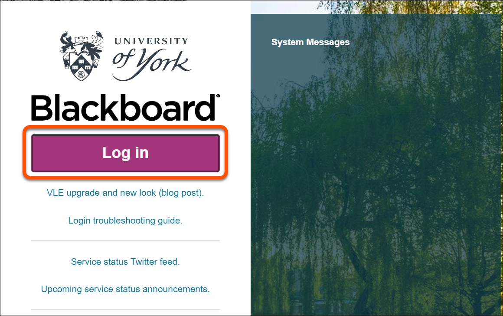
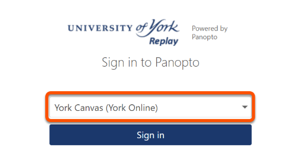

---
tags:
    - Key guide - teaching
    - Panopto
---

# How to Log into Panopto 

!!! Summary

    For the best experience, log in to Panopto using either Chrome or Firefox.

1. Go to https://york.cloud.panopto.eu 
2. From the dropdown box select either University of York (Non York Online) or York Canvas (York Online)
3. Click **Sign in**.
4. You will be prompted to Log In via Blackboard or Canvas (depending on which VLE you use)
 
5. Enter in your UoY credentials (just your username without the @york.ac.uk and your IT account password).
 
6. Follow any Duo two-factor authentication steps as required.

!!! Tip 
    Anyone that uses our Canvas VLE (https://onlinestudy.york.ac.uk/) and studies or works on our York Online Distance Learning programmes should select the **York Online** option. 
    
     
