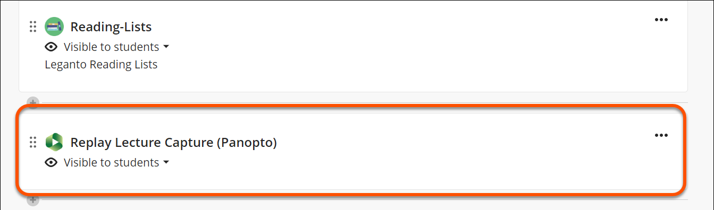
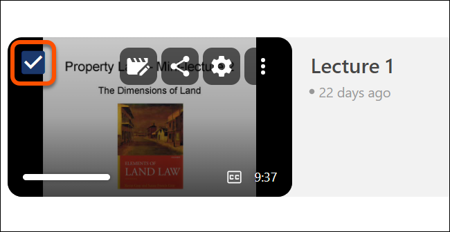
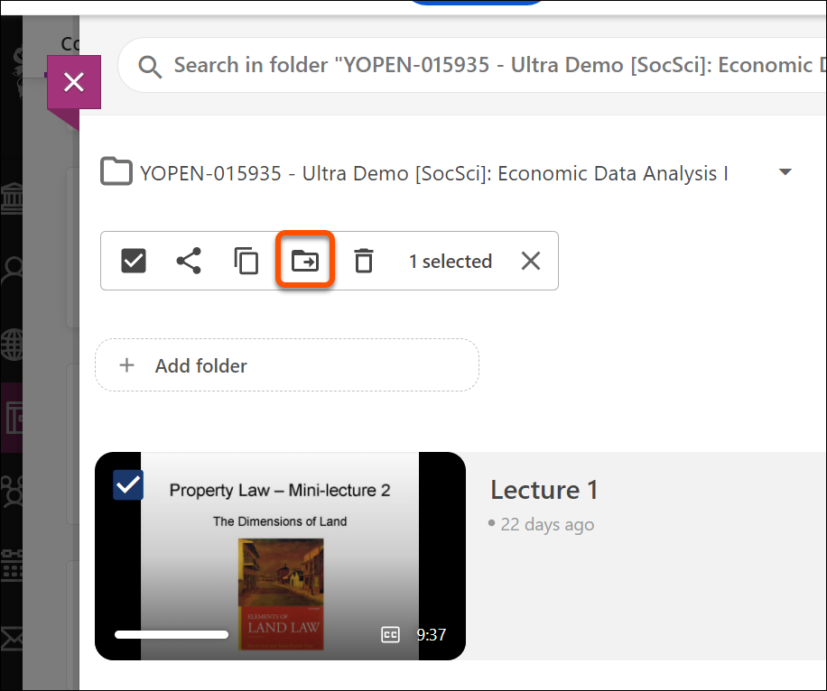
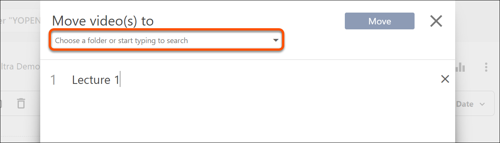

---
tags:
# Delete to leave only relevant tags
    - Panopto
   
---

# Moving a Recording in Ultra

!!! Summary

    This guide explains how to move a Panopto recording within a VLE site to another VLE site.

## Prerequisites
Before you begin, ensure that:

* You are an instructor on the VLE site from where you want to move recordings
* You know the folder names and have access to the recordings you want to move.

### Video Steps

Below is an embedded video detailing how to move a recording in a VLE site. Alternatively, you can [open the video in a new browser tab](https://york.cloud.panopto.eu/Panopto/Pages/Viewer.aspx?id=cfdbf2be-8895-4a2e-a6a4-b20900acc39c).

<!-- PASTE YOUTUBE EMBED (should look like this:) -->
<iframe src="https://york.cloud.panopto.eu/Panopto/Pages/Embed.aspx?id=cfdbf2be-8895-4a2e-a6a4-b20900acc39c&autoplay=false&offerviewer=true&showtitle=true&showbrand=true&captions=false&interactivity=all" height="405" width="720" style="border: 1px solid #464646;" allowfullscreen allow="autoplay" aria-label="Moving a Recording" aria-description="Panopto Quick Tips - Moving a Recording (Ultra)" ></iframe>

### Moving a recording in Ultra

<!-- Clear and concise: Click **Submit**, not Click on the **Submit button** -->
<!-- Use **bold** to highight key tasks and features -->

1. Log into the [Learn ULtra VLE](https://www.vle.york.ac.uk).
2. Locate the site where your recording is hosted.
3. **Click** on the Panopto folder on your site titled 'Replay Lecture Capture (Panopto)'

4. Locate the video you want to move.
5. Hover your cursor over the video thumbnail and click the check box that appears in the top left-hand corner of the video thumbnail.

6. Above the video list, click **Move**.

7. In the window that appears, use the search box to search for the folder destination, either by VLE site code, SITS module code, module name, or by manually searching for the folder using the drop-down box.

8. Click the folder to select. 
9. Click **Move**.
10. Once your upload is finished **click 'X**' to close the window.

