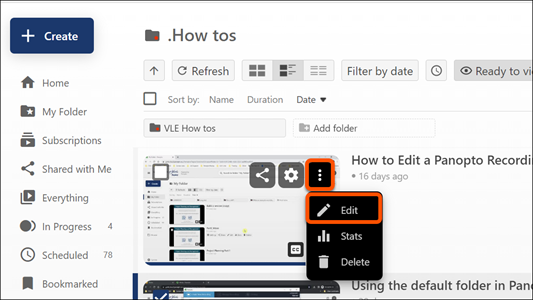
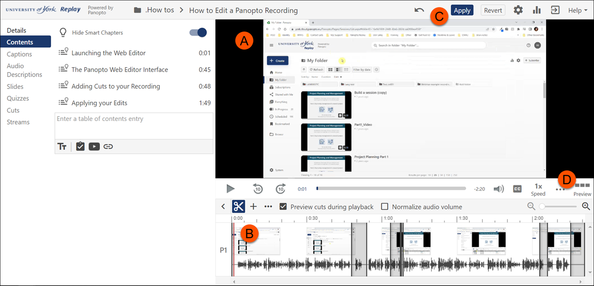
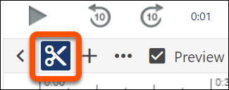
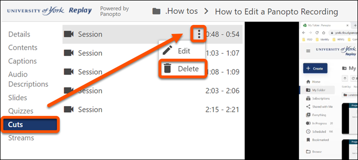

---
tags:
    - Key guide - teaching
    - Panopto
---

# Panopto: Making Basic Edits to your Videos

!!! Summary

    The Panopto web editor allows anyone with 'creator' access in Panopto to perform basic video editing tasks directly from their web browser, eliminating the need to download a separate video editing software. This guide will show you how to make basic edits to your recordings using the Panopto Web Editor. 

## Lauching the Panopto Web Editor

!!! tip

    For the best experience possible, we recommend that you either use **Chrome** or **Firefox** as your main browser.

You can access the Panopto Web Editor directly via [Panopto's web interf ace](https://york.cloud.panopto.eu/Panopto/Pages/Home.aspx) or from the "Replay Lecture Capture (Panopto)" folder in your VLE site.

1. Locate the video you want to edit either by using the **search bar** at the top Panopto's homepage or by searching for the module folder via the **'Browse' menu** in the left-hand navigation menu. 
2. **Hover** your cursor over the video thumbnail. 
3. **Click** on the 'ellipsis' menu (indicated by 3 vertical dots) 
4. **Click** on the edit 'pencil' icon to launch the Web Editor, which will then open in the same window.

## The Panopto Web Editor Interface

(a) The video viewer
(b) Video timeline
(c) Apply button
(d) Preview button (to playback as a viewer)

## Adding Cuts and Trimming to your Recording

1. To trim a video, make sure the **cut tool** (Indicated by a scissor icon) is selected.

2. **Move** your cursor within the timeline (b) of where you would like to insert a cut. A red vertical bar will appear. 
3. **Click and hold down** your mouse button and **drag** the gray line and release to where you would like the cut to finish.
4. Any portion of the video highlighted in **gray** in the timeline (as shown above) will **not** be visible to students. 
5. Perform the same steps as required to add additional cuts. The cut tool can also be used to trim the *beginning* or *end* of your video.
6. Make sure you **save** any edits you make by clicking the **'Apply'** button in the top right-hand corner of the viewer.

## Removing Cuts

To remove any unwanted cuts, this can be done in one of two ways: 

    - Either by clicking and dragging the cut from within the timeline using your mouse, until it disappears from the timeline *or*
    - By selecting 'Cuts' from the left hand menu and following the below steps:  

1. Hover your cursor over the cut you want to delete and click on the elipsis menu. 
2. Click **Delete**, as indicated by a trashcan icon.
3. If you make a mistake, **click** the 'undo arrow' icon next to the Apply button above the video viewer, *or* **hold down** ctrl+Z (Command+shift+Z for Mac users) on your keyboard.

!!! tip 

    After publishing your changes in Panopto, the cut sections will remain visible in the timeline but will not be played back in the Panopto viewer. This is because the Panopto Web Editor is non-destructive, ensuring that you can easily re-insert those sections into your video if needed in the future.

<!-- ## More Details and Troubleshooting 

To explore Panopto's more advanced editing featues, refer to our Advanced Editing in Panopto guide <! insert link to completed guide> -->
