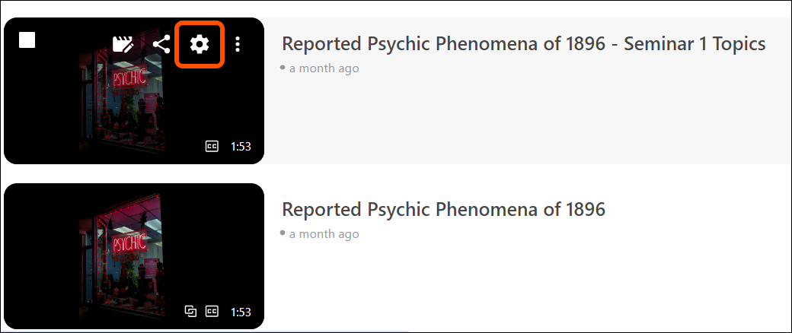
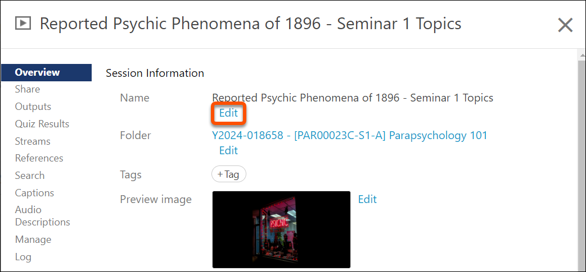
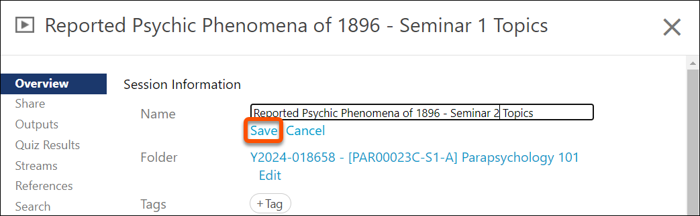

---
tags:
# Delete to leave only relevant tags
    - Panopto
---

# Renaming a Recording in Panopto

!!! Summary

    This guide explains how to rename a Panopto recording within a VLE site folder.

## Quick Start Guide

### Video Steps

Below is an embedded video detailing how to rename a recording. Alternatively, you can [open the video in a new browser tab](https://york.cloud.panopto.eu/Panopto/Pages/Viewer.aspx?id=80fa8639-cee2-4b47-b1ad-b20900b7c8f1).

<!-- PASTE YOUTUBE EMBED (should look like this:) -->
<iframe src="https://york.cloud.panopto.eu/Panopto/Pages/Embed.aspx?id=80fa8639-cee2-4b47-b1ad-b20900b7c8f1&autoplay=false&offerviewer=true&showtitle=true&showbrand=true&captions=false&interactivity=all" height="405" width="720" style="border: 1px solid #464646;" allowfullscreen allow="autoplay" aria-label="Panopto Embedded Video Player" aria-description="Panopto Quick Tips - Renaming a Recording" ></iframe>

### Text Steps

<!-- Clear and concise: Click **Submit**, not Click on the **Submit button** -->
<!-- Use **bold** to highight key tasks and features -->

1. Open your Panopto folder in the VLE site and find the recording you wish to rename.
2. Hover your mouse over the video thumbnail.
3. Click on **Settings** that appears above the thumbnail.
 
4. At the top of the settings screen, click **Edit** next to the current name.
 
5. Enter the new name for the recording.
6. Click **Save** to confirm the new name.
 
7. Close the settings window. The updated name should now be visible.

<!-- More info here as needed. Delete if not needed. Don't add support email address here. -->