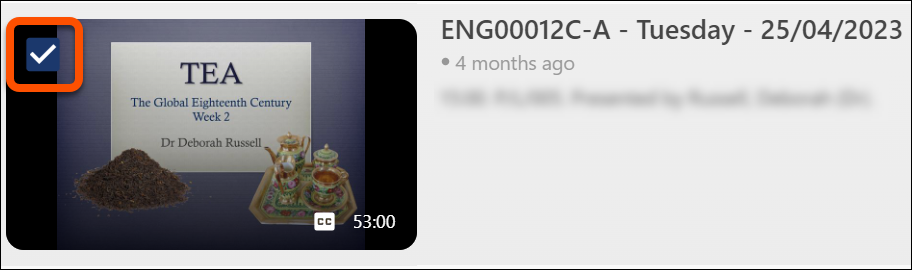
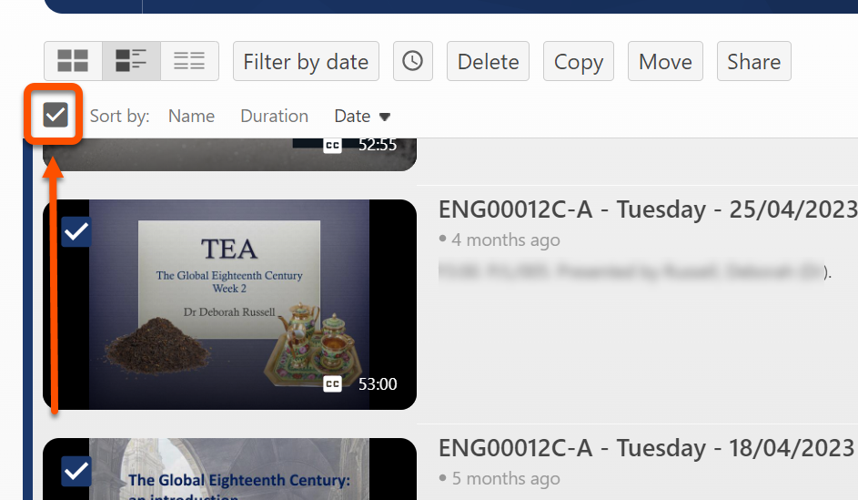
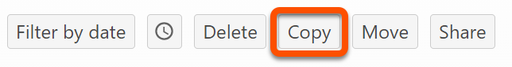
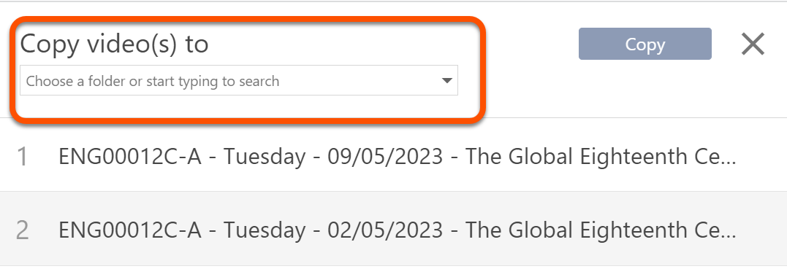
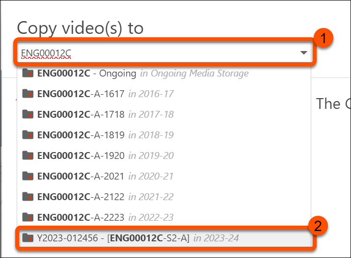
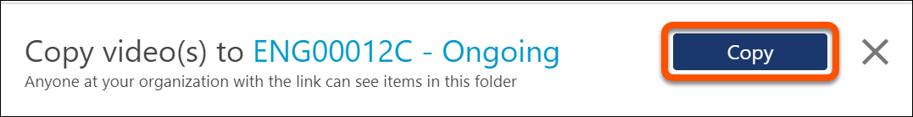

---
tags:
    - Key guide - teaching
    - Panopto
---

# Reusing module recordings from previous years

!!! Summary

    Panopto videos made in previous years are not automatically available to a new cohort of students. This guide will show you how to re-use media.

!!! principle "Relevant [VLE site design principles](../ultra/site-design-principles.md)"

    - 3.5 Essential: Pre-recorded videos are hosted in a streaming service and captioned accurately.
    - 5.1 Recommended: Ensure that students can see and access module materials and content.

!!! Warning

    You might be able to see videos in a module Ultra site, but that doesn't mean that the students can. Check the folders to make sure students have access.

    All reused recordings must have accurate captions - this also applies to reused lecture captures.

The most appropriate method to reuse recordings depends on your situation:

- **Scenario 1:** Videos need to be available on an ongoing basis for multiple cohorts and your department already has an Ongoing Media folder.
- **Scenario 2:** Videos need to be available on an ongoing basis for multiple cohorts, but your department does not have an Ongoing Media folder.
- **Scenario 3:** You wish to **only** give access to a Panopto folder to specfic year group.

## Scenario 1: Using Ongoing Media Folder
  
1. Locate the Panopto folder from last year either from the old module site in Blackboard **or** directly via the folder in Panopto.
2. **Hover** your cursor over the recording you wish to copy. 

3. **Select** the check box that appears in the left-hand corner of your video. Follow this step to select multiple videos.

4. To select all videos click the check box above the video list.

5. Select **move** from the options which appear.
6. To select more videos check the relevant check boxes, or click the check box above the video list to select all videos.
7. Search for your Ongoing Media folder. This will either contain the name of your module or the SITS module code (eg Ongoing Media: MAN00001H).
8. Click **Move**. 

!!! Tip
     If your department has an Ongoing Module Media storage area set up, this can also be located from the **Browse** menu in Panopto by selecting the top level ".Ongoing Media" folder.

## Scenario 2: Creating Ongoing Media Folder

If your department does not have a visible Ongoing Media folder, please contact vle-support@york.ac.uk with the following details:

- The module code, e.g. MAN00149M, which the recordings should be associated with.
- Which department the module belongs to. Please note that these folders are setup at department level, not school level.
- Direct links to the videos which you would like to reuse

## Scenario 3: Without using Ongoing Media Folder

1. Follow steps 1-4 as shown in the first scenario.
2. Select **Copy** from the options which appear.

3. Use the drop-down menu to search for the **current** module site folder, by selecting from the list of folders or typing the folder name. Folders can be searched by module code (eg. MAN00001H), by the current year's VLE site code (eg. Y2023-000001) or by module name.

4. Click **Copy**.

!!! Tip
     If you are unsure of the folder name, search for your current module in Blackboard for reference. Your Panopto folder will have the same name as your site.

