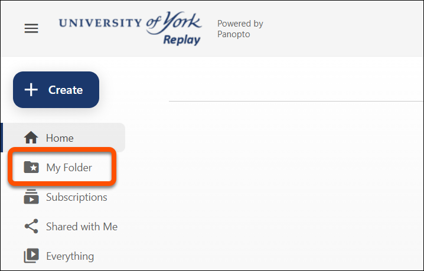
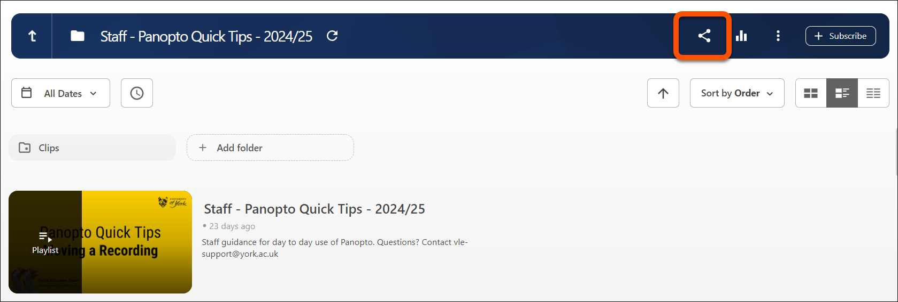
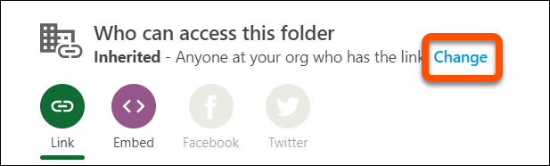
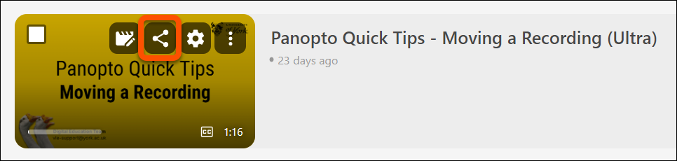
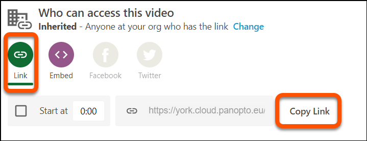

---
tags:
# Delete to leave only relevant tags
    - Panopto
---

# Sharing Panopto Recordings

!!! Summary

    By default, Timetabled Lecture Capture recordings are shared with users on the Learn Ultra VLE module site. This guide will walk you through folder-level and individual capture sharing settings in Panopto to manage access based on your needs.

## Video Steps

Below is an embedded video detailing how to share a recording in Panopto. Alternatively, you can [open the video in a new browser tab](https://york.cloud.panopto.eu/Panopto/Pages/Viewer.aspx?id=70f7eb58-e577-489a-9e2e-b20900e29c3d).

<iframe src="https://york.cloud.panopto.eu/Panopto/Pages/Embed.aspx?id=70f7eb58-e577-489a-9e2e-b20900e29c3d&autoplay=false&offerviewer=true&showtitle=true&showbrand=true&captions=false&interactivity=all" height="405" width="720" style="border: 1px solid #464646;" allowfullscreen allow="autoplay" aria-label="Panopto Embedded Video Player" aria-description="Panopto Quick Tips - Sharing Folders/Recordings With New Users" ></iframe>

## Default Sharing Settings

- **Default Access**: Recordings are automatically shared with users on the Yorkshare VLE module site, accessible either through the VLE module or via direct links (which require login for access).
- **Note**: Even if the Learn Ultra VLE site is unavailable to students, the Panopto folder remains accessible to those enrolled in the module.

!!! Tip

    For public captures, e.g. events, you can download captures and upload YouTube. External users to the University will not be able to access Panopto as a UoY IT account is required. 

## Sharing Recordings from your My Folder in Panopto

* Recordings saved in your **My Folder** in Panopto are private by default, which means they aren’t shared or accessible to others. 
* This folder acts as your personal storage space, so any content saved here can **only** be viewed by you. 
* To share recordings with others, you will need to **move** or **copy** the video to a shared folder with appropriate permissions or update the access settings in My Folder to make it viewable to specific people or groups. 

 

For details on how to move recordings in Panopto, refer to our relevant guidance:

[Moving Recordings in Panopto](move-recording-panopto.md)
[Copying Panopto recordings in Panopto](move-recording-panopto.md)

### Changing Sharing Settings at a Folder Level

1. Access Folder Sharing: Click the **Share** icon in the top right corner of the folder.
 

2. Set Permissions: Under 'Who can access this Folder', click **'Change'**.
 

3. Choose an access level based on your audience requirements:
   * **Specific People** (default): Restrict access to specific users or groups.
   * **Anyone at your organization with the link**: Allow access only through a direct link, which will be accessible to anyone at UoY.

4. Click **Save**.

!!! Warning
    If you need to change any People and Groups access settings, please contact DET for advice before proceeding.  

### Sharing Individual Recordings

1. Go to Panopto and locate the recording you wish to share.
2. Hover your cursor over the recording and click the **Share** icon.
 

3. Under the **Share** section, select **link** and click **copy link** to copy the video URL.
 

!!! Warning 
    Embedding Panopto videos directly within the VLE using the embed option is **not** recommended. For best practices on embedding in Blackboard, please refer to our [Embedding in Blackboard Guide](embed-panopto-ultra).

## More Details and Troubleshooting 

If you are wanting to reuse media from another academic year, please refer to our [Reusing Module Media Guide](https://vle-support.york.ac.uk/panopto/reuse-module-media/).

<!-- More info here as needed. Delete if not needed. Don't add support email address here. -->
