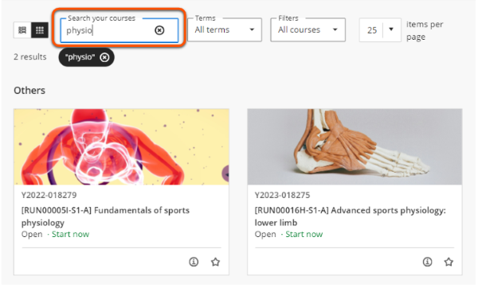
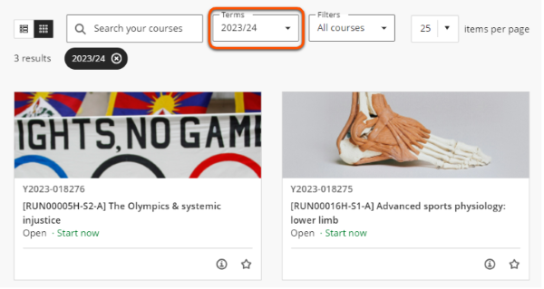
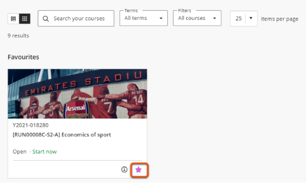

---
tags:
    - Key guide - teaching
    - Key guide - admin
    - Ultra
---

# Access your sites

!!! Summary

    Tips & tricks to quickly access your key sites.

## Course sites

Access module sites through the Courses page. By default, this lists every site that you are enrolled on.

Use the options to select relevant sites and customise the page appearance:

1. **Layout**: select list or grid layout (grid layout contains image thumbnails)
2. **Search** courses by module/site name or keyword  

3. **Terms**: select a specific academic year  

4. **Filters**: various course types (which aren't used at UoY)
5. **Items per page**: Show 25, 50 or 100 sites per page
6. **Favourite** sites with the star icon to pin to the top of the default all sites list and  any applicable search/filter results.  

!!! Tip

    These settings and filters are maintained across log-ins and different devices, so you don't have to repeat them every time.

You can also bookmark relevant sites in your internet browser for easy access.

## Community sites

The Communities page (generally) contains non-academic sites. You may also see these sites described as 'Organisations'.

You can customise the Communities page in the same way as the Courses page.

## Missing a site you need?

If you can't see a site that you require access to after using the methods above, you may not be enrolled on it.

To be given access, contact the module convenor/site owner or your departmental VLE coordinator.