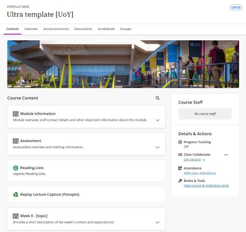
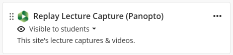
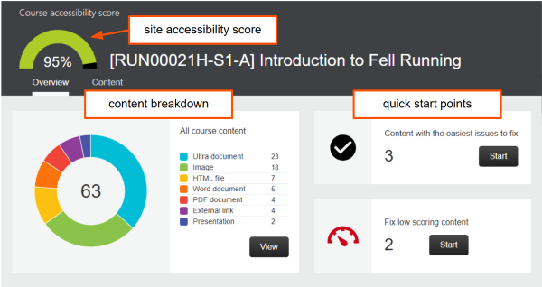
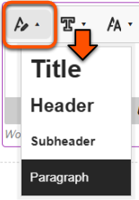
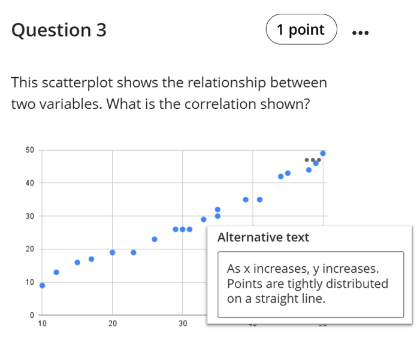
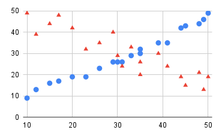

---
tags:
    - Key guide - teaching
    - Accessibility
    - Ultra
---

# Accessible VLE sites

!!! Summary

    It is a **legal requirement** that all our digital content is accessible, including your VLE site and any materials or files provided through it. Accessible sites and materials also improve the learning experience for all students and make sites easier to maintain.

!!! principle "Relevant [VLE site design principles](../ultra/site-design-principles.md)"

    - 3.4 Essential: Site and materials content is accessible.
    - 3.5 Essential: Pre-recorded videos are hosted in a streaming service and captioned accurately.
    - 3.6 Essential: Links and materials titles describe the destination or content.
    - 3.7 Essential: Direct, descriptive links are given to open embedded content (eg. video or Xerte objects) in full screen.

This guide covers key practices to improve the accessibility of your Ultra sites and teaching materials. There are two key areas:

-   :material-tools: **Tools & resources**

    ---

    Appropriately using Ultra and aligned teaching tools to improve accessibility.

-   :material-pencil: **Content tips**

    ---

    Good practice to improve accessibility of content within your Ultra site: text, images, links and files.

## Tool: Departmental Ultra template

Departmental Ultra templates have been developed to apply the [VLE site design principles](../ultra/site-design-principles.md). Templates contain the following pre-built sections:

- **Module information**: key module and departmental information
- **Assessment**: to contain all assessment information
- **Reading List**: all module readings
- **Replay Lecture Capture (Panopto)**: the module's lecture capture recordings
- **Module materials sections:** in most cases, weekly sections. Organise your teaching content within these sections. 

<figure markdown>

<figcaption>Ultra template structure</figcaption>
</figure>

Using your template to improve accessibility:

- **Use the pre-built template structure**. This gives students a broadly consistent experience across all their module sites and helps them navigate the site and easily locate materials.
- **Update the pre-built Module Information and Assessment pages** with your module-specific information. This will ensure your site contains the key details students need.
- **Make sure all departmental pre-built pages** are visible to students, particularly the Accessibility Information page. 

For more details on using the pre-built template structure and pages, see the [Prepare your site for teaching guide](../ultra/prepare-site.md).

If any sections or pages are missing from your site, [contact us](mailto:vle-support@york.ac.uk) to restore them from your departmental template.

## Tool: Reading List

From 2025/26, it is University policy that **all module readings must be provided through the [Leganto Reading List tool](https://subjectguides.york.ac.uk/readinglists/home)**. This supports accessibility by collating all readings in one place and allowing direct access to digital items via the University single-sign-on.

Using your Reading List to improve accessibility:

- **Tag** each item as Essential, Recommended or Background to help students prioritise and manage their workload. 
- Aid navigation by using the same **structure** as your VLE site. In most cases this should be weekly sections.
- Use the **Alternative Format Request (SSP)** tag to identify items for the Library staff to convert to digital format for students who can't access printed text.

See the dedicated [Reading List Accessibility guide](https://subjectguides.york.ac.uk/readinglists/accessibility) for more detail.

<figure markdown>

<figcaption>Accessible Reading List practice</figcaption>
</figure>

## Tool: Panopto for video content

Panopto is our video streaming tool, primarily to manage [Lecture Capture (Replay)](../panopto/lecture-capture.md) recordings.

Any pre-recorded 'at-desk' recordings should also be uploaded to Panopto (or YouTube); do not upload recordings to the VLE site or within slide decks.

<figure markdown>

<figcaption>Replay Lecture Capture (Panopto) link item</figcaption>
</figure>

Using Panopto to improve accessibility:

- **Do not hide** or remove the Replay Lecture Capture (Panopto) link item in the Course Content area of your site.
- Ensure **pre-recorded videos are [accurately captioned](../panopto/editing-captions.md)**. It is not required to correct automatic captions for the current year's lecture captures, but students can request this.
- If you need to use recordings for multiple cohorts, [contact us](mailto:vle-support@york.ac.uk) to set up an Ongoing Panopto folder for your module.

## Tool: Accessibility checkers

!!! ai "Using automated tools effectively"

    Automated checkers may not identify all issues within content, so treat results as a **starting point** for your accessibility considerations.

Accessibility checkers are available for various tools. These can automatically identify key issues (eg. missing alt text, incorrect heading structure) and guide you on how to fix them.

<figure markdown>

<figcaption>Ultra Ally accessibility report</figcaption>
</figure>

Use these checkers to improve accessibility:

- Ultra: [Ally accessibility report](../ultra/ally-accessibility-report.md) for content added directly within the site and uploaded materials
- [Microsoft Accessibility checker](https://support.microsoft.com/en-gb/office/improve-accessibility-with-the-accessibility-checker-a16f6de0-2f39-4a2b-8bd8-5ad801426c7f) for Word, PowerPoint etc.
- Grackle for Google Docs: launch from the Extensions menu

## Tips: text content

!!! Tip

    In the Ultra text editor, we recommend using the default font, text size and colour settings.

Use these tips to make your text-based content easier to navigate for assistive technology users, vision-impaired users and dyslexic and neurodiverse users:

- Structure text and documents with Heading Styles.
- Use left-aligned text.
- Use a legible font and text size.
- Make sure there is sufficient colour contrast between text and the background.
- Consider bulleted lists to break up long chunks of text.
- Use tables only to present data; don't use them for layout.

<figure markdown="span">

<figcaption>Heading styles in the Ultra text editor</figcaption>
</figure>

For more detail, see the [**Block: Content (text editor)** section](../ultra/documents.md#block-content-text-editor) in our Documents guide.

## Tips: images & figures

Some general considerations for images are covered in the Digital Accessibility Team's [guide for graphic adjustments for vision-impaired students](https://docs.google.com/document/d/1_ANA76QioWT2x8k4gf27We5Ceo_T9choYLbwqkOa64Q/edit?usp=sharing). These tips are helpful for all users.

### ALT text and image descriptions

Images and figures must have an appropriate text-based alternative of the information:

- **simple images**: add ALT text describing the key information relevant to the particular context
- **complex images**: provide a separate text description (eg. data in table format, description of a diagram etc.) and direct users to that in the ALT text.
 For example, the image in this section is described in the expandable example below.
- **purely decorative images**: tick the box to *Mark the image as decorative*

<figure markdown>

<figcaption>ALT text describing a simple figure</figcaption>
</figure>

??? Abstract "Example image description"

    **Example: Multiple-choice question with a simple figure and ALT text**

    Question text: This scatterplot shows the relationship between two variables. What is the correlation shown?

    ALT text for the scatterplot: As x increases, y increases. Points are tightly distributed on a straight line.

For more guidance on image descriptions:

- [Adding Images and ALT text in Learn Ultra sites](../ultra/documents.md#block-image)
- [General advice on ALT text](https://subjectguides.york.ac.uk/media/images#s-lg-box-wrapper-18695081)
- [Scope's advice on writing ALT text](https://business.scope.org.uk/how-to-write-better-alt-text-descriptions-for-accessibility/): considers which information is important to include
- [NWEA Image description guidance for assessments (PDF)](https://www.nwea.org/uploads/2022/11/Image-Description-Guidelines-for-Assessments_NWEA_2021.pdf)
- [Higher Education advice on describing complex images](https://www.learningapps.co.uk/moodle/xertetoolkits/play.php?template_id=3023#page1)

### Colour

!!! Tip

    Colour blindness is common and not generally disclosed. You should assume that colour blindness considerations are needed for your materials.

Consider use of **colour** in your images and figures:

- Don't convey meaning via colour alone. For example, use different point shapes and colours for multiple factors in a figure.
- Avoid using red and green together; this is the most problematic colour combination.
- Ensure there is sufficient contrast between foreground and background colours (at least 4.5:1).
- [WhoCanUse](https://www.whocanuse.com/) is our recommended tool to check contrast and explore how colour choices can affect people with different visual impairments.

<figure markdown>

<figcaption>Using colour and shape to differentiate factors</figcaption>
</figure>

### Resolution

Also ensure that images and figures are **high resolution**. This prevents pixelation or blurriness when zooming in or using a screen magnifier, and improves usage for everyone.

- [Veronica with Four Eyes](https://veroniiiica.com/how-to-create-high-resolution-images-for-low-vision/) describes their experiences using images as a student with low vision, and offers tips on creating high resolution images.
- See our [Practical Guide to media editing](https://subjectguides.york.ac.uk/media/images) for more technical guidance on image resolution.

## Tips: links

Accessible link text describes the destination content so that the link makes sense by itself. This makes your text more readable and is important for assistive technology users.

- Use **meaningful link text** that accurately describes the destination content, eg. [Scope guide: How to write better link text](https://business.scope.org.uk/article/how-to-write-better-link-text-for-accessibility).
- **Don’t use generic text** like *click here* or *find out more*; screen readers can extract links from text, but without content these links are meaningless.
- In most cases, **don't give the raw URL** (eg. www.link.com). This generally doesn't make much sense and makes text harder to read.

For more guidance on writing effective link text:

- [Adding links to text content in an Ultra VLE site](../ultra/documents.md#block-content-text-editor)
- [Scope guide: How to write better link text](https://business.scope.org.uk/article/how-to-write-better-link-text-for-accessibility): lots of simple, practical tips
- [WebAIM guide: hyperlinks](https://webaim.org/techniques/hypertext/): background on how screen readers use links

## Tips: uploaded files

- Use file names that describe the file content without having to open it (eg. Week05_Slides_NavigationTechniques)
- Make sure any PDF materials are good quality, tagged and have searchable/highlightable text (OCR). If scans of handwritten notes are uploaded, an alternative digital text-based version must also be provided.
- Do not scan and upload published materials. This is not accessible to screenreader or text-to-speech users, and also likely violates copyright. 
- Provide the native file format, for example, lecture slides as a PPT file. Students can use the Ally file converter tool to download the file in a different format if they wish.
- Avoid presenting materials stored in Google Drive; this prevents the use of the Ally file converter tool and requires students to leave the site. Upload flies (appropriately!) instead.

For more detail, see the [**Block: File upload** section](../ultra/documents.md#block-file-upload) in our Documents guide.