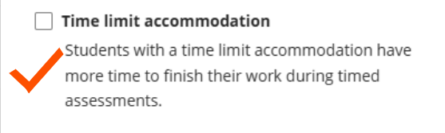
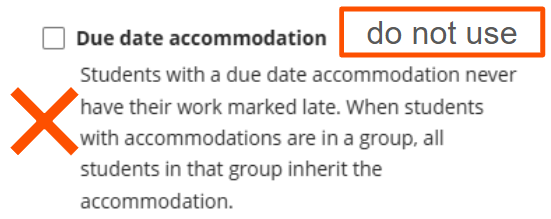
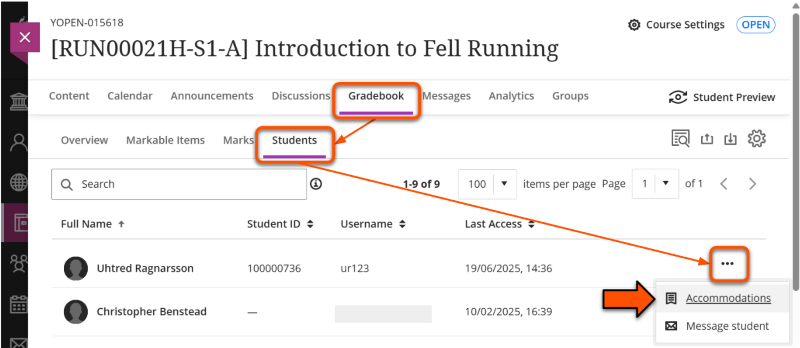
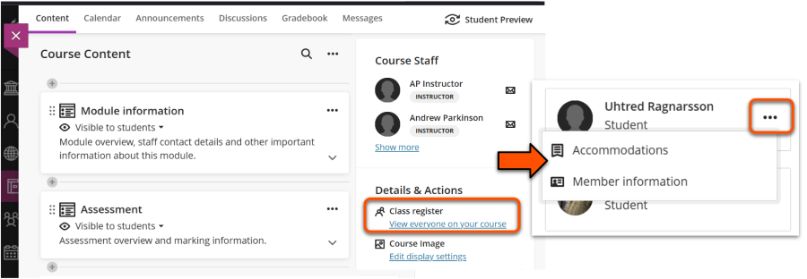
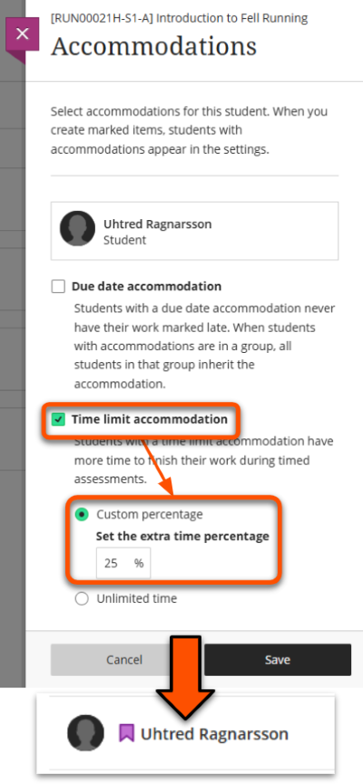

---
tags:
# Delete to leave only relevant tags
    - Assessment
    - Ultra
---

# Accommodations (SSP extensions)

!!! Summary

    Set accommodations in a site to automatically apply SSP extensions to Test time limits.

## Accommodation types

Accommodations are adaptations to assessment settings for students with an SSP. Ultra offers two types of accommodation:

### Time limit accommodation

The time limit accommodation extends the time limit for timed assessments. For example, in a Test with 60 minute time limit, a 25% extension has 75 minutes and a 50% extension has 90 minutes.

Once the accommodation is set, extensions are automatically applied to all Ultra Tests with a time limit set on the site. Students see their own personal time limit.

### Due date accommodation

!!! Warning

    The due date accommodation type is not applicable at UoY.

The due date accommodation means submissions are never marked as late. It does not extend the assessment deadline.

This does not align with UoY assessment policy, so **do not use this option**. To set deadline extensions for submitted work, set up multiple submission points with different deadlines.

## Setting time limit accommodations

!!! Tip

    Accommodations must be set for each student and in each site. There is currently no automatic method to set accommodations in bulk.
    
    Once set, accommodations are automatically applied to all relevant assessments on the site.

Start by accessing the accommodations panel using your preferred method:

- *Via the Gradebook*: open the Gradebook and select the **Students tab**. Locate the relevant student then click the **three dots icon** and select **Accommodations**.
 
- *Via the Class Register*: on the main Content page and in the **Details & Actions** panel, click the **Class Register**. Locate the relevant student then click the **three dots icon** and select **Accommodations**.
 
- *Click the student's name*: this opens a summary of the student's activity. Click **Accommodations** in the menu bar to open the Accommodations panel.
 

To set the relevant time limit extension:

1. Tick the **Time limit accommodation** box.
2. On the options that appear, select **Custom percentage** and enter the relevant extension for that student. This is usually 25% or 50%.
3. Click **Save**, then on the new panel click **Add** to confirm. Close the Accommodations panel.
4. The extension is applied immediately to all timed assessments in the site (including retroactively).
5. Students with accommodations set are shown with a **purple flag icon** wherever their name appears. To edit accommodations once they are set, follow the steps above. Any changes are applied immediately.

