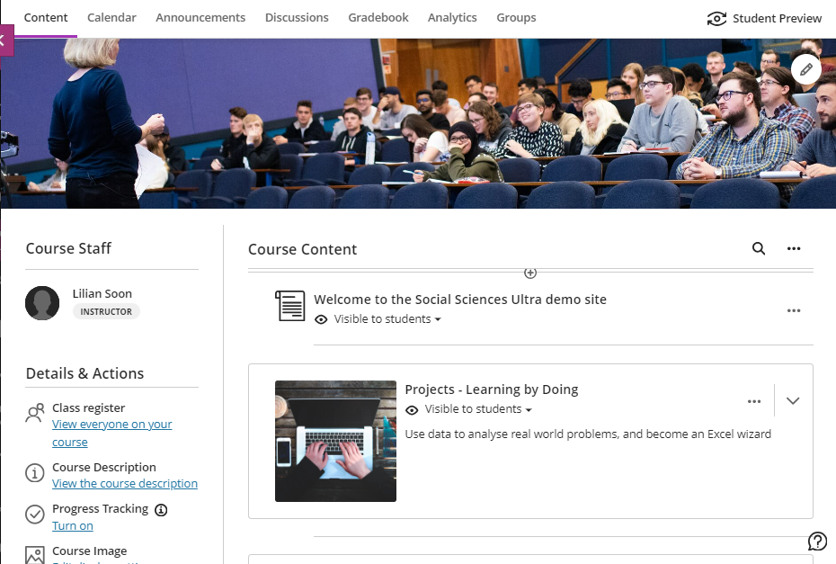
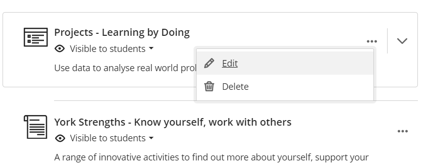
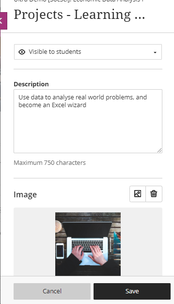
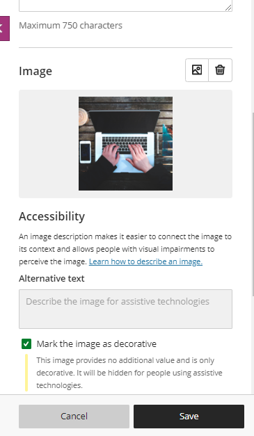

---
tags:
# Delete to leave only relevant tags
    - Ultra
---

# Adding Images to Learning Modules

!!! Summary

    You can choose to add an image to a Learning Module.  This will appear on the left of the module on the course content page, helping to make the site more visually appealing whilst also aiding navigation.

!!! principle "Relevant [VLE site design principles](https://vle-support.york.ac.uk/ultra/site-design-principles)"

    - Section 3: Module materials & site content
    - 2.2 Essential: Materials within sections are clearly organised so content is easy to find.

  

### Text Steps

<!-- Clear and concise: Click **Submit**, not Click on the **Submit button** -->
<!-- Use **bold** to highight key tasks and features -->

1. Click the **three dots** to the right of the learning module on your course content page. Click **Edit** to show the learning module editing window.   
 
2. Click the **image icon / ’Add Image’** and upload an image. JPEG and PNG formats are supported.   

3. A preview of the image appears. Click **Next** to continue or delete the image by selecting the bin icon.   

4. Select the area of the image that you would like to appear on the Learning Module. You can adjust the zoom of the image using the slider. Click **Save** to continue.   

5. Remember to click **Save** again at the bottom of the editing window, to save the changes to the learning module.   

## Accessiblity
<!-- More info here as needed. Delete if not needed. Don't add support email address here. -->

The learning module is automatically marked as decorative, which hides the banner for students using assistive technologies. If you want all students to know the content of the image, uncheck Mark the image as decorative. Enter a description of the image in the Alternative text field. 

## Creating icons

[Guides on image manipulation to create an icon](https://drive.google.com/drive/folders/0BzxHfs7XbRU8ZFlxRFNVaS00NTg?resourcekey=0-1sMAmx9mux1BL9ArThGsPw&usp=share_link)

[Images for number or letter icons](https://docs.google.com/presentation/d/19ey3zq2l-GP7PAQocRhXfbK1Ua3Fy8mV/edit?usp=sharing&ouid=101199476229048788013&rtpof=true&sd=true)

## Sourcing images

You must not use copyrighted material when creating your site’s course image.

Images should be high quality; preferably taken by a professional photographer. You can use the [University’s photo library](https://brand.york.ac.uk/account/dashboard/) to download professional photographs owned by the University. 

You can also use [Unsplash.com](https://unsplash.com/) to source copyright-free images.

Download images at a resolution that meets the minimum requirements for Ultra. The **Web Image gallery** size on the University's photo library meets these requirements.

<!-- More info here as needed. -->