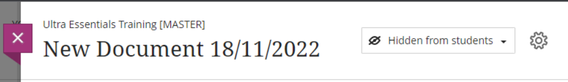

---
tags:
# Delete to leave only relevant tags
    - Foundation
    - Teaching
    - Administration
    - Ultra
---

# Adding Documents

!!! Summary

    Documents can be created inside Learning Modules and Folders, or created directly within the **Course Content** area.

!!! principle "Relevant [VLE site design principles](https://vle-support.york.ac.uk/ultra/site-design-principles)"

    - 3.1 Essential: Organise module materials in sections that support student progress through the module.
    - 3.3 Essential: Provide up-to-date documents in an accepted file format.
    - 3.4 Essential: Site and materials content is accessible.
    - 3.6 Essential: Links and materials titles describe the destination or content.
    - 5.1 Recommended: Ensure that students can see and access module materials and content.

### Video Steps

Below is an embedded video detailing how to create documents. Alternatively, you can [open the video in a new browser tab](https://youtu.be/qUl2fAfqCrg).

<iframe width="560" height="315" src="https://www.youtube.com/embed/qUl2fAfqCrg" title="YouTube video player" frameborder="0" allow="accelerometer; autoplay; clipboard-write; encrypted-media; gyroscope; picture-in-picture; web-share" allowfullscreen></iframe>

### Text Steps

1. Click container to show content options or click the plus icon.
2. Choose **Create**, select **Document**.

3. Edit title, make visible to students, click cog icon to add description.

## More Details and Troubleshooting 

For information on using the content collection, or adding LTIs and SCORMs, please see the relevant advanced guide on this site (coming soon). Contact vle-support@york.ac.uk if you run into issues following these steps.