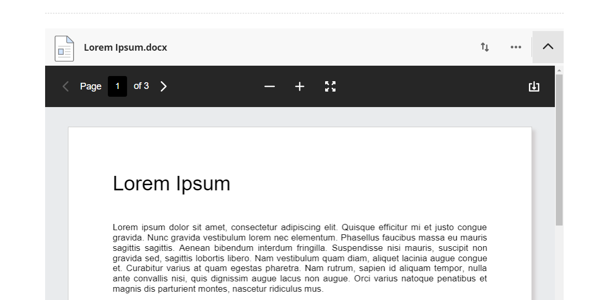

---
tags:
# Delete to leave only relevant tags
    - Foundation
    - Teaching
    - Administration
    - Ultra
---

# Adding files to a Document

!!! Summary

    Files can be uploaded into Documents or directly to the Course Content area. Most common file types can be previewed in a Document, and colleagues uploading the file can choose whether students can download or simply view it.

    We recommend only uploading files into an Ultra Document so they can be previewed.

!!! principle "Relevant [VLE site design principles](https://vle-support.york.ac.uk/ultra/site-design-principles)"

    - 3.1 Essential: Organise module materials in sections that support student progress through the module.
    - 3.4 Essential: Site and materials content is accessible.
    - 3.6 Essential: Links and materials titles describe the destination or content.
    - 5.1 Recommended: Ensure that students can see and access module materials and content.

## Uploading Files

This method is almost identical to uploading images - see our [guide on adding images](https://vle-support.york.ac.uk/ultra/adding-images).

### Video steps

Below is an embedded video detailing how to upload files. Alternatively, you can [open the video in a new browser tab](https://youtu.be/nUcweeCfcvU).

<iframe width="560" height="315" src="https://www.youtube.com/embed/nUcweeCfcvU" title="YouTube video player" frameborder="0" allow="accelerometer; autoplay; clipboard-write; encrypted-media; gyroscope; picture-in-picture; web-share" allowfullscreen></iframe>

### Text steps

1. In a Document click the plus icon to add content and/or click **Upload from Computer**

2. Find the item you would like to upload, select it, and click **Open**
]
3. Select a descriptive display name (eg "Week 4 Seminar Materials"), choose the appropriate file options, and then click **Save**

4. Files can be previewed inline within Ultra Documents if "View" is allowed in the file options

!!! Note

    These steps are also applicable when using the Attachment tool within the text editor.

## More Details and Troubleshooting 

<!-- More info here as needed. -->