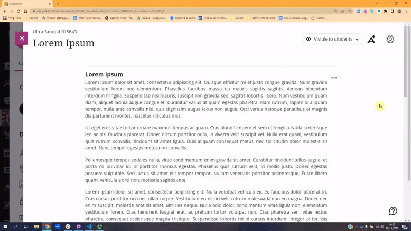
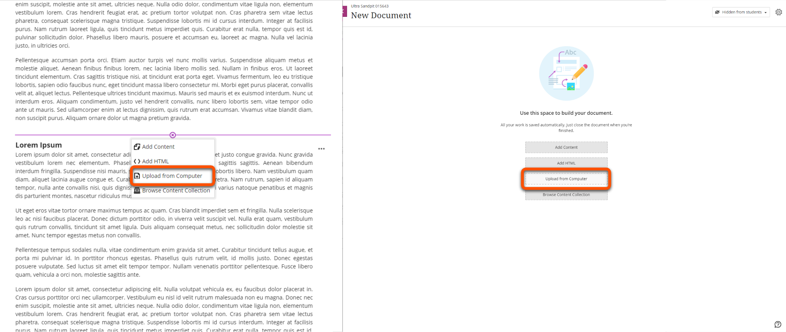
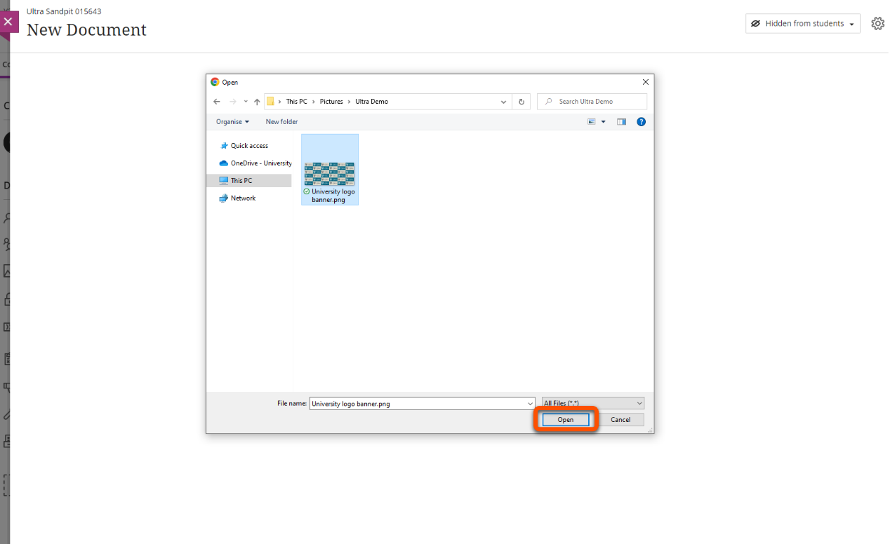
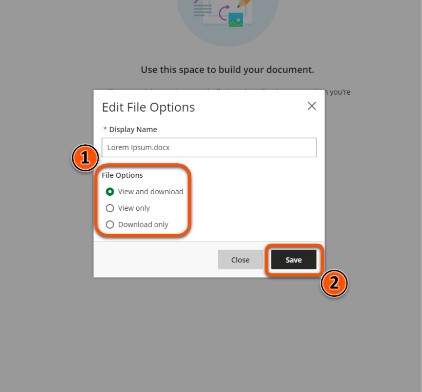
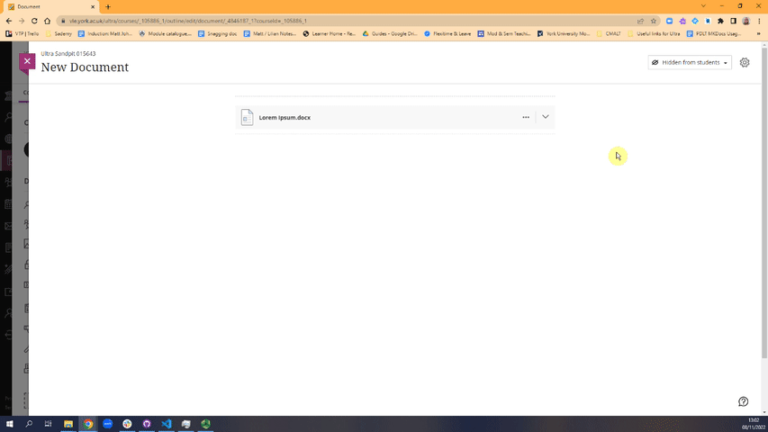

---
tags:
# Delete to leave only relevant tags
    - Foundation
    - Teaching
    - Administration
    - Ultra
---

!!! Warning

    This guide is a work in progress, and should not be considered complete.

# Adding files to a Document

!!! Summary

    Files can be uploaded into Documents or directly to the Course Content area. Most common file types can be previewed in a Document.

## Uploading Files

Files can be uploaded directly into Ultra Documents. Uploaded files can be previewed in the same window by users, and colleagues uploading the file can choose whether students can download or simply view it.

### Video steps

### Text steps

1. If you're uploading files to a Document with pre-existing content, click the small plus icon - otherwise skip to Step 2

2. Select **Upload from Computer**

3. Find the item you would like to upload, select it, and click **Open**
]
4. Select a descriptive display name (eg "Week 4 Seminar Materials"), choose the appropriate file options, and then click **Save**

5. **Files** can be previewed inline within Ultra Documents, example below

!!! Note

    These steps are also applicable when using the Attachment tool within the text editor.

## More Details and Troubleshooting 

<!-- More info here as needed. -->