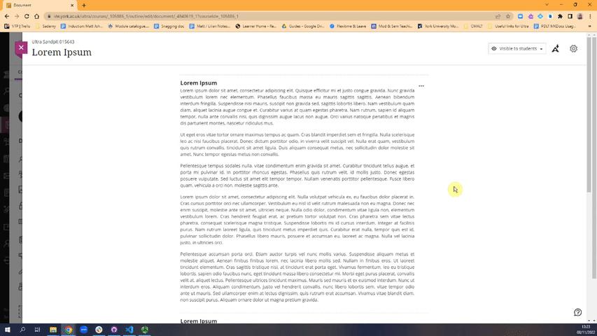

---
tags:
# Delete to leave only relevant tags
    - Foundation
    - Teaching
    - Administration
    - Ultra
---

# Adding images to a Document

!!! Summary

    Short summary here

## Uploading Files and Images

As well as uploading files and images using the text editor (see above), you can upload them directly between blocks of text in a Document:

### Video steps

### Text steps

1. If you're uploading files/images to a Document with pre-existing content, click the small plus icon - otherwise skip to Step 2

2. Select **Upload from Computer**

3. Find the item you would like to upload, select it, and click **Open**
]
4. When **uploading an image** add a brief description of the image in the alternative text box (eg "Cartoon image of a coffee cup") or mark it as decorative, select the appropriate file options, and then click **Save**

5. When **uploading a file** select a descriptive display name (eg "Week 4 Seminar Materials.docx"), choose the appropriate file options, and then click **Save**

6. **Files** can be previewed inline within Ultra Documents, example below

!!! Note

    These steps are also applicable when using the Attachment tool within the text editor, but the uploaded file will often display slightly off-centre.

## More Details and Troubleshooting 

<!-- More info here as needed. -->