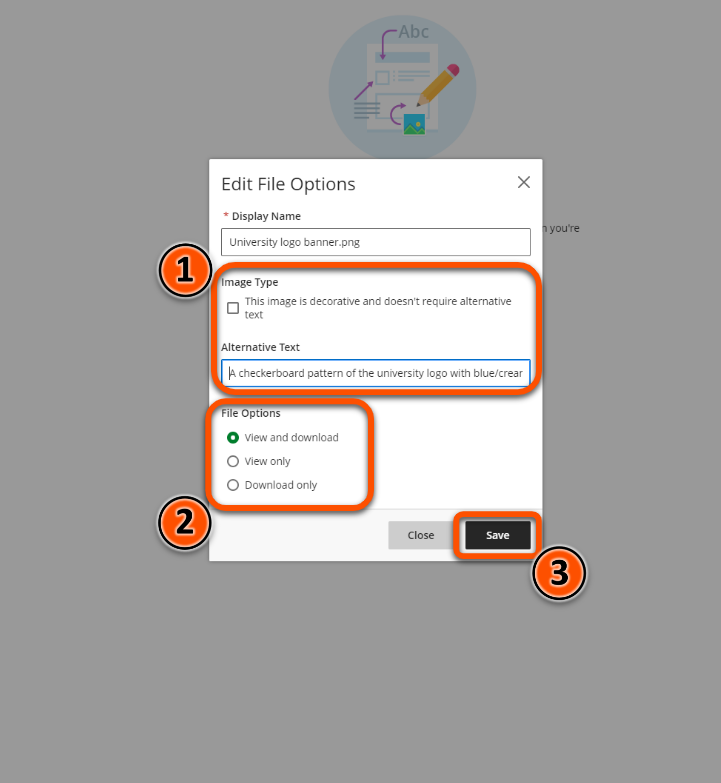
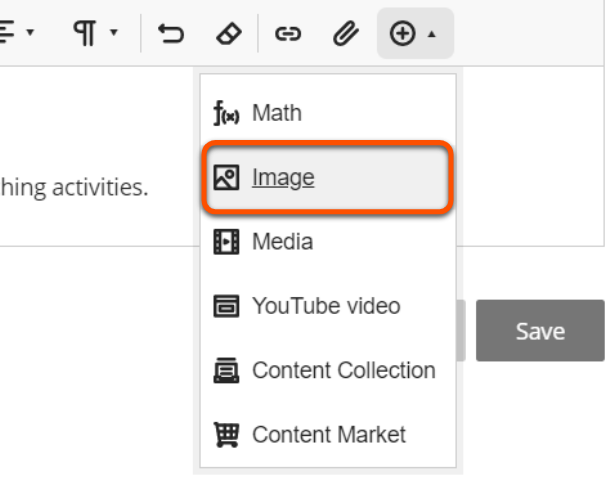
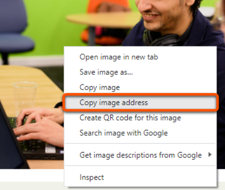
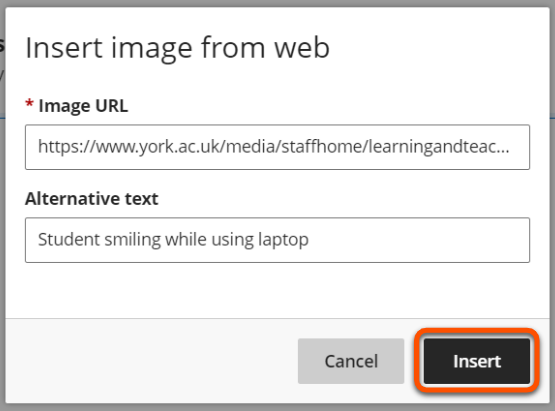

---
tags:
# Delete to leave only relevant tags
    - Foundation
    - Teaching
    - Administration
    - Ultra
---

# Adding images to a Document

!!! Summary

    Images can be added into Documents in or between chunks of text. Images cannot be cropped or resized after being added to a Document, so make sure to add the final version.

!!! principle "Relevant [VLE site design principles](https://vle-support.york.ac.uk/ultra/site-design-principles)"

    - 2.3 Essential: Design and images adhere to the UoY Brand.
    - 3.4 Essential: Site and materials content is accessible.

## Uploading Images

The preferred way to add images is to upload them directly in the same way as files. See also our [adding files guide](https://vle-support.york.ac.uk/ultra/adding-files).

### Video steps

Below is an embedded video detailing how to upload images. Alternatively, you can [open the video in a new browser tab](https://youtu.be/dQOaGmi6u0E).

<iframe width="560" height="315" src="https://www.youtube.com/embed/dQOaGmi6u0E" title="YouTube video player" frameborder="0" allow="accelerometer; autoplay; clipboard-write; encrypted-media; gyroscope; picture-in-picture; web-share" allowfullscreen></iframe>

### Text steps

1. In a Document click the plus icon to add content and/or click **Upload from Computer**

2. Locate the item you would like to upload, select it, and click **Open**

3. Add a brief description of the image in the alternative text box (eg "Cartoon coffee cup") or mark it as decorative, select the appropriate file options, and then click **Save**

!!! Note

    These steps are also applicable when using the Attachment tool within the text editor.

## Linking Images
Images can also be added to Documents by uploading them from a static source on the internet. Make sure you have the appropriate rights to use an image in this way, and that the source address will not be changed while the image is in use.

We recommend downloading images onto your devide and uploading them using the above steps.

### Video Steps

Below is an embedded video detailing how to link images using an image address. Alternatively, you can [open the video in a new browser tab](https://youtu.be/KmzGYW2cO0g).

<iframe width="560" height="315" src="https://www.youtube.com/embed/KmzGYW2cO0g" title="YouTube video player" frameborder="0" allow="accelerometer; autoplay; clipboard-write; encrypted-media; gyroscope; picture-in-picture; web-share" allowfullscreen></iframe>

### Text Steps

1. Select the “Insert content” drop-down menu in the text editor and click **Image**

2. Locate your image on the internet, right-click it, and select **copy image address**

3. Paste in the URL for the image you’d like to add, add a brief description of the image in the alternative text box (i.e. cartoon image of a coffee cup) and click **Insert**

!!! Warning

    Images added via static URL cannot currently be marked as decorative. Instead, please provide a concise description of the image in the alternative text box.
