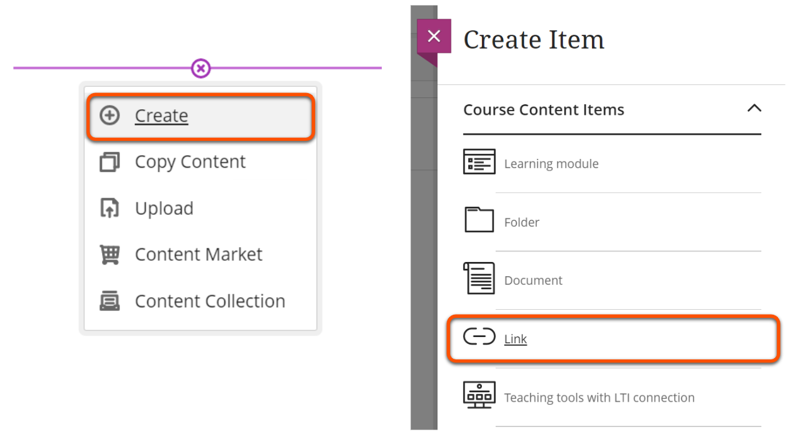
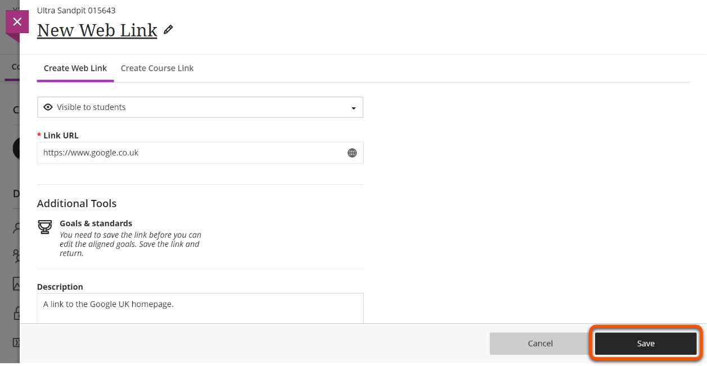

---
tags:
# Delete to leave only relevant tags
    - Foundation
    - Teaching
    - Administration
    - Ultra
---

# Adding link items

!!! Summary

    Links to external websites can be added inside Learning Modules and Folders, or directly to the **Course Content** area.

!!! principle "Relevant [VLE site design principles](https://vle-support.york.ac.uk/ultra/site-design-principles)"

    - 3.4 Essential: Site and materials content is accessible.
    - 3.6 Essential: Links and materials titles describe the destination or content.
    - 5.1 Recommended: Ensure that students can see and access module materials and content.

### Video Steps

Below is an embedded video detailing how to add link items. Alternatively, you can [open the video in a new browser tab](https://youtu.be/yC8dvJsoC4g).

<iframe width="560" height="315" src="https://www.youtube.com/embed/yC8dvJsoC4g" title="YouTube video player" frameborder="0" allow="accelerometer; autoplay; clipboard-write; encrypted-media; gyroscope; picture-in-picture; web-share" allowfullscreen></iframe>

### Text Steps

1. Hover over where you want to add the link and click the plus icon.
2. Choose **Create**, select **Link**.

3. Edit the title to show the link name, make it visible to students, copy & paste the relevant URL, add a brief description, and click **Save**.

