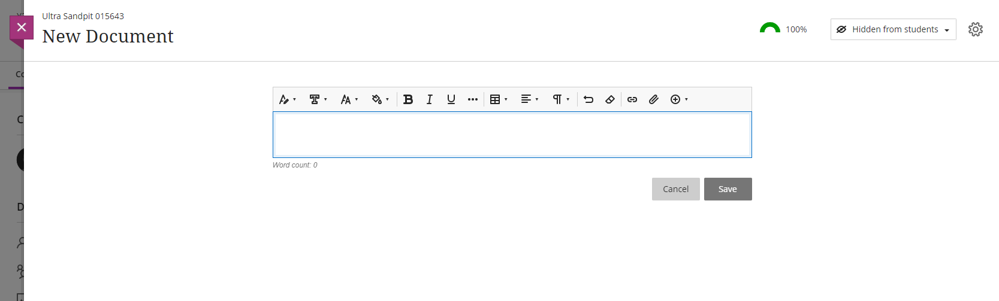
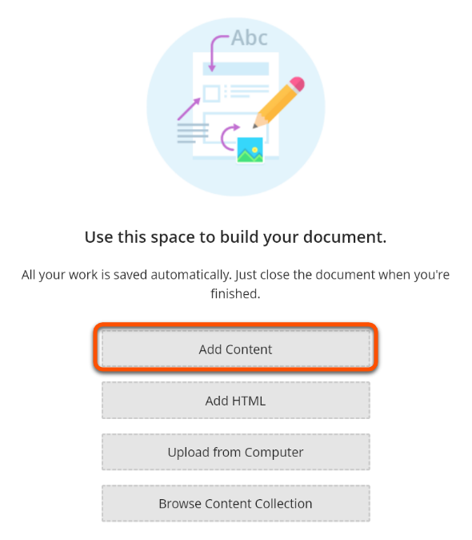
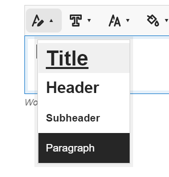
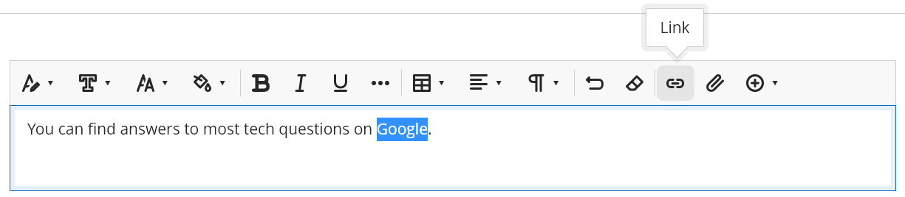
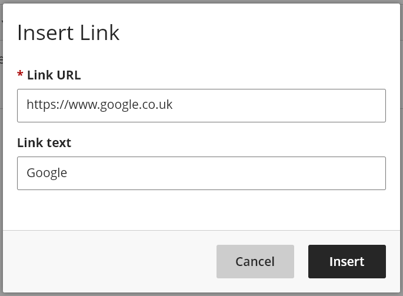

---
tags:
# Delete to leave only relevant tags
    - Foundation
    - Teaching
    - Administration
    - Ultra
---

# The Text Editor

!!! Summary

    The Text Editor in Ultra has lots of tools to help format the content of a Document. Styles are important when adding text, and hyperlink text should be descriptive.

!!! principle "Relevant [VLE site design principles](https://vle-support.york.ac.uk/ultra/site-design-principles)"

    - 3.4 Essential: Site and materials content is accessible.
    - 3.6 Essential: Links and materials titles describe the destination or content.

<!--  -->

## Adding Text

!!! Warning

    It is important to add text structure through the Styles feature in the text editor instead of relying on different font sizes, as the latter information is not conveyed accurately through most screen readers.

### Video Steps

Below is an embedded video detailing how to add text to a Document. Alternatively, you can [open the video in a new browser tab](https://youtu.be/NDFTG9wd23k).

<iframe width="560" height="315" src="https://www.youtube.com/embed/NDFTG9wd23k" title="YouTube video player" frameborder="0" allow="accelerometer; autoplay; clipboard-write; encrypted-media; gyroscope; picture-in-picture; web-share" allowfullscreen></iframe>

### Text Steps

1. To add text to an Ultra site, create or open a Document (see our [adding documents guide](https://vle-support.york.ac.uk/ultra/adding-documents)) and click **add content**
]
2. Add a heading by clicking the **Styles** tool and clicking **Title** (starting a new line will automatically revert to the paragraph style)

3. Continue adding your text, using the **Styles** tool to add section headings.

4. You can insert standard LaTeX into text within double dollar signs, and it will render when the text chunk is saved.

## Hyperlinks

### Video Steps

Below is an embedded video detailing how to add a hyperlink to a Document. Alternatively, you can [open the video in a new browser tab](https://youtu.be/twsTPVFlULE).

<iframe width="560" height="315" src="https://www.youtube.com/embed/twsTPVFlULE" title="YouTube video player" frameborder="0" allow="accelerometer; autoplay; clipboard-write; encrypted-media; gyroscope; picture-in-picture; web-share" allowfullscreen></iframe>

### Text Steps

1. If adding a hyperlink to pre-existing text, highlight that text
2. Press the **Link** tool in the Text Editor

3. Paste in the destination URL and add/adjust the link text so that it's descriptive (**not** "click here" or "open link") and press **Insert**

## YouTube Videos

Details on adding YouTube videos using the built-in tool are in a separate guide - see our [adding YouTube videos](https://vle-support.york.ac.uk/ultra/adding-youtube) guide.

## Further information and troubleshooting

If you encounter difficulties following this guide, please contact [vle-support@york.ac.uk](mailto:vle-support@york.ac.uk).