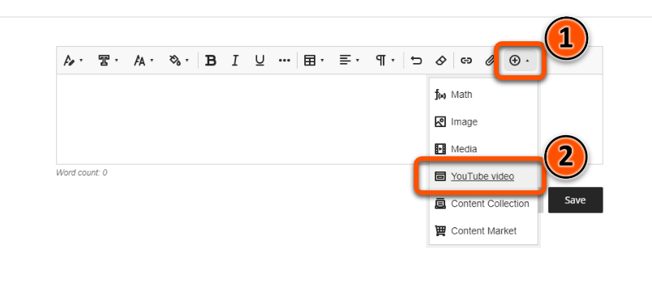
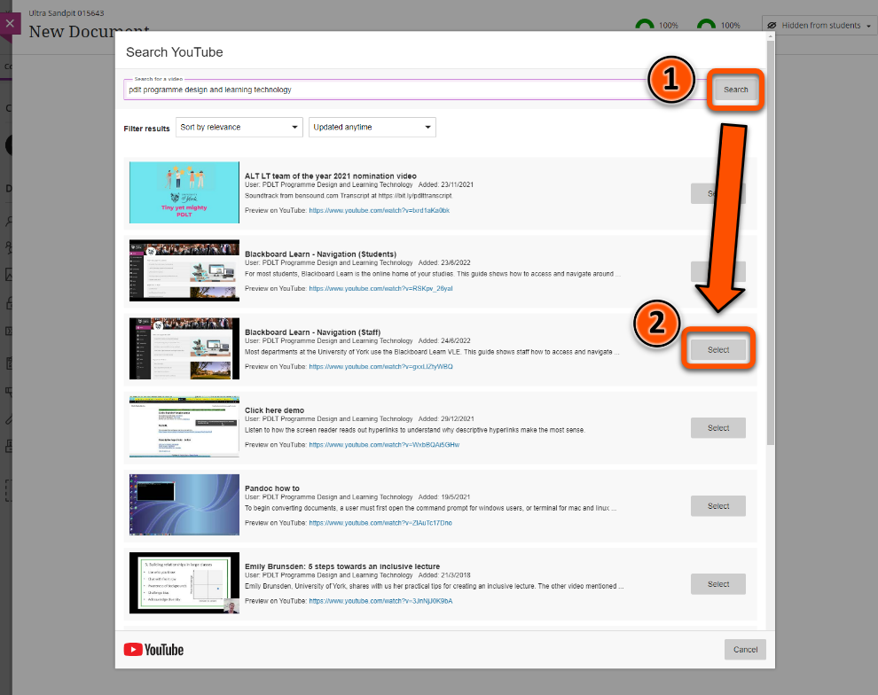
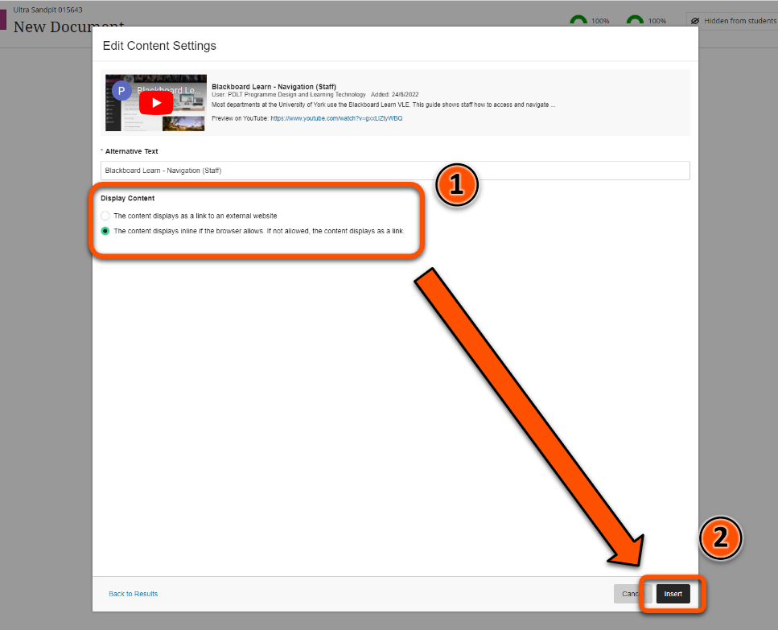
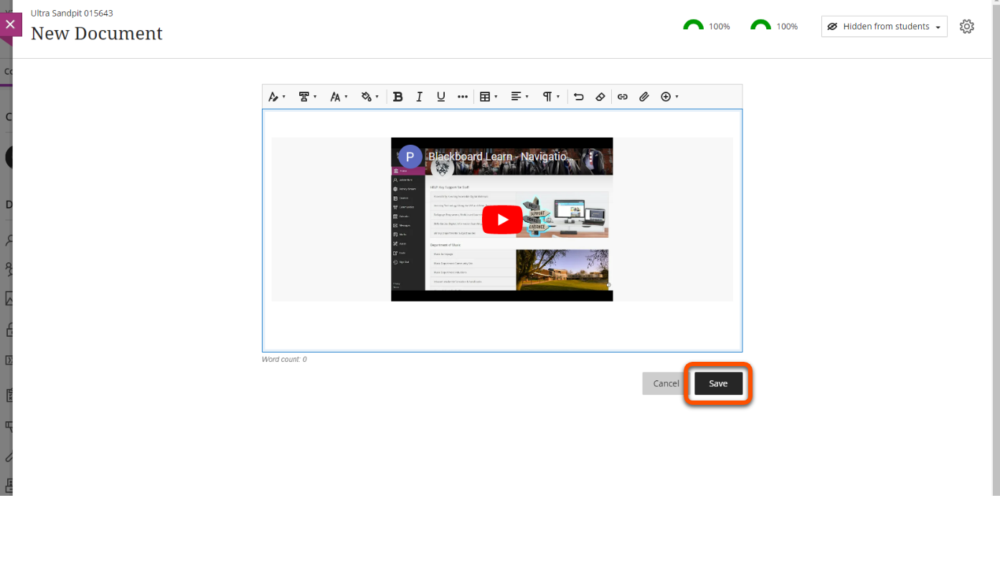

---
tags:
# Delete to leave only relevant tags
    - Foundation
    - Teaching
    - Administration
    - Ultra
---

# Adding text to a Document

!!! Summary

    Most Ultra content must be added straight into a Document. Files can be uploaded directly with quick previews available for students, images need alternative text or to be marked as decorative.

## Adding Text
To add **text** to an Ultra site, create or open a Document and click “Add Content”. This will open up a text editor at the top of the Document similar to Original but slightly more streamlined. The text editor includes easy access to text formatting features such as styles, fonts, and colours. You can also add bullet-pointed or numbered lists, tables, or other content like MathType input and YouTube videos.

To see how to upload images from your computer, see the section below about **Uploading Files and Images**.

!!! Warning

    It is important to add text structure through the Styles feature in the text editor instead of relying on different font sizes, as the latter information is not conveyed accurately through most screen readers.

### Video Steps

Below is an embedded video detailing how to add images to a Document. Alternatively, you can [open the video in a new browser tab](VIDEO URL).

<!-- PASTE YOUTUBE EMBED -->

## YouTube Videos

To embed a YouTube video using the built-in tool:

### Video steps

### Text steps

1. In the text editor, open the "Insert content" drop-down menu and select **YouTube video**

2. Search for the video you'd like to embed and press **Select**

3. Choose the appropriate display option and press **Insert**

4. Make sure to save this section of the Document by clicking **Save**

!!! Note

    For more control and customisation, you can also embed YouTube videos directly via HTML. Please see the advanced guide [Embedding content with HTML](https://pdlt-university-of-york.github.io/vle-help/ultra/) for more information.

## Panopto Videos

Coming Soon to a guide near you

## Reading List Items

Coming Soon to a guide near you

## Further information and troubleshooting
<!-- More info here as needed. -->
For detailed information on how to embed and add content via HTML, please see the relevant advanced guide <!--A link? -->. Please email vle-support@york.ac.uk if you run into any issues using this guide.