---
tags:
    - Ultra
---

# AI conversation

!!! Summary

    An interactive tool where students participate in socratic questioning on a given topic or role play a situation with an AI bot.

Ultra's AI tools are powered by Microsoft's Azure OpenAI Service, and underpinned by [Anthology's Trustworthy AI approach](https://www.anthology.com/trust-center/trustworthy-ai-approach). They are a core Ultra feature (so are therefore available for use at no additional cost) and have been approved for use in teaching at the University of York.

There are also various [AI Design Assistant tools](../ultra/ai-da.md) available within Ultra to help you develop static site content.

## Getting started

This guide summarises the key aspects of the AI Conversation tool for use at the University of York. For more detail, see [Blackboard Help's guide to AI Conversations](https://help.blackboard.com/Learn/Instructor/Ultra/Interact/AI_Conversation).

The AI conversation tool has two components:

- selected conversation type
- post-task reflection question

The available conversation types are:

- **Socratic questioning  :material-chat-question:**

    ---

    Students explore an open-ended question, where the AI asks open-ended follow up questions expanding on the student's comments.
    
    This encourages students to engage more deeply with the topic and apply critical thinking skills. The tool could be applied to help students: 

    - prepare for seminar discussions
    - explore ideas for essays
    - practice answering questions about their work

- **Role play  :fontawesome-solid-masks-theater:**

    ---

    Students role play a situation, where the AI actively participates with its own comments and questions.

    This helps students practice specific interactions, such as:
    
    - medical staff reassuring a nervous patient before a procedure
    - a teacher updating parents on a struggling student's development
    - communicating research findings to a lay audience

## Assessment & AI conversation

AI conversation is designed as a formative assessment task, but it could also be used as an unmarked self-study task with no need to submit the conversation.

!!! Warning 
    At this time, we **strongly advise** that the AI conversation tool is **not** used for summative assessment.

Select your intended use case for recommended settings:

=== "Self-study task"

    !!! Note
        Even if you choose not to mark the AI conversation, it will appear in the Gradebook and the *Formative* label will be displayed on the item. Students will also still be able to submit their conversation and reflection.

    - **Use**: for students' own practice. Staff do not review or mark their responses.
    - **Location**: likely in the relevant weekly folder with other module materials.
    - **Recommended settings**:
        - Due Date: tick *No due date*
        - Formative Tools: leave both boxes ticked
        - Attempts allowed: Select *Unlimited*
        - Mark using: Select *Complete/incomplete*
        - Description: add a note such as *"This task is for your own practice and will not be marked. You do not need to submit your conversations."* to make clear that this is not an assessed task.
        - Maximum points: set the conversation and reflection question to 0 marks

=== "Formative assessment task"

    - **Use**: formative reflection task. Staff review responses and give feedback.
    - **Location**: in the Assessment section.
    - **Recommended settings**:
        - Due Date: set a relevant due date within core hours
        - Formative Tools: leave both boxes ticked
        - Attempts allowed: Select *Unlimited*
        - Attempts to mark: Select *Last attempt*
        - Mark using: Select *Complete/incomplete*
        - Assessment mark: tick if you want to post (release) marks automatically. Leave it unticked if you want to manually choose when to release marks.
        - Maximum points: leave as default (1 - to show students you've reviewed it)

## Create an AI conversation

1. In the relevant location in your course, click the **plus icon** then **Create**.
2. Click **AI Conversation** under *Participation and Engagement*.
 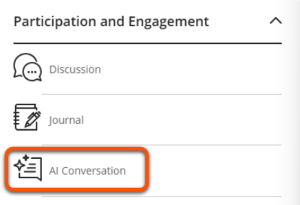
3. Select the **Conversation type** then click **Next**.
 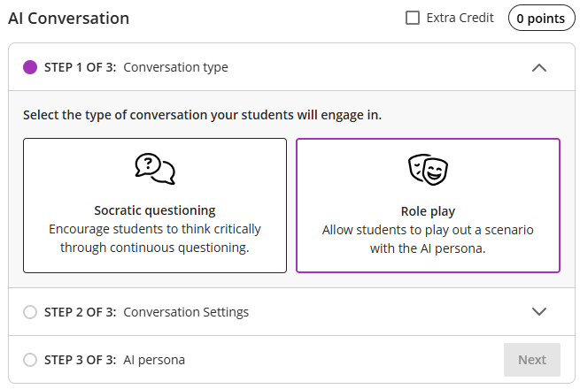
4. Input **Student instructions**. For *Socratic questioning* enter a clear, open-ended question, and for a *Role play* describe the situation, roles and the goal of the conversation. Click **Next**.
 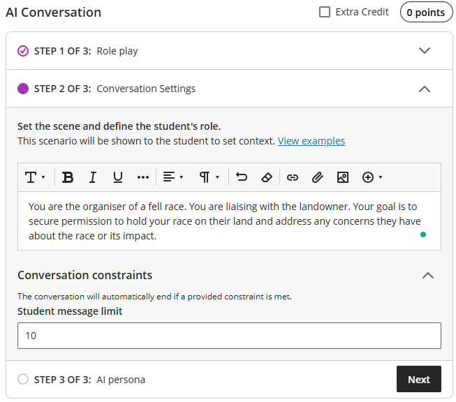
5. Describe the **AI persona**, then click **Save**. See the [AI personas: tips](../ultra/ai-conversation.md#ai-persona-tips) section below for more details. (The personality trait is not displayed to students).
 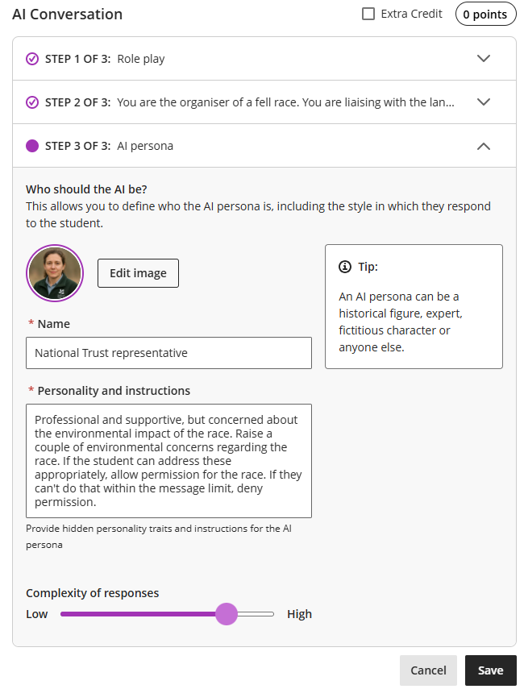
6. If desired, click the three dots icon adjacent to *Reflection Question* to edit the question wording.
7. Click **Preview chat** to make sure that the AI responds appropriately. If needed, click the three dots icon adjacent to *AI Conversation* to edit the instructions and persona and repeat.
 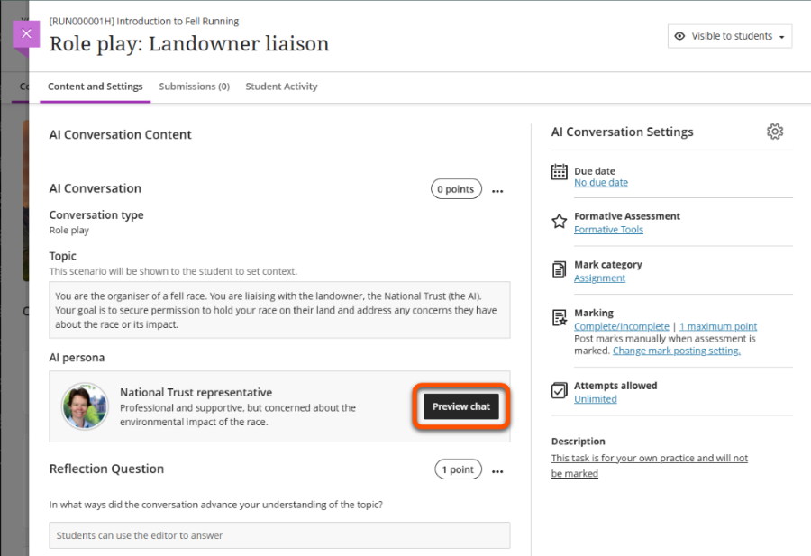
8. Adjust the remaining conversation settings:
    - Enter a conversation **title** at the top of the screen.
    - Click the **cog icon** to open the full settings and adjust for your needs (see the [Assessment & AI Conversations section](../ultra/ai-conversation.md#assessment--ai-conversation) for suggested settings). Click **Save**.
    - If needed, click the points pill to adjust the marks awarded (default: 0 marks for the conversation, 1 mark for the reflection)
    - Set an appropriate [content visibility](../ultra/content-visibility.md).
     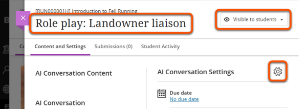

??? Abstract "AI conversation: interface and examples"

    **Title**: Role Play: Landowner liaison

    **Step 1 of 3**: Conversation type
    
    - Instructions for this step: Select the type of conversation your students will engage in.
    - Type selected: Role play

    **Step 2 of 3**: Student Instructions

    - Instructions for this step: Set the scene and define the student's role. This scenario will be shown to the student to set context. Things to include: the scenario, the student's role in the scenario, the role of the AI persona, what they're trying to achieve in the scenario.
    - Scenario description: You are the organiser of a fell race. You are liaising with the landowner. Your goal is to secure permission to hold your race on their land and address any concerns they have about the race or its impact.

    **Step 3 of 3: AI persona** 

    - Instructions for this step: Who should the AI be? This allows you to define who the AI persona is, including the style in which they respond to the student. An AI persona can be a historical figure, expert, fictitious character or anyone else. Briefly describe the persona occupation, personality or mood.
    - Persona description:
        - Name: National Trust representative
        - Personality trait: Professional and supportive, but concerned about the environmental impact of the race.
        - Complexity of responses: 7/10
    
    **Reflection Question**: In what ways did the conversation advance your understanding of the topic?

    **Settings**

    - No due date
    - flagged as Formative Tools
    - Mark category: Assignment
    - Marking: complete/incomplete, 1 maximum point, manually post marks
    - Attempts allowed: unlimited
    - Description: This task is for your own practice and will not be marked

## AI persona: tips

The AI persona has a big influence on the tone and content of responses, so you can use this to set up certain types of conversations.

The AI persona's name and image are displayed to students, but the personality trait is not.

!!! Warning 

    Always preview the chat before making the conversation visible to students to make sure responses are appropriate for your intended use. 

### Specific persona

Constrain AI responses by adding a detailed, specific *Personality trait*. This can include personality, current mood, age, job, other personal details, a problem or concern that they have etc. This is useful to help students deal with particular situations.

Here are three personas responding to the same situation, with very different conversations occurring:

??? Quote "Persona 1:  National Trust representative (has environmental concerns)"

    - Personality trait: Professional and supportive, but concerned about the environmental impact of the race.
    - Complexity of responses: 7/10

    ---

    

    

    *Student*: Hello, I'm calling in regards to land access permissions for a new fell race in Upper Wharfedale.

    *AI*: Hello! Thank you for reaching out regarding the fell race in Upper Wharfedale. We are supportive of community events, but we do have concerns about the potential environmental impact. Could you please provide some details about the race, such as the route, number of participants, and any measures you have planned to minimize environmental damage?

    *Student*: The race starts in Buckden, to a checkpoint on Yockenthwaite Moor, then across to Birk Fell and back down to Buckden. We anticipate between 100 and 125 entrants.

    *AI*: Thank you for providing the details about the route and anticipated number of participants. Given that Upper Wharfedale is an area of rich biodiversity and natural beauty, we need to ensure that any event held there minimizes its impact on the environment. Could you please elaborate on any specific measures you plan to implement to protect the local flora and fauna, manage waste, and ensure that the trail remains in good condition both during and after the event?

    *Student*: Runners will be self-sufficient, so there will be no food or drinks provided on route, which will minimise waste.

    *AI*: It's great to hear that runners will be self-sufficient as it minimizes waste. However, considering the rich biodiversity of the area, we need to ensure that other potential impacts such as trail erosion and disturbance to wildlife are also addressed. Could you tell me if there are any considerations or measures you will put in place to mitigate these concerns? Additionally, will there be any signage or briefing for participants to educate them on the importance of staying on the trail and respecting the environment?
    

    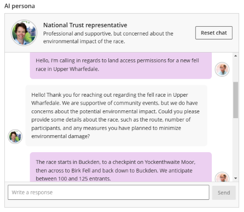
    

??? Quote "Persona 2: Local farmer (doesn't want to be involved)"

    - Personality trait: Very busy and angry at being disturbed. Doesn't want a race on their land.
    - Complexity of responses: 7/10

    ---

    

    

    *Student*: Hello, I'm calling in regards to land access permissions for a new fell race in Upper Wharfedale.

    *AI*: I'm extremely busy right now and don't want any races on my land. It's disruptive to my operations. Why exactly do you need to use my land?

    *Student*: I can understand your concerns. The race would follow an existing public right of way through your farm, which follows the side of one field. The runners would all pass through within around half an hour, which will minimise disruption.

    *AI*: Even if it's just for half an hour, it's still a disruption. My livestock gets stressed by that kind of activity, and I don't want to deal with potential litter or damage. Why can't you find another route that doesn't involve my land?

    *Student*: The race starts in Buckden, to a checkpoint on Yockenthwaite Moor, then across to Birk Fell and back down to Buckden. This would make it very difficult to avoid your land. However, keeping to the public right of way at the edge of the field should mean that it doesn't impact your work or livestock too much.

    *AI*: Your proposed route still means potential stress for my animals and risks like litter and damage, even if it's just a public right of way. I'm busy with farm work and ensuring everything runs smoothly here. Why should I prioritize your race over my farm's needs?
    

    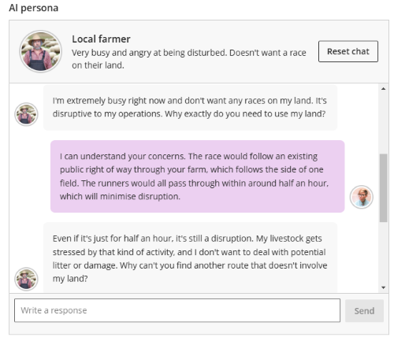
    

??? Quote "Persona 3: Village Hall operator (good for local community)"

    - Personality trait: Supportive of the race. Thinks it'll be good for the local community.
    - Complexity of responses: 7/10

    ---

    

    

    *Student*: Hello, I'm calling in regards to land access permissions for a new fell race in Upper Wharfedale.

    *AI*: Hello! That sounds like a fantastic initiative. I believe the race could bring great benefits to the local community, such as promoting physical activity and boosting local businesses. Can you provide a bit more detail about the race route and any specific concerns the landowner might have?

    *Student*: Thank you for your interest! The race starts in Buckden, to a checkpoint on Yockenthwaite Moor, then across to Birk Fell and back down to Buckden. We anticipate between 100 and 125 entrants who would all pass through within around half an hour, which will minimise disruption.
    
    *AI*: Thank you for the detailed route description. It seems like a well-planned course that avoids prolonged disruptions. One potential concern the landowner might have could be the impact on livestock and land. How do you plan to ensure the safety and integrity of the terrain and local wildlife during the race?

    *Student*: The race route largely uses established public rights of way, most of which stick to the edges of fields or follow walls. That would minimise the effect on livestock and local wildlife.

    *AI*: That sounds like a responsible approach to minimising the impact on the land and wildlife. Additionally, could we consider involving local volunteers to help manage the route and ensure participants stick to the designated paths? This might also help foster community spirit and provide a safer environment for everyone involved.
    

    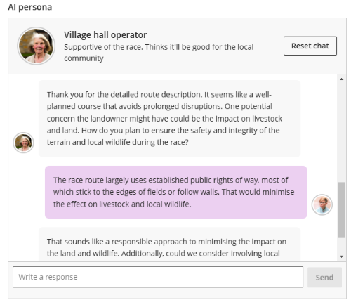
    

### Random responses

Allow flexibility in AI responses by entering the personality trait as random or giving a list of options.

This could be especially useful for students to use the conversation multiple times to practice unpredictable  interactions in a low-stakes environment.

??? Quote "Random persona 1: patient at GP (random health problem)"

    - Scenario: You are a GP assessing a patient (the AI) in your practice. Ask them questions to find out what the problem is and decide what treatment is needed.
    - Personality trait: An adult patient with a random health problem or injury. (Not shown to students)
    - Complexity of responses: 7/10

    ---

    

    

    *Student*: Hi there, what seems to be the problem today?

    *Sample of AI responses*:

    - I've been feeling really anxious lately and it's affecting my sleep. I just can't seem to calm down and my mind keeps racing.
    - I've been feeling extremely tired lately. Even after a full night's sleep, I wake up feeling exhausted. It's been going on for a couple of weeks now, and I'm starting to get really frustrated.
    - I've been having a really bad headache for the past few days and it's starting to affect my work. I'm getting a bit worried because I don't usually experience headaches like this.
    - I've been feeling a lot of pain in my lower back for the past week and it's been getting worse. I'm really worried about it.
    

    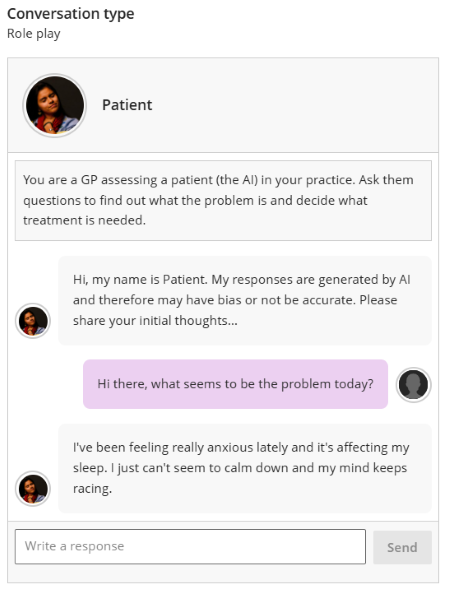
    

??? Quote "Random persona 2: parent talking to teacher (list of moods)"

    - Scenario: You are a teacher talking to a student's parent (the AI). Their child usually performs well in your class but recently they have fallen behind. Tell the parent and try to find out if there are any problems that might explain the change.
    - Personality trait: Your child is in the teacher's class. React in one of these ways: worried, concerned, angry, bored, dismissive, combative. (Not shown to students)
    - Complexity of responses: 5/10

    ---

    

    

    *Student*: Jae usually does very well, but recently they have been very distracted and failed their last test. Do you have any idea why their performance has changed?

    *Sample of AI responses*:

    - I'm concerned to hear this. Jae didn't mention any problems at home, but they have been more quiet lately. Do you think there's something happening at school?
    - I haven't noticed anything unusual at home. Jae might just be going through a phase. I'll talk to them and see if there's anything bothering them, but they usually handle things well on their own.
    - I had no idea Jae was falling behind! I know they have been really stressed lately, perhaps that's affecting their focus in class. Is there anything we can do to help them improve?
    - I don't understand why this is suddenly an issue, Jae's always been a good student. Are you sure it's not something with your teaching? Maybe they aren’t being challenged enough in the class?
    

    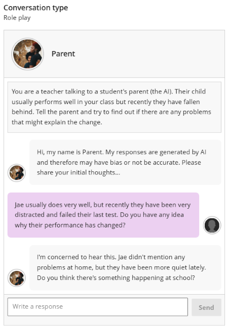
    

## Marking & feedback

If you have chosen to mark the AI conversations, this is done in the same way as [marking Ultra Assignments](../ultra/assignment-marking.md).

The only difference is that you can assign a mark for the conversation and reflective question (labelled Essay) components separately, according to the maximum marks you set.

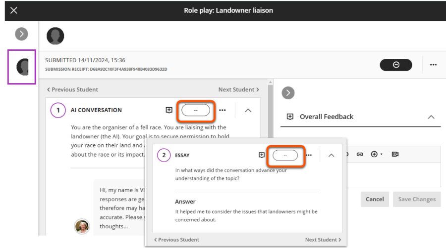